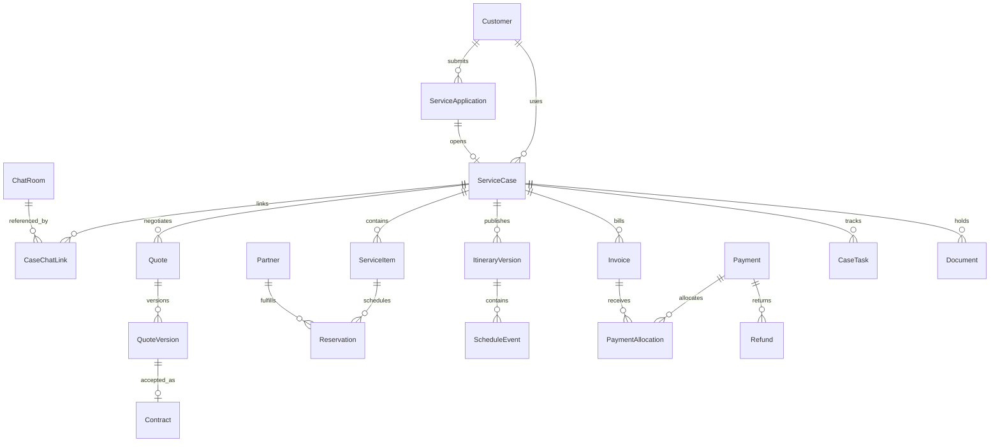

# 스템케어재팬 백엔드시스템 구축계획서

| 항목 | 내용 |
|---|---|
| 작성일 | 2026-09-21 |
| 버전 | 1.1 / 고객·운영자 관점 검토 반영안 |
| 개정일 | 2026-09-21 |
| 대상 | 서비스 신청 이후 예약·계약·이용·일정·결제·사후관리 및 운영 조직 관리 |
| 기준 시스템 | 현 저장소의 홈페이지, 상담 API, 상담 관리자, 배포·운영 구성 |
| 문서 목적 | 업무 범위, 데이터 구조, 권한, 개발 단계, 검증·출시 기준을 정의하는 실행 계획 |
| 문서 상태 | 구현 전 계획. 아래 신규 모델·API·화면·성능 수치는 설계 제안이며 구현 완료 사실이 아님 |
| 파일명 | 요청한 `20260921_스템테어재팬_백엔드시스템_구축계획서.md`를 그대로 사용하며 본문 브랜드명은 스템케어재팬으로 표기 |

## 1. 구축 목표와 기본 방향

스템케어재팬의 홈페이지와 상담시스템을 고객 유입 창구로 유지하면서, 서비스 이용 신청 이후의 업무를 하나의 운영 시스템에서 관리한다. 고객 한 명이 여러 차례 서비스를 신청할 수 있고, 한 번의 이용에 병원·통역·차량·숙박 등 여러 예약과 여러 결제가 연결될 수 있는 구조를 채택한다.

시스템의 중심은 **고객(Customer)**과 **서비스 이용 건(ServiceCase)**이다. 상담방, 예약, 일정, 결제를 고객 하나에 직접 나열하는 대신 어느 이용 건에 속하는지 식별한다. 고객 상세에서는 전체 이력을, 이용 건 상세에서는 해당 계약의 진행 상태와 해야 할 일을 확인한다.

주요 목표는 다음과 같다.

1. 신청 접수부터 담당자 배정, 견적, 계약, 예약, 서비스 제공, 정산, 사후관리까지 추적한다.
2. 고객·상담자·현지 코디네이터·재무담당자 사이의 정보 전달 누락을 줄인다.
3. 예약 중복, 일정 충돌, 중복 결제, 과다 환불, 미수금, 파트너 미정산을 통제한다.
4. 상담 이력을 재사용하면서 회원 인증, 직원 권한, 개인정보 처리를 운영 수준으로 보강한다.
5. 변경자·변경 사유·승인자·증빙을 남겨 분쟁과 운영 장애에 대응한다.
6. 한국어·일본어, 한국·일본 일정, KRW·JPY를 업무 모델에 반영한다.

### 1.1 범위와 책임 경계

이 계획의 백엔드시스템은 서버 API만이 아니라 **운영 관리자 화면, 최소 고객 마이페이지, 업무 데이터, 배치 작업, 외부 연동 및 운영체계**를 포함한다. 운영자만 사용하는 초기 단계도 가능하지만 고객의 신청·동의·견적 확인·일정 확인 경로는 반드시 마련한다.

의료 관련 서비스에서는 병원 예약, 문서 전달, 동행, 통역, 사후 연락을 관리한다. 진단·처방·치료 적합성 판단은 의료기관의 책임이며, 본 시스템의 상태나 AI 답변이 이를 대체하지 않는다. 임상 EMR, 의료영상 판독, 자체 진단 엔진은 범위에서 제외한다.

### 1.2 우선순위

| 구분 | 포함 기능 | 출시 기준 |
|---|---|---|
| 필수 / P0 | 계정·권한·고객·신청·계약·예약·일정·서비스·청구·수납·환불·감사·백업, 최소 고객 포털·자료 보완·요청·중요 알림, 업무함·대체 담당·현장 수행·기본 지급 대장 | 고객 행동과 운영 후속 처리가 끝까지 연결되는 제한 운영 |
| 확장 / P1 | PG 자동 결제, 알림 채널 확대·일반 리마인더 자동화, 파트너 정산 자동화, 고객 재이용 편의, 저장 필터·안전한 일괄 처리, 상세 원가·운영 통계 | 반복 업무 감소 및 운영 규모 확대 |
| 고도화 / P2 | 파트너 포털, 외부 예약·캘린더 연동, 회계 시스템 연동, 고급 수익 분석 | 실운영 데이터와 계약에 근거해 별도 추진 |

P0의 결제관리는 계좌 입금 확인과 외부 결제 내역 수동 등록을 지원한다. 수동 기록에도 증빙·권한·승인·대사 절차를 적용한다. 온라인 카드 결제가 최초 출시 조건으로 결정되면 PG 연동을 P0로 올리고 계약·심사 일정을 선행한다.

### 1.3 양측 관점 검토 결과와 개정 원칙

1.0은 데이터·거래 무결성을 비교적 상세히 정의했지만, 고객이 행동하는 화면과 운영자가 그 행동을 처리하는 연결 구조에는 보완이 필요했다. 이번 검토는 문서 기반의 업무 시나리오 검토이며 실제 고객 인터뷰나 사용성 테스트를 수행했다는 의미는 아니다. B0에서 한국어·일본어 고객, 디지털 사용이 익숙하지 않은 이용자/보호자, 상담자, 현지 담당자, 재무담당자를 대상으로 검증한다.

| 검토 관점 | 기존 공백/불일치 | 반영 결정 |
|---|---|---|
| 고객 | 신청 도중 이탈·인증수단 분실 후 재개 경로 부족 | 임시 저장, 안전한 재개, 계정 복구·연락처 변경 절차 추가 |
| 고객 | 다음 행동·처리 예상시간·대기 사유가 불명확 | 고객 행동 목록, 공개 상태·다음 안내 예정일 추가 |
| 고객 | 변경/취소 버튼 이후의 처리 과정 부족 | 요청번호, 비용안, 수락/철회, 처리 결과를 갖는 요청 관리 추가 |
| 고객 | 문서 업로드 후 보완·승인 여부 확인 부족 | 자료별 검토 상태·보완 사유·기한·재제출 추가 |
| 고객 | 현장 만남, 통신 장애, 서비스 미제공 대응 부족 | 만남 카드·출발 준비 점검·대체 연락·이의제기 추가 |
| 운영자 | 목록은 있으나 통합 우선순위·처리 책임 부족 | 통합 업무함, 기한 관리, 담당 수락·이관·상급자 통보 추가 |
| 운영자 | 알림 발송을 고객 확인으로 오해할 위험 | 발송·전달·열람·명시 확인을 분리하고 미확인 후속 작업 생성 |
| 운영자 | 외부 일정 변경·부재 시 대체 계획 부족 | 파트너 회신 추적·대체 후보·근무/부재·미배정 감시 추가 |
| 양측 | 최소 포털·자료 제출·알림이 P0와 P1 사이에서 불명확 | 필수 고객 기능과 중요 알림을 P0로 고정; 확장 자동화만 P1 |
| 양측 | 기능 확장에도 기존 16주 일정 유지 위험 | 추가 설계·개발·UAT를 반영해 20주 기준안으로 재산정 |

개정 요구사항은 고객 `UX-01~UX-10`, 운영 `OP-01~OP-10`으로 식별한다. 5.8~5.17에 상세 업무, 7.5에 데이터, 9.1에 API, 15.4에 단계·검수 연결을 추가한다. 기존 개인정보·금융 통제는 유지한다.

## 2. 현행 시스템 분석

### 2.1 저장소에서 확인한 사실

| 영역 | 확인한 구성 | 확장 방향 |
|---|---|---|
| 홈페이지 | 루트 정적 사이트, `stemcell/`, `korea-travel/`, JavaScript 상담 위젯 | 상담과 별도로 서비스 신청 및 마이페이지 진입 추가 |
| API | `apps/api`, Express·TypeScript, Prisma, PostgreSQL | 동일 API 안에 업무별 모듈 추가 |
| 관리자 | `apps/admin/app`, Next.js·React | 기존 상담을 유지하며 운영 메뉴 확장 |
| 공유 코드 | `packages/shared` | 업무 DTO·상태·권한 계약 확장 |
| 실시간 | Socket.IO 및 폴링 대체 | 담당자 업무 알림과 일정 변경 반영에 활용 |
| 고객 | `Customer`: 이름, 전화, 이메일, 선호 언어, 서비스 분류, 동의 시각 | 회원 인증·연락처 검증·다중 이용 건 추가 |
| 상담 | `ChatRoom`, `Message`, `ChatSummary`, `OperatorNote`, `ChatFeedback` | 이용 건과 명시적으로 연결 |
| 직원 | `Operator`, 역할 문자열 및 활성 여부, 쿠키 기반 JWT | 초대·권한·MFA·세션 회수·퇴사 처리 추가 |
| 설정 | `ChatSettings` 및 외부/로컬 번역 선택 | 상담 설정과 사업 운영 설정을 분리 |
| 운영 | Docker/Nginx, 테스트, 로그·지표, 보관 작업, 백업·복구 문서 | 영속 작업 처리, 결제 대사, 자료 저장, 감사 확장 |

`package.json` 기준 Node.js 요구 버전은 22 이상이며, 현행 의존성에는 Prisma 6 계열·Next.js 15 계열 등이 선언되어 있다. 이는 저장소의 현황이며 최신 버전 권고가 아니다. 구현 착수 시 잠금 파일·취약점·배포 환경 호환성을 확인한다.

`README-chat.md`는 기존 기능의 구현 및 로컬 검증을 기록하지만, 이것만으로 운영 서버 배포 상태나 실제 고객 데이터의 존재를 단정하지 않는다. 착수 때 운영 환경과 실제 DB 스키마를 별도 대조한다.

### 2.2 핵심 차이와 보완점

- 공개 상담 시작은 새 `customerId`를 생성하는 구조다. 동일 이름·전화번호가 있더라도 이미 통합 고객으로 관리된다고 볼 수 없다.
- 상담 시작 폼은 서비스 이용 계약이나 예약 확정 신청서가 아니다. 별도 `ServiceApplication`을 도입한다.
- 서비스 유형은 현재 `stemcell`, `korea_travel`, `undecided`다. 이를 유지하고 상품·이용 건에서 세부 서비스 및 출발·도착 국가를 관리한다.
- 현재 `Customer.serviceType` 하나로 고객의 모든 서비스 이용을 표현할 수 없다. 신규 서비스 분류의 기준은 이용 건이며 기존 필드는 상담 호환용으로 단계적으로 축소한다.
- 직원 토큰 검증은 `admin`, `operator` 역할을 전제한다. 새 역할을 DB에 추가하는 것만으로는 충분하지 않으며 JWT·HTTP·소켓·화면 권한을 함께 변경해야 한다.
- 상담방 방문 토큰은 해당 상담방 접근 수단이다. 계약·결제·건강 자료에 접근하는 회원 인증 수단으로 확대하지 않는다.
- 현행 보관 작업은 상담 종료 후 180일 기준 고객 정보 비식별화, 365일 기준 메시지 및 관련 자료 삭제를 수행한다. 활성 이용 건·미수금·분쟁·보존 의무를 인식하도록 수정하지 않으면 운영 자료가 먼저 삭제될 수 있다.
- 현재 고객→상담 등 일부 관계에 연쇄 삭제가 있다. 계약·청구·결제·감사 자료에는 동일한 연쇄 삭제 규칙을 적용하지 않는다.

### 2.3 참고한 내부 자료

- `README.md`, `README-chat.md`
- `apps/api/prisma/schema.prisma`
- `apps/api/src/app.ts`, `auth/token.ts`, `auth/requireOperator.ts`
- `apps/api/src/chatRooms/publicChatRoutes.ts`, `ops/retention.ts`
- `packages/shared/src/constants.ts`, `apps/admin/app/`
- `deploy/DEPLOY.md`, `deploy/RUNBOOK.md`, `deploy/backup/RESTORE-DRILL.md`의 존재 및 기존 운영 구조
- `docs/20260413_일본 줄기세포 컨시어지 사업계획서 ver2.md`의 업무 여정

사업계획서의 매출·시장 규모·법률 해석·의료 효과를 이 문서의 검증된 사실로 전용하지 않는다. 실제 상품과 업무 정책은 착수 단계에서 재확정한다.

## 3. 사용자와 권한 모델

### 3.1 역할별 업무

| 역할 | 주요 권한 | 기본 접근 범위 |
|---|---|---|
| 시스템 관리자 | 계정·권한·환경 관리, 장애 대응 | 시스템 관리. 민감자료 열람은 별도 권한 |
| 운영 책임자 | 신청·담당 배정·예외 승인·운영 통계 | 소속 조직 전체 이용 건 |
| 상담자 | 고객 상담, 신청 보완, 견적 초안, 담당 건 조회 | 본인 또는 소속 팀 담당 건 |
| 케어매니저/코디네이터 | 예약, 현지 일정, 제공 체크리스트, 사후 연락 | 배정된 이용 건과 필요한 자료 |
| 재무담당자 | 청구, 입금 확인, 환불 실행, 대사, 파트너 정산 | 금액·계약·정산 자료. 건강자료 제외 |
| 파트너 담당자 | 요청 수락·확정·실적 제출 | 자기 업체에 배정된 예약만; P2 포털 |
| 감사/조회 담당자 | 승인된 보고서와 감사 이력 조회 | 읽기 전용·다운로드 별도 승인 |
| 고객 | 본인 신청·견적·계약·일정·결제·자료 조회 | 본인에게 명시적으로 연결된 이용 건 |
| 보호자/대리인 | 위임받은 업무 수행 | 위임 범위·기간·대상 이용자 제한 |

### 3.2 권한 적용 원칙

`역할 권한 × 조직/팀 범위 × 건별 배정 × 자료 민감도`를 함께 검사한다. 메뉴 숨김은 보조 수단이며 모든 API·다운로드·소켓 구독에서 서버가 검사한다.

권한 예시는 `case.read`, `case.assign`, `quote.approve`, `reservation.confirm`, `payment.record`, `refund.request`, `refund.approve`, `refund.execute`, `document.sensitive.read`, `report.export`, `staff.manage`로 정의한다. 역할은 권한 묶음이며 한 직원이 복수 역할을 가질 수 있다.

- 환불 요청자와 승인자는 다른 사람이어야 한다. 직원 수가 적을 경우 대표 또는 외부 승인 담당자를 지정한다.
- 본인 권한 상승, 본인이 요청한 예외·환불의 자기 승인, 감사 기록 삭제를 금지한다.
- 관리자라고 해서 건강·여권 자료를 기본 열람할 수 없도록 별도 권한을 둔다.
- 긴급 접근은 사유·만료시간·사후 검토를 남기는 제한적 절차로 제공한다.
- 팀 이동·휴직·퇴사 시 미완료 업무를 재배정하고 HTTP 세션·소켓·초대·재설정 토큰을 회수한다.

### 3.3 계정 기능

직원 초대, 만료되는 일회용 초대 링크, 최초 비밀번호 설정, 비밀번호 변경·재설정, MFA 등록·복구, 로그인 실패 제한, 활성/정지, 직무·팀 변경, 접속 이력을 구현한다. 비밀번호 원문과 일회용 토큰 원문을 저장하지 않는다.

세션을 서버에서 식별하고 폐기할 수 있게 `StaffSession`과 인증 버전을 도입한다. 기존 JWT 쿠키와 병행하는 전환 기간을 두되, 권한 회수 후 기존 소켓이 계속 수신하지 않도록 연결 해제와 이벤트별 권한 재검사를 포함한다. 관리자·재무 역할의 MFA는 실제 운영 전 필수로 한다.

고객은 인증된 이메일 링크 또는 전화 OTP로 초기 진입하도록 제안한다. 채널 선택은 고객 연락처 보유율과 발송 가능 국가를 확인한 후 확정한다. 링크·OTP의 유효기간, 재전송 제한, 시도 횟수, 단일 사용을 통제하고 쿠키 세션으로 전환한다. 민감자료 다운로드·연락처 변경·대리인 위임은 재인증한다.

### 3.4 고객 계정 복구·연락처 변경·관계자 권한

인증수단을 잃어버린 고객에게 새 계정을 만들어 기존 자료를 다시 제출하도록 강요하지 않는다. 만료 링크 재발급, 다른 사전 검증 연락처 이용, 증빙 기반 운영자 복구 접수를 제공한다. 이름·생년월일·전화번호를 알고 있다는 이유만으로 접근을 복구하지 않는다.

- 복구 요청은 일반 상담과 분리해 요청번호·검증 단계·승인자·결과를 기록한다. 검증 기준은 B0에서 확정한다.
- 기존 연락처 접근이 불가능한 복구는 권한 있는 별도 직원의 검토를 거친다. 직원은 고객을 가장해 로그인하지 않는다.
- 새 연락처 검증 및 승인 완료 후 이전 세션·복구 토큰을 회수하고, 가능한 기존 채널과 새 채널에 변경 사실을 안내한다.
- 가족·대리인·결제자의 접근은 이용 건뿐 아니라 대상 이용자·문서·행동 단위로 제한한다. 결제했다는 사실만으로 건강자료 접근을 부여하지 않는다.
- 위임 철회는 서버 접근·알림 수신자·소켓·향후 다운로드 권한에 즉시 반영한다. 민감자료는 인증 프록시로 전달해 이미 발급한 서명 URL의 잔여 유효기간에 의존하지 않는다.
- 열람·내보내기·정정·동의 철회·탈퇴 요청의 접수 및 상태 확인 경로를 제공한다. 보존 사유가 있는 자료는 계정 비활성과 자료 보존을 구분해 처리 결과를 설명한다.

## 4. 전체 업무 흐름

### 4.1 기본 여정

```text
홈페이지·채팅·전화 접수
  → 서비스 신청 / 본인·대리인 확인 / 필요한 동의
  → 접수 검토 / 담당자 배정 / 서비스 이용 건 생성
  → 요구사항 확인 / 파트너 가능 여부 조회
  → 견적 발행 / 고객 수락 / 계약 확정
  → 청구 / 예약금 확인 / 예약 확정
  → 상세 일정 확정 / 준비 안내 / 잔금 확인
  → 출국·입국·이동·방문·동행 서비스 수행
  → 이용 완료 / 추가 비용 정리 / 고객 확인
  → 사후관리 / 환불·분쟁·파트너 정산 정리
  → 종료 / 보관 정책 적용
```

진료 가능 여부나 항공편 등 외부 변수 때문에 순서가 달라질 수 있다. 단계별 진입 조건은 서비스 정책으로 정의하며, 예외 진행은 권한 있는 운영 책임자가 사유를 기록한다. 예약 확정 조건을 모든 상품에 일괄적으로 “전액 결제”로 고정하지 않는다.

### 4.2 대표 업무 시나리오

| 시나리오 | 처리 방식 |
|---|---|
| 한국 고객의 일본 병원 방문 지원 | 병원 확인, 통역·차량·숙박 예약, 일본 현지 일정, 귀국 후 연락을 하나의 이용 건으로 연결 |
| 일본 고객의 한국 방문 서비스 | 출발·도착 국가, 현지 담당자, 한국 일정, 일본어 안내를 같은 모델로 관리 |
| 상담 없이 전화로 신청 | 직원 대리 등록, 접수 채널·등록자·동의 증빙·본인 확인 상태 기록 |
| 한 고객의 재이용 | 기존 고객에 새 신청·이용 건 생성. 이전 계약·견적은 변경하지 않음 |
| 가족 동반 | 신청자·계약자·실이용자·동반자·결제자 관계 분리. 연락처 공유를 동일인으로 판단하지 않음 |
| 병원 일정 변경 | 변경 요청 생성 → 대체 자원 확보 → 비용·고객 동의 → 새 일정 발행 → 기존 예약 해제 |
| 일부 서비스 취소 | 해당 예약·이용 항목 취소와 차감/환불을 처리. 전체 이용 건을 자동 취소하지 않음 |
| 지연·노쇼·서비스 누락 | 사고/이슈 생성, 담당자 알림, 비용·대체·보상 결정과 증빙 연결 |
| 의료기관이 진행 불가 통지 | 기관 통지 사실만 기록, 계약 기준 취소·대체·환불 검토. 상담자가 의료 판단을 기록하지 않음 |

### 4.3 고객 여정과 운영 후속 업무 연결

| 고객의 질문/행동 | 고객에게 보여줄 정보 | 운영자가 처리할 업무 | 완료 증거 |
|---|---|---|---|
| “신청이 접수됐나요?” | 접수번호·접수 시각·다음 연락 예정 | 중복 검토·담당 배정 | 담당 수락·첫 안내 기록 |
| “무엇을 준비하나요?” | 나에게 필요한 자료·이유·기한 | 자료 검토·부족 항목 요청 | 최신 자료의 승인/면제 |
| “총 얼마이고 누구에게 내나요?” | 수취 주체별 비용·통화·기한·포함/제외 | 견적 발행·가격 승인·청구 | 수락 버전·수납 확인 |
| “예약이 정말 확정됐나요?” | 임시/확정 구분·남은 조건 | 파트너 확인·미확정 추적 | 확인번호/증빙 |
| “언제 어디서 누구를 만나나요?” | 최신 일정·만남 장소·담당 연락·변경점 | 출발 준비·현장 담당 수락 | 일정 확인·현장 수행 기록 |
| “바꾸거나 취소할 수 있나요?” | 요청 상태·비용안·예상 처리일 | 영향 분석·승인·외부 실행 | 고객 수락 버전·실행 결과 |
| “문제가 생겼어요” | 지원 창구·운영시간·접수 상태 | 이슈 배정·대체·보상 판단 | 해결 안내·고객 이의 처리 |
| “환불은 언제 되나요?” | 요청/승인/실행/확인과 예상일 | 실패 조회·대사 | 수취 확인 또는 미확정 사유 |
| “서비스가 끝난 뒤에는요?” | 제공 내역·증빙·사후 연락·재문의 | 미제공 확인·정산·사후 작업 | 정리된 완료 보고·남은 요청 |

고객 화면의 예상일은 실제 담당·파트너 회신에 근거해 갱신한다. 정보가 없으면 “확인 중, 다음 안내 예정일”로 표시하며 임의의 확정일이나 환불 입금일을 약속하지 않는다.

## 5. 기능 요구사항

### 5.1 고객 및 신청 관리

**고객 기본정보**: 표시명, 필요한 경우 원어명, 선호 언어, 인증된 연락처, 국가, 담당 팀, 연락 가능 시간, 관계자, 동의 내역, 중복 후보, 이용 이력을 관리한다. 여권번호·건강자료는 일반 고객 메모에 저장하지 않는다.

**신청서**: 서비스 유형, 희망 기간, 출발·도착 지역, 이용 인원, 요청 서비스, 연락 선호, 유입 경로, 관련 상담방, 접수 시각, 동의 문서 버전과 확인 방법을 받는다. 최초 신청은 최소 정보로 접수하고 추가 자료는 담당자 배정 후 요청한다.

**접수 처리**: 접수번호 발급, 필수 정보 검증, 중복 제출 방지, 보완 요청, 담당자 배정, 미처리 알림, 수락/거절 사유를 지원한다. 초기 업무 목표는 영업시간 내 신규 신청 2시간 이내 최초 확인으로 제안하며 실제 인력에 맞게 확정한다.

**고객 통합**: 전화·이메일 일치는 중복 후보 생성에만 사용한다. 소유권 확인 및 담당자 검토 후 통합하며, 기존 ID→대표 ID 매핑·처리자·근거를 남긴다. 이전 상담의 접근 권한을 새 사용자에게 자동 부여하지 않는다. 오통합 복구용 참조 이력과 분리 절차를 마련한다.

**보호자**: 위임 범위, 동의 주체, 관계, 만료·철회 이력을 관리한다. 미성년자·의사표현 곤란 사례의 절차는 사업 정책 검토 후 적용한다.

### 5.2 상품·견적·계약 관리

- 상품은 서비스 유형, 판매 기간, 통화, 포함/불포함 항목, 기본 일정 템플릿, 예약금·잔금 규칙, 변경·취소 규칙을 가진다.
- 병원 진료비, 컨시어지 수수료, 통역·차량·숙박 등 항목별 제공자·청구 주체·수취 주체를 구분한다.
- 견적은 수량, 단가, 할인, 세금 적용 구분, 총액, 통화, 유효기간, 환율 적용 근거, 제외 항목을 포함한다. 세율·과세 구분은 재무 검토 결과를 설정값으로 사용한다.
- 견적 수정은 새 버전으로 발행하며, 고객이 수락한 버전은 변경 불가 스냅샷으로 남긴다.
- 계약은 수락한 견적, 약관·취소 정책 버전, 당사자, 확인 시각·방식·증빙에 연결한다. 단순 화면 체크를 법적으로 충분한 전자서명이라고 단정하지 않는다.
- 서비스 도중 추가 비용은 변경 견적과 고객 동의 후 청구한다. 긴급 선집행은 한도·승인자·사후 동의 여부를 별도로 기록한다.
- 상품 가격 변경이 이미 발행된 견적·계약·청구 금액을 바꾸지 않도록 한다.

### 5.3 예약 관리

예약 유형은 병원 방문, 상담, 통역, 차량, 숙박, 항공 관련 지원, 기타 서비스로 구분한다. 항공권 발권 시스템을 자체 구축하지 않고 초기에 예약번호·증빙·담당 업체를 기록한다.

필수 항목은 이용 건, 서비스 항목, 파트너, 자원, 현지 날짜·시간, 시간대, 이용자 수, 담당자, 외부 확인번호, 확정 근거, 비용, 취소 조건, 변경 이력이다.

- 요청 → 가용 확인 → 임시 확보 → 확정 → 이용 완료를 구분한다.
- 내부 자원은 시간 중복·정원·휴무·이동 완충시간을 검증한다.
- 외부 병원·호텔은 내부 화면의 가용 표시만으로 확정하지 않는다. 업체 확인번호 또는 확인 증빙이 필요하다.
- 임시 확보에는 만료시각과 해제 작업을 두며 만료 후 결제가 들어오면 다시 가용성을 확인한다.
- 예약 변경은 변경 전·후 차이, 영향받는 일정, 취소 수수료, 고객 동의를 보여준다.
- 변경 실패 시 기존 예약을 유지할 수 있도록 새 예약 확보와 기존 해제를 분리하고, 외부 취소 실패는 미처리 목록에 남긴다.
- 노쇼·취소·부분 이용을 구분하며 결제 환불 상태와 별도로 추적한다.

### 5.4 서비스 이용 관리

이용 건 상세에 담당자, 고객 요구사항, 계약, 예약, 일정, 결제, 준비 서류, 체크리스트, 이슈, 사후관리 계획을 통합한다.

서비스 유형별 템플릿에 따라 준비 확인, 파트너 재확인, 출발 전 연락, 도착 확인, 방문 동행, 귀국 확인, 사후 연락 등을 작업으로 만든다. 작업마다 담당자·기한·필수 여부·증빙·완료 시각을 둔다.

`ServiceItem` 단위로 미착수/진행/완료/미제공/취소를 관리한다. 방문 완료와 치료 완료는 동일한 의미로 처리하지 않는다. 의료기관에서 전달한 결과 자료는 출처와 접근 권한을 부여해 별도 보관한다.

전체 이용 완료는 필수 서비스 항목의 처리와 미해결 이슈 확인을 요구한다. 업무 종료는 미수금·환불·분쟁·미지급 정산이 없거나 승인된 별도 추적 대상으로 이관되었을 때 허용한다.

### 5.5 사용자 일정 및 직원 일정 관리

- 고객별, 이용 건별, 담당자별, 파트너·자원별 일/주/월 및 목록 보기를 제공한다.
- 일정에는 시작·종료, IANA 시간대, 장소, 이동 정보, 연락 창구, 관련 예약, 고객 공개 여부를 저장한다.
- 한국·일본의 현재 시차 유무와 무관하게 `Asia/Seoul`, `Asia/Tokyo`를 저장하고 화면에 현지시간과 시간대 라벨을 표시한다.
- 확정 시각은 UTC로 저장하고, 호텔 숙박일·생일 등 날짜 자체는 `DATE` 개념으로 분리한다. 날짜만 있는 항목을 자정 UTC로 임의 변환하지 않는다.
- 고객용 일정에는 내부 메모·원가·타 고객 정보가 포함되지 않는다.
- 일정은 초안과 공개 버전을 분리한다. 변경 공개 시 변경점·발행자·고객 확인 여부를 기록한다.
- 임시 일정은 점선/임시 라벨 등으로 구분하고 확정 안내 알림을 보내지 않는다.
- 직원 근무·휴가·업무 부하와 이동 완충시간을 함께 검증한다.
- 초기에는 일회성 일정과 템플릿 복제, 파일 형태 일정 내보내기를 지원한다. 반복 일정과 외부 캘린더 양방향 동기화는 P2로 분리한다.
- 내보내는 캘린더에는 건강정보를 넣지 않으며 외부로 내려받은 파일은 회수할 수 없음을 사용자 흐름에 반영한다.

### 5.6 결제·청구·환불·정산 관리

**청구**는 고객에게 받을 금액, **결제**는 실제 자금 수취, **배분**은 결제를 청구에 연결하는 행위, **정산**은 PG 또는 파트너와 자금 이동을 맞추는 행위로 분리한다.

1. 계약에 따라 예약금·잔금·추가 청구를 나누어 발행한다.
2. 수동 입금은 입금일, 금액, 통화, 은행 거래 참조, 증빙, 확인자를 기록한다. 고객의 “입금 완료” 클릭만으로 납부 처리하지 않는다.
3. 과입금은 미배분 잔액으로 관리하고 자동 매출 처리하지 않는다. 입금자명만으로 고객을 자동 확정하지 않는다.
4. 부분 결제, 여러 차례 납부, 한 결제의 여러 청구 배분을 지원하되 결제 통화와 청구 통화가 같은 배분만 P0에서 허용한다.
5. 미납·기한 경과 알림과 서비스 진행 제한을 상품 정책으로 관리한다.
6. 환불은 요청 → 산정 → 승인 → 실행 → 확인을 구분한다. 환불 수수료·공제·고객 수령액·근거를 표시한다.
7. 승인된 환불을 실행할 때 이미 실행·진행 중인 환불을 포함해 환불 가능 잔액을 잠금 후 재검증한다.
8. 환불 실패·응답 유실은 결과 미확정으로 유지하고 조회·대사 후 처리한다. 같은 환불을 다른 ID로 반복 송금하지 않는다.
9. 분쟁/차지백은 환불과 별도 이벤트로 기록하고 가용 잔액과 정산에 반영한다.
10. 파트너 청구·실적·승인·지급·대사를 연결하며 예약 취소 수수료와 추가 비용도 반영한다.

통화는 ISO 코드와 최소 통화 단위 정수로 저장한다. 금액 연산에 부동소수점을 사용하지 않는다. KRW·JPY는 각각 따로 집계하고 환산 보고서는 적용일·환율 출처·반올림 규칙을 함께 표시한다. 실제 청구 통화, 결제 통화, PG 정산 통화가 다르면 별도 환산·수수료 기록을 남긴다.

청구 취소·감액은 발행된 청구서를 덮어쓰지 않고 취소 기록 또는 조정 문서로 처리한다. 결제 성공 후의 금액 정정도 기존 거래 변경 대신 반대 방향 거래와 새 거래로 남긴다.

**PG 선정 조건**: 계약 사업자 소재지, 실제 제공 서비스 업종 수용 여부, KRW/JPY 지원 범위, 해외 카드, 부분 환불, 정산 통화·주기, 웹훅·조회 API, 수수료, 본인인증, 개인정보 처리 조건을 비교한다. 특정 PG 사용 가능 여부나 수수료는 이 문서에서 확정하지 않는다. 카드번호·CVC는 자체 저장하지 않고 PG가 제공하는 결제창/토큰 방식으로 구현한다.

**직접 결제 구분**: 병원에 직접 납부한 금액은 참고용 외부 지급 이력으로 관리하고 스템케어재팬 수취액·매출에 합산하지 않는다. 대리 수납 및 파트너 송금이 필요하면 계약·법률·회계 검토를 완료한 범위에서 별도 자금 흐름으로 처리한다.

### 5.7 파트너·문서·알림·이슈

| 영역 | 필수 기능 |
|---|---|
| 파트너 | 병원·통역·운송·숙박 업체, 담당 창구, 서비스 지역, 제공 가능 시간, 계약 기간, 비용·취소 규칙, 활성 여부 |
| 문서 | 업로드 요청, 문서 종류, 버전, 이용 건 연결, 접근 등급, 검토 상태, 만료·삭제 예정일 |
| 알림 | 접수, 보완 요청, 견적, 납부, 예약 확정·변경, 출발 전 안내, 사후 연락 |
| 이슈 | 고객 불만, 지연, 누락, 분실, 사고, 분쟁, 우선도, 담당자, 처리 기한, 보상·환불 연결 |
| 업무 인수인계 | 담당자 변경, 미완료 작업·오늘 일정·미수금·미해결 이슈 확인 및 인수 확인 |
| 설정 | 영업일, 언어별 서식, 번호 체계, 승인 한도, 알림 시각, 보관 정책, 상품별 상태 전환 조건 |

자료는 비공개 객체 저장소에 보관하고 업로드 크기·확장자·실제 파일 형식·악성코드 검사를 적용한다. 검사 전 다운로드를 차단한다. 다운로드는 짧은 수명의 서명 URL 또는 인증 프록시로 제공하고 권한 검증·열람 로그를 남긴다. 파일명을 공개 URL에 그대로 노출하지 않는다.

초기 알림 채널은 이메일과 시스템 내 알림으로 제안한다. SMS·LINE·카카오 등은 실제 계정·계약·고객 채널 선호 확인 후 추가한다. 발송 실패·재시도·수신 거부·주소 오류를 추적하며 마케팅 동의와 업무 안내를 구분한다.

고객 안내에는 건강정보·여권번호·결제 인증정보를 넣지 않는다. 민감 내용은 로그인 후 확인하게 한다. 의료적 긴급 상황은 담당자의 운영 대응과 해당 지역 응급·의료기관 안내 절차로 연결하고, 자동 상담이 의료적 우선순위를 확정하지 않는다.

### 5.8 신청 재개·접근성·고객 행동 목록 — UX-01, UX-02

**신청 재개(P0)**: 짧은 단계별 입력, 필수/선택 구분, 입력 오류 위치 안내, 제출 전 요약을 제공한다. 인증 후 서버에 초안을 저장하고 다른 기기에서도 이어서 작성한다. 인증 전에는 비민감 최소 입력만 현재 화면 메모리에 유지하고 건강·여권 정보를 브라우저 저장소에 남기지 않는다. 초안 만료일과 삭제 예정일은 정책으로 정하고 고객에게 표시한다.

제출 응답이 끊기면 같은 요청 키로 접수 결과를 확인한다. 고객에게 무조건 다시 신청하도록 유도하지 않는다. 신청 후 수정은 변경 이력을 남기고 이미 검토·견적·예약에 사용된 항목은 변경 요청으로 전환한다.

**접근성(P0)**: 작은 화면에서도 핵심 버튼을 읽고 조작할 수 있게 하며 글자 확대, 키보드 조작, 명확한 입력 라벨, 오류 안내, 색상 외 상태 표시, 한국어·일본어 긴 문구를 검증한다. 시간 제한이 있는 인증은 남은 시간·재발급 방법을 안내한다. 전화 대리 접수는 유지하되 누가 입력했고 고객이 무엇을 확인했는지 구분한다.

**내가 할 일(P0)**: 고객 홈에 현재 단계, 다음 행동, 기한, 담당자, 다음 안내 예정일을 표시한다. 자료 제출·견적 확인·입금·일정 변경 확인 등을 업무 원본에서 계산해 보여주며 중복 입력으로 별도 상태를 관리하지 않는다. 할 일이 없으면 “담당자가 확인 중”과 다음 안내 예정일을 표시한다.

### 5.9 자료 제출·검토·출발 준비 — UX-03, OP-04

자료 요청에는 대상 이용자, 필요 목적, 허용 형식, 제출 기한, 유효기간, 제출 면제 가능 여부를 지정한다. 업로드 완료와 서류 승인 완료를 구분하고 고객에게 `미제출/업로드 중/검사 중/검토 중/보완 필요/확인 완료/만료`로 안내한다.

- 보완 요청은 문제 항목과 수정 방법을 고객 언어로 제시한다. 재제출은 새 버전이며 이전 보완 사유와 연결한다.
- 담당자는 단순 서식·누락 확인과 파트너의 확인을 구분한다. 문서 승인 버튼이 의료 적합성 승인이 되지 않게 한다.
- 요청 취소·면제는 이유와 승인자를 남긴다. 필수자료가 바뀌면 출발 준비 상태를 재평가한다.
- 출발 준비 점검은 필요한 계약/납부, 필수 문서, 파트너 확정, 현장 담당자 수락, 최신 중요 일정 확인, 미해결 차단 이슈를 합산한다.
- 출발 전 7일/3일/1일 점검을 상품별 기본안으로 두고, 임박 접수에는 이미 지난 작업을 중복 생성하지 않고 즉시 확인 업무 하나로 묶는다.
- 업무 담당자가 차단 사유를 면제할 때는 허용된 항목과 권한을 검사한다. 필수 동의·접근 권한 등의 보안 조건은 운영 편의로 면제하지 않는다.

### 5.10 변경·취소·문의 요청 관리 — UX-04, OP-03

마이페이지, 상담, 전화로 들어온 일정 변경·부분 취소·전체 취소·추가 서비스·이의제기를 `CustomerRequest`로 접수한다. 고객의 문의와 실제 예약/환불 명령을 분리한다.

요청에는 요청번호, 접수 채널, 요청자/대리인, 대상 서비스, 고객이 요청한 내용, 담당자, 우선도, 다음 안내 예정일, 현재 상태를 둔다. 고객에게 “요청 접수는 변경 확정이 아님”을 분명하게 표시한다.

1. 담당자가 기존 계약·취소 기준시각·자원·후속 일정·비용 영향을 확인한다.
2. 변경안에 대체 일정, 추가금/공제/환불 예상액, 통화, 유효기간, 실제 확정 조건을 표시한다.
3. 고객이 해당 버전을 수락하거나 거절한다. 가격·날짜·서비스 범위가 바뀌면 다시 수락받는다.
4. 필요한 내부 승인 후 외부 예약 변경과 청구/환불 처리를 시작한다.
5. 일부만 성공하면 `partially_applied`로 남기고 고객에게 완료된 항목과 미확정 항목을 각각 안내한다.
6. 모든 실행 결과가 확인되면 처리 완료하고 관련 예약·일정·금융 증빙으로 연결한다.

고객은 실행 전 요청을 철회할 수 있다. 외부 실행이 시작된 뒤에는 철회도 별도 검토 요청으로 처리한다. 접수 시각·타임존·정책 버전을 보존하여 담당자 처리 지연으로 취소 기준이 임의 변경되지 않게 한다. 실제 수수료 적용 기준은 상품별 계약 정책을 따른다.

### 5.11 현장 이용·연락·완료 확인 — UX-05, OP-05

고객에게 최신 일정에서 출발 장소, 현지어 주소, 만남 위치 설명, 필요한 경우 지도 링크, 예약 참조, 담당자와 대체 연락 창구를 묶은 **만남 카드**를 제공한다. 업무상 필요한 정보만 포함하며 병명·검사결과는 넣지 않는다.

고객이 직접 선택해 인쇄/다운로드할 수 있는 최소 일정 요약에는 발행 시각·버전·“변경 가능, 최신 안내 확인” 표시를 넣는다. 다운로드 사본은 서버에서 회수할 수 없으므로 민감자료를 제외하고, 앱에서 민감정보를 장기 오프라인 캐시하지 않는다.

현장 직원은 모바일에서 배정 수락, 도착, 서비스 시작/종료, 지연, 고객 부재, 미제공을 기록한다. 통신 장애 후 재전송은 동일 이벤트 키로 처리하며 실제 수행 시각과 서버 수신 시각을 구분한다. 증빙 사진은 필요한 경우에만 요청하고 상시 위치 추적을 기본 기능으로 두지 않는다.

고객에게 제공 항목 확인과 “도움이 필요해요/제공받지 못했어요”를 제공한다. 고객 무응답을 만족·의료적 정상 상태·분쟁 포기로 간주하지 않는다. 직원 기록에 따른 행정상 완료와 고객 확인 여부를 분리하고 미확인은 후속 작업으로 남긴다.

지원 운영시간, 현지 긴급 연락 경로, 부재 시 대체 연락을 계약 및 고객 화면에 명시한다. 24시간 인력이 확보되지 않았다면 24시간 대응을 표시하지 않는다. 야간 접수에는 실제 다음 응대 시간과 별도 긴급 연락 안내를 제공한다.

### 5.12 비용 이해·증빙·환불 안내 — UX-06, OP-06

고객 금융 화면에는 상품 총액 하나만 표시하지 않고 계약 총액, 청구 예정, 청구 발행, 납부 확인 중, 납부 확인, 남은 금액, 환불 진행을 통화별로 구분한다. 회사 수취액과 병원/파트너 직접 지급액도 분리한다.

- 입금 안내에는 수취인·계좌/결제 경로·통화·입금 기한·거래 참조·확인 예상시간을 표시한다.
- 입금 신고는 납부 확인 요청이며 확정 수납이 아니다. 제출 증빙과 재무 확인 결과를 함께 추적한다.
- 청구서, 수납 확인서, 계약·변경 내역, 환불 처리 증빙을 다운로드할 수 있게 한다. 세무 증빙은 적용 주체와 발행 절차를 확정한 경우에만 해당 명칭으로 제공한다.
- 환불은 예상액과 확정액, 공제 사유, 실행일과 실제 입금 확인일을 구분한다. 고객 화면에 내부 승인자 메모나 계좌 전체를 노출하지 않는다.
- 원 결제수단 환불을 기본으로 검토하고, 계좌 환불이 필요한 경우 수취인 확인과 계좌 변경 재인증·별도 승인을 요구한다. 상담 메시지의 계좌번호만으로 지급하지 않는다.
- 파트너 계좌 변경 역시 변경 전 채널을 통한 확인과 별도 승인 후 반영하고 기존 지급 실행 자료를 덮어쓰지 않는다.
- 할인·수수료 면제·환불·추가비용의 승인 한도를 설정하고 동일 건을 나누어 한도를 회피하는 요청을 함께 검토한다.

기본 파트너 지급 대장은 P0에 포함한다. 마감한 정산 기간은 수정 잠금하고 승인된 재개방 또는 다음 기간 조정으로 처리한다. 미정산 건을 숨기기 위해 완료 처리하지 않는다. 상세 원가·예상 대비 실제 마진 분석과 자동 대사는 P1 확대 범위다.

### 5.13 통합 업무함·담당자·기한 관리 — OP-01, OP-02

운영자 첫 화면은 전체 통계뿐 아니라 **내가 지금 처리할 업무**를 우선 제공한다. 미배정 신청, 보완 자료, 파트너 미회신, 고객 미확인, 임박 출발, 입금 확인, 환불 승인, 실패 알림, 사후 연락을 하나의 업무함에서 필터링한다.

각 항목에 책임자 1명, 대체 담당자, 담당 팀, 기한, 우선도, 현재 대기 대상, 다음 행동, 원본 링크를 둔다. 팀 배정만 하고 개인 책임자가 없는 건은 미배정으로 표시한다. 업무함은 `CaseTask`와 요청·승인 등 원본을 연결하는 조회 모델이며 별도의 예약/결제 원장을 만들지 않는다.

- 배정은 언어, 서비스 지역, 근무 시간, 권한, 진행 중 업무량을 참고한다. P0는 추천·수동 배정과 수락, 자동 최적 배정은 후속 검토로 둔다.
- 배정 변경은 새 담당자의 수락까지 추적한다. 기존 직원이 정지되면 즉시 권한을 회수하고 팀 책임자가 임시 업무 소유자가 된다.
- 휴가·병가·교대 전 미완료 목록을 인계하고, 고객에게 보이는 연락 창구도 갱신한다.
- 처리 기한은 영업일 달력과 시간대·업무 종류를 기준으로 계산한다. “고객 대기”, “파트너 대기”의 중지는 사유·재확인 예정일을 요구하며 과거 경과시간을 지우지 않는다.
- 담당자가 없거나 기한을 넘기면 대체 담당자와 운영 책임자에게 통보한다. 읽음 표시만으로 업무를 완료할 수 없다.
- 저장 필터, 일괄 배정, 대량 안내는 P1로 추가한다. 미리보기·대상 고정·행별 권한 재검사·일부 실패 결과를 제공하고 금전 승인·예약 확정은 일괄 처리 대상에서 제외한다.

### 5.14 중요 안내·고객 확인·소통 이력 — UX-07, OP-07

일정 변경, 만남 장소 변경, 출발 준비 미완료, 납부 기한 변경 등 중요한 안내는 P0에서 보장한다. 발송·공급자 전달·화면 열람·명시 확인을 각각 기록한다. 이메일의 전달 완료나 열람 추정값은 고객의 일정 동의를 뜻하지 않는다.

- 중요 안내는 해당 일정/견적 버전과 연결하고 고객이 무엇을 확인했는지 저장한다.
- 중요 날짜·장소가 바뀌면 이전 확인을 새 버전의 확인으로 승계하지 않는다.
- 확인 기한이 지나면 운영자 연락 업무를 만들고, 전화로 확인했다면 실제 확인자·시각·사용 언어·확인 내용을 기록한다.
- 고객 연락 가능 시간·선호 언어·선호 채널을 존중한다. 긴급 업무 안내의 예외 범위와 대체 연락 대상은 사전에 설정한다.
- 연락 시도, 통화 결과, 고객 공개 안내, 내부 메모를 분리한다. 외부 통화/메시지 결과는 P0 수기 기록, 채널 자동 수집은 계약이 확보된 후 확장한다.
- 템플릿은 초안→검수→발행을 거치고 한국어·일본어 버전을 연결한다. 승인된 가격·날짜·취소 문구를 임의 번역으로 교체하지 않는다.

### 5.15 파트너 회신·대체 자원·공급 중단 — OP-08

파트너 요청에는 회신 기한, 확인 담당자, 마지막 확인 시각, 확인 증빙, 대체 후보를 둔다. 파트너 포털이 없어도 전화·메일 확인 결과를 운영자가 기록할 수 있어야 한다.

파트너 휴업, 담당자 부재, 계약 만료, 서비스 중단을 등록하면 신규 배정을 막고 영향받는 미완료 예약을 검색한다. 기존 확정 예약을 자동 취소하지 않고 대체 필요 업무를 생성한다. 원래 조건과 대체 조건의 차이·추가금·이동 영향을 고객에게 설명하고 필요한 수락을 받는다.

여러 자원이 묶인 서비스는 필수 구성 요소별 확보 상태를 관리한다. 병원만 확정되고 차량·통역이 미확정이면 전체 패키지를 “모두 확정”으로 표시하지 않는다. 내부 단일 DB 자원 확보는 하나의 트랜잭션으로 처리하고 외부 자원은 부분 성공·보상 절차로 추적한다. 대기 순번·자동 빈자리 안내는 P1로 두며 대기 등록 자체가 예약 보장이 되지 않게 한다.

### 5.16 사후관리·고객 권리 요청·재이용 — UX-08, UX-09, UX-10

**사후관리(P0)**: 서비스별 계약 범위에 맞춰 연락 시점·담당자·고객 선호를 설정한다. 고객의 주관적 피드백과 의료기관 전달 필요 사항을 구분하고, 응답이 없으면 “미응답”으로 기록한다. 고객 요청으로 연락을 중단하거나 빈도를 조정할 수 있게 한다.

**이의제기(P0)**: 완료 처리 뒤에도 서비스 누락·청구·환불 관련 요청을 열 수 있다. 새 이슈가 생기면 운영상 재검토 업무를 생성하되 종료된 계약·원장을 덮어쓰지 않는다. 고객은 처리 상태와 결과, 추가 문의 경로를 확인한다.

**개인정보·계정 요청(P0)**: 연락처 정정, 자료 열람/사본, 위임 철회, 동의 철회, 계정 탈퇴를 접수·확인할 수 있도록 한다. 요청자 신원과 대상 범위를 확인하며 자료 제공은 인증된 전달 경로로 한다. 보관 예외가 있으면 삭제 여부와 별도 보존 범위를 설명한다. 처리 기한은 적용 정책에 따라 설정하며 이 문서에서 법정 일수를 가정하지 않는다.

**재이용(P1)**: 기존 고객이 새 신청을 만들 때 기본정보를 재확인하여 가져오되, 이전 건강자료·약관 동의·견적·여권 자료를 자동 복사하지 않는다. 필요한 자료의 최신성·동의 범위를 확인한 뒤 명시적으로 연결한다.

### 5.17 운영 정책 변경·장애 중 업무·관리 편의 — OP-09, OP-10

업무 정책과 상품 템플릿은 버전·발효일·작성자·승인자를 관리한다. 운영 중인 이용 건은 생성/계약 시점의 정책을 참조하며 새 정책의 일괄 소급 적용을 금지한다. 적용해야 하는 중요 변경은 영향 목록과 재동의/재확인 업무를 생성한다.

고객 통합 화면과 검색은 이름만이 아니라 업무번호·인증 연락처·예약번호·청구 참조로 찾을 수 있게 한다. 검색 결과와 내보내기에도 동일한 건별 접근 제한과 마스킹을 적용한다. P1 저장 필터·다운로드는 만료·감사·대량 반출 통제를 포함한다.

시스템 장애 시 당일 담당자는 사전에 확보한 최소 일정·연락 요약으로 업무를 이어간다. 비상 기록에는 임시 사건번호, 수행 시각, 작성자, 연락·수납/환불 결과를 남긴다. 복구 후 원거래 조회와 중복 검토를 거쳐 입력하고 시스템 장애를 이유로 별도 송금·결제를 반복하지 않는다. 종이/다운로드 사본은 사용 종료 후 정해진 보관·폐기 절차를 따른다.

관리자 화면에는 외부 연동·워커·발송·백업 상태와 실패 작업의 업무 영향을 표시한다. 재시도는 권한 있는 담당자가 원인을 확인한 뒤 동일 업무 키로 실행하며, 고객에게 이미 완료 안내가 갔는지도 확인한다.

## 6. 상태 모델 및 업무 불변조건

### 6.1 주요 상태

| 대상 | 상태 흐름 | 중요 조건 |
|---|---|---|
| 신청 | `draft → submitted → reviewing → needs_info / accepted / rejected / withdrawn` | 보완 후 reviewing 복귀, accepted 시 이용 건 생성은 1회 |
| 이용 건 | `planning → contracted → preparing → in_service → follow_up → completed → closed` | `on_hold`, `cancelling`, `cancelled` 예외 분기 별도 |
| 견적 | `draft → issued → accepted / declined / expired / superseded` | 수락한 버전 변경 금지 |
| 예약 | `requested → checking → held → confirmed → completed` | rejected/expired/no_show, cancel_requested→cancelled/취소 실패 분기 |
| 일정 버전 | `draft → published → superseded / withdrawn` | 공개 버전 변경 대신 새 버전 발행 |
| 청구 | `draft → issued → partially_paid → paid` | overdue는 기한 기반 파생값, void/adjusted는 조정 문서 연결 |
| 결제 시도 | `created → pending → succeeded / failed / cancelled / unknown` | unknown은 조회·대사 전 확정하지 않음 |
| 환불 | `requested → approved → processing → succeeded / failed / unknown` | rejected/cancelled 분기, 승인과 실행 분리 |
| 파트너 정산 | `draft → reviewed → approved → payable → paid → reconciled` | 차이 발생 시 exception |

`on_hold`는 이전 단계와 중지 사유를 저장하고 재개 조건을 확인한 뒤 복귀한다. `cancelled`는 계약/서비스의 취소 상태이며 환불 완료를 뜻하지 않는다. 이용 건 상태에서 결제·예약 상태를 역으로 추정하지 않는다.

### 6.2 상태 전환 명령

모든 전환은 현재 상태, 요청자 권한, 기대 버전, 전제 조건, 사유, 승인 및 증빙을 검사한다. 화면의 범용 상태 드롭다운으로 임의 수정하지 않고 “견적 발행”, “예약 확정”, “환불 승인”처럼 명령별 API를 사용한다.

대표 불변조건:

- 동일 신청에서 활성 이용 건은 하나만 생성한다. 여러 독립 계약은 신청을 분리하거나 명시적인 분할 절차를 적용한다.
- 예약 확정에는 유효한 이용 항목, 고객, 자원/파트너 확인 및 상품별 계약·결제 조건이 필요하다.
- 확정된 결제 성공은 브라우저 반환값만으로 생성할 수 없다.
- 결제 배분 합계는 해당 결제의 유효 수취 잔액을 넘을 수 없다.
- 성공·처리 중 환불 합계와 분쟁으로 제한된 금액은 환불 가능 원금을 초과할 수 없다.
- 고객 일정 공개는 내부 일정 저장과 별도이며 미승인 변경을 고객에게 자동 공개하지 않는다.
- 거래·감사 자료는 고객 삭제 요청이나 상담 종료로 연쇄 삭제되지 않는다.

### 6.3 취소 처리 예시

고객이 출발 전 전체 취소를 요청하면 이용 건을 `cancelling`으로 바꾸고 예약별 취소 가능 여부와 수수료를 수집한다. 취소 정산안을 승인한 뒤 파트너 취소, 청구 조정, 환불 요청을 각각 진행한다. 외부 취소가 하나라도 미확정이면 그 예외를 유지한다. 모든 서비스 취소가 확정되면 이용 건은 `cancelled`가 될 수 있지만 환불·정산 작업은 끝날 때까지 별도로 남긴다.

### 6.4 고객 공개 상태와 요청 상태

내부 상태를 고객에게 그대로 번역하지 않고 공개 상태를 명시적으로 매핑한다. 상태 변경에 걸린 시간만으로 진행률 80%처럼 임의 수치를 만들지 않는다.

| 내부 상황 | 고객 공개 표현 | 고객 행동 |
|---|---|---|
| 신청 submitted/reviewing | 신청 접수 / 담당자 확인 중 | 접수 내용 확인, 필요한 경우 수정 요청 |
| needs_info | 추가 정보가 필요합니다 | 요청 항목 제출 |
| planning + 견적 issued | 견적을 확인해주세요 | 포함 내역·총비용 확인 및 수락/문의 |
| preparing + 일부 예약 checking/held | 예약을 조율 중입니다 | 남은 조건·다음 안내 예정일 확인 |
| 준비 조건 충족 + 필수 예약 confirmed | 이용 준비가 완료되었습니다 | 최신 일정·만남 장소 확인 |
| in_service | 서비스를 이용 중입니다 | 오늘 일정·도움 요청 |
| follow_up/completed | 이용 완료 / 사후 안내 진행 | 제공 내역·남은 금융 처리 확인 |
| cancelling/cancelled | 취소 처리 중 / 서비스 취소 완료 | 환불 상태는 별도 카드에서 확인 |

공통 요청 상태는 `submitted → triaging → awaiting_customer / awaiting_partner / awaiting_approval → ready_to_apply → applying → resolved`를 기본으로 하며 `rejected`, `withdrawn`, `partially_applied` 분기를 둔다. 대기 상태 간 이동과 재검토는 허용 전환표·사유·다음 기한을 요구한다. 실행이 일부 실패하면 해결할 때까지 resolved로 이동하지 않는다.

추가 불변조건:

- 변경안 고객 수락은 특정 버전에만 유효하며 가격·날짜·대상 변경 시 무효화한다.
- 요청 처리 완료, 예약 변경 완료, 환불 확인 완료를 서로 대체하지 않는다.
- 고객 자료 확인은 현재 요청에 제출된 최신 허용 버전에 대해서만 유효하다.
- 중요 일정 확인은 대상 이용자/권한 있는 대리인과 공개 버전에 귀속한다.
- 업무 재배정·위임 철회 시 업무 소유권과 실제 접근 권한을 함께 변경한다.
- 고객 무응답으로 서비스 만족·동의·환불 수령 사실을 자동 생성하지 않는다.

## 7. 데이터 설계

### 7.1 주요 엔터티

아래는 논리 설계다. 실제 Prisma 필드와 SQL 제약은 B0~B1에서 확정한다.

| 영역 | 엔터티 | 핵심 필드·관계 |
|---|---|---|
| 직원 | 기존 `Operator`, `Role`, `Permission`, `OperatorRole`, `Team`, `TeamMember` | 기존 직원 ID 유지, 복수 역할·팀 범위 |
| 직원 인증 | `StaffSession`, `StaffInvitation`, `MfaCredential` | 만료·폐기 시각, 인증 버전, 토큰 해시 |
| 고객 | 기존 `Customer`, `CustomerContact`, `CustomerIdentity` | 인증 연락처와 인증 계정 분리, 동일 연락처의 가족 사용 고려 |
| 관계자 | `CustomerRelationship`, `CaseParticipant` | 계약자/이용자/보호자/결제자, 위임 범위·기간 |
| 통합 | `CustomerMergeEvent`, `CustomerAlias` | 원본 ID·대표 ID·근거·복구 참조 |
| 동의 | `ConsentDocument`, `ConsentRecord` | 종류·언어·버전·해시·주체·동의/철회 시각·증빙 |
| 신청 | `ServiceApplication` | 신청번호, 고객, 서비스 유형, 상태, 접수 채널 |
| 이용 건 | `ServiceCase`, `CaseAssignment`, `CaseChatLink` | 신청 ID, 고객 ID, 유형, 담당 팀·직원, 상태·버전 |
| 서비스 | `ServiceProduct`, `ProductVersion`, `ServiceItem`, `TaskTemplate`, `CaseTask` | 가격·규칙 스냅샷, 필수 작업·기한·담당 |
| 계약 | `Quote`, `QuoteVersion`, `QuoteLine`, `Contract`, `ContractAmendment` | 항목·통화·금액, 수락 증빙, 변경 계약 |
| 예약 | `Partner`, `Resource`, `Availability`, `Reservation`, `ReservationChange` | 용량, 시간 범위, 상태, hold 만료, 외부 참조 |
| 일정 | `ItineraryVersion`, `ScheduleEvent`, `ScheduleAcknowledgment` | 공개 버전, 타임존, 예약 참조, 고객 확인 |
| 청구 | `Invoice`, `InvoiceLine`, `InvoiceAdjustment` | 계약·발행번호·만기·통화·금액 |
| 수납 | `Payment`, `PaymentAttempt`, `PaymentAllocation` | PG/은행 참조, 확정 금액, 청구 배분 |
| 환불·분쟁 | `Refund`, `RefundApproval`, `PaymentDispute` | 원결제, 사유, 공제, 승인자, 외부 실행 참조 |
| 원장 | `JournalEntry`, `JournalLine` | 통화별 균형, 원거래·역분개 참조, 변경 불가 |
| 정산 | `PartnerBill`, `PartnerSettlement`, `SettlementLine`, `ReconciliationItem` | 실적·원가·지급·PG/은행 차이 |
| 문서 | `Document`, `DocumentVersion`, `DocumentAccessLog` | 저장 키·크기·해시·검사·접근 등급·보관 만기 |
| 운영 | `CaseIssue`, `ApprovalRequest`, `AuditEvent` | 사유·담당·결정·변경 이력 |
| 비동기 | `OutboxEvent`, `Job`, `Notification`, `NotificationAttempt`, `WebhookInbox` | 이벤트 ID, 멱등키, 시도 횟수, 다음 실행, 결과 |
| 보관 | `RetentionPolicy`, `RetentionHold`, `ErasureRequest` | 데이터 종류별 기간·근거·보존 중지·처리 결과 |

### 7.2 관계 개요



상담방과 이용 건은 연결 테이블로 관리한다. 상담 하나가 여러 신청으로 이어지거나 하나의 이용 건에 여러 상담이 연결될 수 있기 때문이다. 연결되었다고 상담의 모든 내용이 고객 포털이나 파트너에게 공개되는 것은 아니다.

### 7.3 제약·인덱스·검색

- 공개 업무번호는 고유값으로 두되 인증 수단으로 사용하지 않는다. 내부 키는 UUID 등을 사용한다.
- `ServiceCase.applicationId` 유일 제약으로 신청 수락 중복을 방지한다.
- PG 거래는 `(provider, merchantAccountId, transactionId)`, 웹훅은 `(provider, merchantAccountId, eventId)`를 유일하게 관리한다.
- 서버 멱등키는 요청 주체·명령·키 조합에 유일 제약을 두고 요청 본문 해시를 비교한다.
- 주요 검색 인덱스는 고객·생성일, 담당자·상태·기한, 이용 건·상태, 파트너·예약 시각, 청구 상태·만기, 작업 상태·다음 실행 시각에 둔다.
- 자원 정원이 1인 시간 범위 중복은 PostgreSQL 제약 또는 자원별 트랜잭션 잠금으로 방어한다. 정원이 여러 명인 자원은 잠금 상태에서 동시 사용량을 합산한다.
- 타임존이 포함된 시각에는 `timestamptz` 사용을 명시한다. Prisma 기본 매핑만으로 시간대 의도가 보장된다고 가정하지 않는다.
- 납부·환불·예약 수량에는 양수 및 허용 범위 검증을 DB와 도메인 계층에 적용한다.
- 계약·금융 자료는 FK 삭제 제한을 기본으로 하고 고객 표시정보의 비식별화와 원거래 보존을 분리한다.
- 목록은 커서 페이지네이션을 적용하고 개인정보 전체 검색·내보내기는 권한과 감사 대상으로 한다.

### 7.4 금융 기록 원칙

통화별 차변·대변 합계가 일치하는 간단한 운영 보조원장을 둔다. 입금, 미배분금, 청구 배분, 환불, PG 수수료, 파트너 지급을 추적하며 회계 법정장부를 대체한다고 보지 않는다. 계정과 매출 인식 기준은 재무담당자가 확정한다.

최소 대사 식은 다음과 같다.

- 청구 미수액 = 발행 청구액 + 증액 조정 − 감액 조정 − 유효 납부 배분액.
- 결제 미배분 잔액 = 확정 수취액 − 성공 환불액 − 유효 배분액. 환불 대상이었던 배분은 취소한 뒤 계산하며, 환불 예정 잔액은 사용 가능액에서 별도로 유보한다.
- 환불 가능액 = 확정 수취액 − 성공 환불액 − 진행 중 환불 예약액 − 분쟁 등 지급 제한액.

배분된 금액의 환불은 청구 감액/취소와 배분 취소를 같은 도메인 처리로 연결한다. 예를 들어 수취 100, 배분 100에서 20을 감액·환불했다면 성공 환불 20, 유효 배분 80, 미배분 잔액 0이어야 한다. 위 금액은 계산 설명용 동일 통화 최소 단위 값이다. 원장·배분·환불 결과가 서로 다른 잔액을 만들면 자동 종료하지 않고 대사 예외를 생성한다.

### 7.5 관점 검토에 따른 추가 데이터

| 모델/확장 | 주요 내용 | 원본 및 중복 방지 원칙 |
|---|---|---|
| `ApplicationDraft` | 인증 주체, 임시 입력, 버전, 만료시각, 제출 참조 | 제출 성공 후 같은 초안으로 신청 중복 생성 금지 |
| `CustomerSession`, `AccountRecoveryRequest` | 고객 세션·폐기, 복구 검증·승인·연락처 변경 | 연락처 변경 완료 시 기존 세션과 위임 알림 대상 재평가 |
| `DelegationGrant` | 위임자·수임자·대상 이용자·권한·기간·철회 | `CustomerRelationship`의 관계와 실제 접근 허가 분리 |
| `CustomerRequest`, `RequestProposal` | 유형, 상태, 담당, 기한, 고객 공개 내용, 제안 버전·수락 | 이용 건 이전 요청은 신청 참조 가능; 신청/이용 건 중 유효한 업무 참조 필수 |
| `RequestAction` | 요청별 실행 대상, 외부 실행 참조, 결과·보상 상태 | 예약·환불 등을 복제하지 않고 원본 ID 참조 |
| `DocumentRequirement`, `DocumentReview` | 대상 이용자·필수 여부·기한·자료 버전·검토·면제 | 파일 검사와 업무 승인 분리, 동일 버전 중복 승인 제한 |
| `ReadinessCheck` | 조건별 원본 참조·결과·차단 사유·검토자 | 캐시된 준비 상태는 출발 확정 시 최신 원본으로 재검증 |
| `CaseTask` 확장, `TaskAssignment` | 책임자·대체자·수락·기한·대기 사유·원본 참조 | 원본 이벤트+작업 유형+버전으로 중복 작업 제한 |
| `WorkCalendar`, `StaffAbsence`, `SlaPolicy` | 근무일·시간대·부재·기한 산정·통보 대상 | 기한 산정 정책 버전과 경과시간 이력 유지 |
| `CommunicationLog`, `NoticeAcknowledgment` | 채널별 연락 결과·고객 공개 범위·버전 확인 | 명시 확인과 전달/열람 상태 분리 |
| `ServiceExecutionEvent`, `CustomerServiceFeedback` | 현장 수행·기기 이벤트 키·서버 수신시각·고객 이의 | 직원 수행 기록과 고객 확인 기록 분리 |
| `PartnerResponse`, `PartnerAvailabilityException` | 요청 회신·증빙·중단 기간·대체 검토 | 예약 원본에 연결, 예약 자동 취소 금지 |
| `PayoutDestinationVersion`, `FinancialPeriod` | 지급 계좌 버전·검증·승인, 기간 마감/재개방 | 지급 당시 수취정보 스냅샷, 원거래 불변 |
| `OperationalPolicyVersion`, `TemplateVersion` | 발효일·언어·검수·적용 범위 | 기존 상품/계약 정책 스냅샷과 일치하는 버전 참조 |
| `PrivacyRequest`, `BusinessContinuityRecord` | 정보주체 요청, 비상 기록 및 복구 연결 | 기존 `ErasureRequest`는 삭제 하위 처리로 연결, 별도 중복 접수 금지 |

추가 모델 이름은 논리적 책임을 나타낸다. 실제 구현 시 기존 테이블의 확장 또는 공통 모델 활용으로 합칠 수 있지만 요청·금전·예약 원본의 책임을 섞지 않는다. 고객 타임라인과 업무함은 이 모델들의 권한 제한 조회 결과로 구성한다.

## 8. 기술 아키텍처

### 8.1 권장 구조

초기에는 기존 모노레포에 **모듈형 단일 API와 별도 워커 프로세스**를 추가한다. 채팅·고객·결제 DB를 처음부터 여러 마이크로서비스로 나누지 않고, 모듈 경계와 트랜잭션 규칙을 먼저 확보한다.

```text
정적 홈페이지 / 상담 위젯       운영 관리자 / 고객 마이페이지
              ↓ HTTPS / 인증된 API ↓
                  Nginx / API 경계
                         ↓
          Express API + 기존 Socket.IO
  인증·권한 | 고객·신청 | 이용 건·계약 | 예약·일정 | 금융
                         ↓
              PostgreSQL / Prisma
                   ↓ Outbox·Job
                  별도 워커
       알림 / PG 조회·대사 / 예약 만료 / 보관 작업
             ↓                    ↓
       외부 PG·메시지 공급자     비공개 객체 저장소
```

API는 명령을 검증하고 짧은 트랜잭션을 커밋한다. 네트워크 호출·파일 검사·대량 발송은 워커로 넘긴다. 알림 장애가 예약 저장을 롤백하게 만들지 않는다.

### 8.2 코드 배치안

```text
apps/api/src/
  auth/ permissions/ staff/
  customers/ applications/ cases/
  catalog/ quotes/ contracts/
  partners/ reservations/ schedules/
  invoices/ payments/ refunds/ settlements/
  documents/ notifications/ audit/
  jobs/ integrations/
  chatRooms/ messages/ realtime/ ai/  # 기존 모듈 유지
apps/admin/app/
  dashboard/ customers/ applications/ cases/
  reservations/ calendar/ finance/ partners/ staff/
  chats/ settings/                    # 기존 경로 호환
apps/portal/                          # 제안: 고객용 별도 Next.js 앱
packages/shared/                      # 공개 DTO·검증 계약
```

고객 포털은 별도 앱을 권장하지만 신규 앱 운영 부담이 크면 기존 프런트의 분리된 레이아웃으로 시작할 수 있다. 어느 경우에도 고객/직원 쿠키 범위, API 네임스페이스, DTO, 인증 경계를 분리한다. 인프라 및 호스팅 방식은 현행 운영 환경 확인 후 결정한다.

### 8.3 작업 처리와 신뢰성

초기는 PostgreSQL 기반 Outbox/Job을 기본안으로 한다. Redis 기반 큐는 실제 처리량·운영 필요가 확인되면 선택한다.

- 업무 데이터 변경과 Outbox 삽입을 동일 트랜잭션으로 수행한다.
- 워커는 잠금과 lease 만료로 작업을 점유한다. 프로세스 중단 후 다시 가져올 수 있게 한다.
- 외부 호출은 지수형 재시도·최대 횟수·실패 격리 목록을 적용한다.
- 적어도 한 번 실행될 수 있음을 전제로 수신측 멱등성을 구현한다. 정확히 한 번 전달을 보장한다고 가정하지 않는다.
- 예약 변경 이후 오래된 출발 안내가 발송되지 않도록 발송 직전에 일정 버전·현재 상태·동의를 확인한다.
- 동일 일정·버전·템플릿·수신자 조합의 중복 발송을 제한한다.
- 업무 예약 잠금은 프로세스 메모리에만 두지 않는다. 기존 채팅 잠금 구현과 별개로 DB 수준에서 설계한다.

## 9. API 설계

기존 `/api/public/chat/*`, `/api/admin/chat-rooms/*` 경로를 유지하고 신규 업무 API는 `/api/v1` 아래에 추가한다. 모든 신규 엔드포인트의 요청·응답·오류·권한을 OpenAPI로 관리한다.

| 구분 | 대표 API | 설명 |
|---|---|---|
| 신청 | `POST /api/v1/public/applications` | 최소 신청 접수, 속도 제한·중복 방지 |
| 고객 인증 | `POST /api/v1/customer/auth/challenges` | OTP/링크 발급, 계정 존재 여부 노출 제한 |
| 고객 조회 | `GET /api/v1/customer/cases` | 인증 고객에게 연결된 이용 건만 반환 |
| 일정 조회 | `GET /api/v1/customer/cases/:id/itinerary` | 공개 버전만 반환 |
| 접수 검토 | `POST /api/v1/admin/applications/:id/accept` | 중복 없이 이용 건 생성 |
| 담당 배정 | `POST /api/v1/admin/cases/:id/assignments` | 재배정 사유·범위 검사 |
| 견적 | `POST /api/v1/admin/cases/:id/quotes` | 버전 생성·발행 명령 별도 |
| 견적 수락 | `POST /api/v1/customer/quotes/:id/accept` | 본인·버전·만료·동의 검증 |
| 예약 | `POST /api/v1/admin/reservations` | 자원 중복·수량·시간 검증 |
| 예약 확정 | `POST /api/v1/admin/reservations/:id/confirm` | 외부 증빙 및 결제 조건 검증 |
| 일정 발행 | `POST /api/v1/admin/cases/:id/itineraries/:version/publish` | 공개 스냅샷 생성·알림 예약 |
| 청구 | `POST /api/v1/admin/cases/:id/invoices` | 계약 항목과 금액 검증 |
| 수동 입금 | `POST /api/v1/admin/payments/manual` | 증빙과 확인 권한 필요 |
| 결제 시작 | `POST /api/v1/customer/invoices/:id/payment-attempts` | 서버에서 금액 산출, P1 |
| 웹훅 | `POST /api/v1/integrations/payments/:provider/webhooks` | 서명·가맹점·중복·본문 검증 |
| 환불 | `POST /api/v1/admin/payments/:id/refunds` | 요청 생성; 승인·실행은 별도 API |
| 직원 | `POST /api/v1/admin/staff/invitations` | 초대·권한 부여 감사 |
| 자료 | `POST /api/v1/customer/cases/:id/documents/upload-requests` | 권한 검사 후 격리 저장 경로 발급 |
| 감사 | `GET /api/v1/admin/audit-events` | 접근·검색 범위 제한 |

공통 규칙:

- 생성·결제·환불·확정 명령에 `Idempotency-Key`를 적용한다. 같은 키와 다른 본문은 409로 거절한다.
- 갱신에는 `expectedVersion` 또는 `If-Match`를 사용하고 경합 시 409를 반환한다.
- 권한 부족·존재 여부 노출 방지를 일관되게 처리한다. 고객은 다른 고객 ID를 전달해 조회 범위를 바꿀 수 없다.
- 오류는 `code`, 사용자 언어 메시지, `requestId`, 필드 오류를 제공하며 내부 SQL·토큰·민감값은 반환하지 않는다.
- 웹훅의 서명 검증에 원본 본문이 필요할 수 있으므로 현재 전역 `express.json()`보다 앞선 별도 라우트 처리를 설계한다.
- 쿠키 인증의 변경 API에는 CSRF 방어와 허용 Origin 검증을 적용하고 CORS 설정만으로 대체하지 않는다.
- 파일 업로드는 현재 JSON 1MB 제한을 무작정 확대하지 않고 별도 객체 저장 경로를 사용한다.

### 9.1 추가 고객 행동과 운영 처리 API

| 기능 | 대표 API | 필수 검사 |
|---|---|---|
| 신청 임시 저장/제출 | `POST /api/v1/customer/application-drafts`, `POST /api/v1/customer/application-drafts/:id/submit` | 인증 주체·버전·만료·멱등키 |
| 고객 홈 | `GET /api/v1/customer/action-items` | 고객/대리인 범위·공개 상태만 반환 |
| 계정 복구 | `POST /api/v1/public/account-recovery-requests` | 속도 제한·계정 존재 비노출; 생성만으로 접근 부여 금지 |
| 자료 요청 조회 | `GET /api/v1/customer/cases/:id/document-requirements` | 대상 이용자·위임·최신 상태 |
| 자료 보완 처리 | `POST /api/v1/admin/document-requirements/:id/reviews` | 실제 문서 버전·검사 완료·검토 권한 |
| 변경/취소 접수 | `POST /api/v1/customer/cases/:id/requests` | 요청 유형·범위·접수시각·멱등키 |
| 변경안 수락 | `POST /api/v1/customer/requests/:id/proposals/:version/accept` | 고객/대리 권한·유효기간·최신 버전 |
| 중요 안내 확인 | `POST /api/v1/customer/notices/:id/acknowledgments` | 대상 공개 버전·확인 주체 |
| 업무함 | `GET /api/v1/admin/work-items` | 팀/개인 범위·기한·우선도 |
| 담당 수락 | `POST /api/v1/admin/task-assignments/:id/accept` | 배정 대상·현재 버전·근무 가능 여부 |
| 출발 준비 | `GET /api/v1/admin/cases/:id/readiness` | 최신 조건·차단 근거 및 면제 범위 |
| 현장 수행 | `POST /api/v1/admin/service-items/:id/execution-events` | 배정·이벤트 키·허용 전환·실제/수신 시각 |
| 고객 이의 | `POST /api/v1/customer/service-items/:id/feedback` | 이용자 범위, 새 문의/이슈 연결 |
| 위임 철회 | `POST /api/v1/customer/delegations/:id/revoke` | 위임 주체·재인증·세션/알림 전파 |
| 개인정보 요청 | `POST /api/v1/customer/privacy-requests` | 신원·범위·진행 중 중복 접수 확인 |
| 운영 정책 발행 | `POST /api/v1/admin/policies/:id/versions/:version/publish` | 작성/승인 권한·발효일·영향 범위 |

단순 제출·저장·읽음과 계약 수락·예약 확정·자금 이동은 서로 다른 명령으로 제공한다. 초안 갱신, 요청 상세 조회, 철회, 승인, 실행 등 나머지 API도 동일한 규칙으로 OpenAPI에 명시한다.

## 10. 운영 화면 및 고객 화면

### 10.1 관리자 메뉴

| 메뉴 | 주요 구성 |
|---|---|
| 대시보드·통합 업무함 | 내 할 일·기한 초과·미배정·담당 수락 대기, 오늘 일정, 출발 준비 차단, 고객 미확인, 승인·실패 작업 |
| 신청 관리 | 단계별 목록, 보완 요청, 배정, 이용 건 전환 |
| 고객 관리 | 기본정보, 관계자, 동의, 이용 이력, 상담 링크 |
| 이용 건 관리 | 진행 단계, 작업, 견적·계약, 예약·일정, 금융, 문서, 이슈 탭 |
| 상담 | 기존 상담 UI, 고객/이용 건 연결, 신청 생성 버튼 |
| 예약·캘린더 | 자원·담당자별 보기, 충돌 표시, 변경 영향 비교 |
| 결제·정산 | 청구, 입금 확인, 환불 승인함, 대사 예외, 파트너 지급 |
| 파트너 | 업체·자원·계약·실적 |
| 직원·권한 | 초대, 팀, 역할, 활성 상태, 근무·부재·대체 담당, 업무 수락·인수인계 |
| 고객 요청·지원 | 변경·취소·이의·계정 복구·개인정보 요청의 접수·기한·처리 결과 |
| 보고서 | 유입→계약 전환, 처리 시간, 취소, 수납, 정산, 담당자 업무량 |
| 설정·감사 | 업무 정책, 템플릿, 보관 정책, 감사 조회 |

이용 건 헤더에는 업무번호·고객·담당자·단계·다음 작업·미수액을 표시한다. 상태 변경 전에 금액·일정·고객 안내에 미치는 영향을 미리 보여준다. 긴급 연락·실패 작업·미확정 외부 처리는 일반 완료 항목과 분리한다.

### 10.2 고객 마이페이지

내 신청, 보완 자료 제출, 견적·약관 확인, 계약 상태, 공개 일정, 청구·납부·환불 상태, 담당 창구, 변경/취소 요청을 제공한다. 휴대전화 사용을 우선 고려하고 한국어·일본어 표시를 지원한다.

고객은 일정 변경을 요청할 수 있지만 파트너 예약을 직접 확정하지 않는다. 내부 원가·직원 메모·AI 내부 요약·다른 관계자의 민감자료는 반환하지 않는다. 계약·금액·일정의 확정 안내 문구는 검수한 다국어 템플릿을 사용한다.

### 10.3 고객 화면의 최소 출시 구성

P0 고객 화면은 다음 7개 흐름을 빠짐없이 연결한다. 운영자 대리 처리는 접근성이 필요한 고객의 보조 경로로 제공하되, 고객 확인을 대신한 것으로 기록하지 않는다.

1. **시작/재개**: 인증 → 새 신청 또는 임시 저장 재개 → 접수 결과.
2. **내 이용 건 홈**: 현재 단계 → 다음 행동·기한 → 담당 연락·예정 안내.
3. **준비 자료**: 요청 이유·대상·기한 → 제출 → 검토 결과·보완.
4. **견적/비용**: 포함·제외·수취 주체 → 수락 → 청구·입금 확인·증빙.
5. **일정/현장**: 최신 공개 일정 → 변경점 확인 → 만남 카드·지원 요청.
6. **요청함**: 변경/취소 접수 → 제안·금액 확인 → 수락/철회 → 실행 결과.
7. **이용 이후/내 정보**: 제공 내역·이의·사후 연락, 위임·연락처·개인정보 요청.

고령 고객·보호자 이용, 긴 일본어 문구, 모바일 업로드 실패, 인증 만료 상황을 화면 검수에 포함한다. “완료”라는 표현에는 신청 접수 완료인지 납부 확인 완료인지 대상을 표시한다.

### 10.4 운영자의 일일 업무 순서

| 시점 | 확인·처리 | 종료 조건 |
|---|---|---|
| 업무 시작 | 당일 출발/방문·미확인 안내·차단 이슈·휴무자 업무·미배정 접수 확인 | 모든 임박 업무에 책임자·대체자 지정 |
| 접수/준비 | 신청 배정 수락, 자료 검토, 견적·파트너 확인, 준비 상태 점검 | 다음 행동과 기한 없는 활성 건 0건 |
| 현장 진행 | 지연·도착·제공 상태, 연락 실패, 대체 필요 업무 처리 | 미제공·미확정 상태를 예외 목록으로 관리 |
| 재무 마감 | 입금 확인, 승인 대기, 지급·환불 미확정, 통화별 대사 | 차이 해소 또는 책임자·기한 있는 예외 등록 |
| 업무 종료/교대 | 미완료 인계, 고객 다음 안내일, 야간 창구, 실패 작업 확인 | 인수 확인 또는 운영 책임자의 임시 소유 지정 |

읽지 않은 메시지 수만으로 업무 종료를 판단하지 않는다. 필터·담당자 변경 이후에도 미배정·기한 초과 업무가 관리자 전체 보기에서 누락되지 않아야 한다.

## 11. 결제 연동·동시성 상세

### 11.1 결제 성공 확정

1. 서버가 청구 상태와 미수액을 조회하고 `PaymentAttempt`를 생성한다.
2. PG 요청은 멱등키와 내부 주문 참조를 전달한다.
3. 브라우저 복귀는 “확인 중” 표시만 담당한다.
4. 웹훅/조회 응답의 서명, 가맹점, 주문, 통화, 금액, 실제 승인 상태를 확인한다.
5. 결제·청구 관련 행을 잠그고 이미 처리된 거래인지 확인한다.
6. 결제 확정, 배분, 원장, 감사, Outbox를 한 트랜잭션으로 기록한다.
7. 알림과 예약 조건 충족 처리는 별도 작업으로 수행한다.

외부 PG 성공과 내부 DB 실패를 하나의 분산 트랜잭션으로 묶지 않는다. 웹훅 수신 원본을 검증 후 영속 저장하고 내부 확정 실패를 재처리한다. 민감값은 최소 보관·마스킹하며 공급자 조회를 통한 대사를 마련한다.

### 11.2 예외 처리 기준

| 상황 | 처리 |
|---|---|
| 같은 웹훅 반복 수신 | 이벤트·거래 유일 제약으로 한 번만 금융 반영 |
| 환불 웹훅이 결제 성공보다 먼저 도착 | 사실을 보관하고 PG 조회로 원거래 확인 후 반영 |
| PG 호출 시간 초과 | `unknown` 유지, 동일 키 조회/재시도로 결과 확인 |
| 예약 hold 만료 후 결제 성공 | 자금 수취는 기록, 예약 자동 확정 금지, 재확보 또는 승인 환불 |
| 청구 취소 후 결제 성공 | 미배분금/예외 등록, 운영자 검토와 환불 절차 |
| 두 직원이 동시에 환불 | 결제 행 잠금·진행 중 환불액 예약으로 초과 방지 |
| 두 고객이 마지막 자원을 요청 | DB 제약/잠금으로 하나만 확보, 나머지는 대체 안내 |
| 서버 재시작 중 알림 발송 | lease 만료 재처리와 발송 멱등성 확인 |

매일 PG 거래·수수료·정산금, 은행 입금, 내부 결제·환불·원장 차이를 비교한다. 금액이 맞지 않는 거래는 담당자와 처리 기한을 지정하며 차이를 임의 보정하지 않는다.

## 12. 개인정보·보안·감사

### 12.1 데이터 분류와 처리

| 분류 | 예시 | 설계 기준 |
|---|---|---|
| 일반 운영정보 | 상품·업체 공개 연락처·일반 템플릿 | 역할 기반 변경·이력 |
| 개인정보 | 고객명·전화·이메일·여행 일정 | 최소 수집, 전송/저장 보호, 조회 범위 제한 |
| 민감·고위험 자료 | 건강자료·여권 사본·위임 증빙 | 별도 저장·권한·열람 감사·짧은 링크·필요시 재인증 |
| 금융 운영정보 | 청구·수납·환불·정산 | 변경 불가 원거래, 승인, 대사, 목적별 보관 |
| 인증정보 | 비밀번호·세션·복구키·API 비밀 | 해시/암호화·비밀 관리·회전·로그 제외 |

동의는 하나의 `privacyAgreedAt`로 통합하지 않는다. 기본 개인정보, 필요한 민감정보, 제3자 제공, 국외 이전, 마케팅 등 목적과 법적 근거를 구분하고 버전·언어·동의 주체·철회 이력을 기록한다. 동의 외의 적법한 근거가 적용되는 처리는 그 근거를 별도로 기록한다.

한국 개인정보보호위원회 안내와 일본 PPC 가이드라인을 설계 참고자료로 사용한다. 민감정보 처리 및 국외 이전은 수집·제공 대상과 적용 법령에 따라 요건이 달라지므로, 한국→일본 병원, 일본→한국 운영팀, 클라우드 저장, 외부 AI 전송을 구분한 데이터 흐름표와 법률 검토를 출시 조건으로 둔다. 아래 자료가 모든 사업 구조의 적법성을 보장하는 것은 아니다.

- [한국 개인정보보호위원회 개인정보 처리방침 작성 관련 안내](https://www.pipc.go.kr/np/cop/bbs/selectBoardArticle.do?bbsId=BS074&mCode=&nttId=11836)
- [일본 PPC 국외 제3자 제공 가이드라인](https://www.ppc.go.jp/personalinfo/legal/guidelines_offshore/)
- [일본 PPC 개인정보보호 가이드라인 통칙](https://www.ppc.go.jp/personalinfo/legal/guidelines_tsusoku/)

### 12.2 보관·삭제 정책 재설계

현행 180일/365일 상수를 신규 업무 전체에 적용하지 않는다. 자료 종류별 수집 목적, 보관 시작점, 기간, 법적 근거, 담당자, 파기 방법을 정책 테이블로 정의한다. 구체적인 법정 보관 기간은 계약 주체·사업 국가·거래 유형 확정 후 검토해 설정한다.

- 활성 계약·미수·환불·분쟁·정산이 존재하면 필요한 관련 데이터의 삭제를 보류한다.
- 보존 보류는 데이터 범위와 만료·검토일을 정하고 고객의 모든 자료를 무기한 보관하는 근거로 사용하지 않는다.
- 상담 본문과 금융 증빙의 보관 목적을 분리한다. 거래 보관 때문에 모든 대화 원문을 유지하지 않는다.
- 논리 삭제, 비식별화, 객체 삭제, 검색 인덱스 삭제, 파생 요약 삭제를 구분한다.
- 삭제 실행은 작업 이력과 실패 목록을 남기고 법적 보존 및 실제 업무 참조를 트랜잭션 안에서 재검사한다.
- 백업에서 즉시 개별 삭제하기 어려운 자료는 백업 만료 정책과 복원 후 삭제 목록 재적용 절차를 둔다.
- 신규 연계 전 기존 보관 작업의 대상 판정을 먼저 수정하고 dry-run 결과를 확인한다.

### 12.3 보안 통제

TLS, 안전한 쿠키, CSRF 방어, 입력 검증, 요청 크기 제한, 계정/IP별 요청 제한, 인증 이벤트 경보, 비밀 관리, 의존성 점검, 운영 DB 접근 제한을 적용한다. 개발·테스트에서는 합성 고객 정보를 사용한다.

감사 이벤트에는 행위자·역할·대상·명령·성공 여부·변경 필드·사유·요청 ID·시각을 기록한다. 민감 본문 전체를 변경 전후 JSON으로 복제하지 않고 마스킹/참조 방식으로 남긴다. 금융 변경과 필수 감사 기록의 저장은 동일 트랜잭션으로 묶는다. 운영자가 직접 감사 테이블을 수정할 수 없게 하고 별도 보관처로 정기 내보내기를 검토한다.

기존 AI 상담·번역 설정을 존중한다. 건강자료·여권·계약서를 자동으로 외부 AI에 전송하지 않는다. AI가 생성한 요약이나 번역은 참고 정보이며 예약·계약·환불 확정 명령을 실행할 권한을 부여하지 않는다. 금액·날짜·취소 조건 번역은 사람이 확인한 템플릿을 우선한다.

## 13. 배포·운영 및 비기능 요구사항

### 13.1 초기 설계 가정과 목표

다음 수치는 실측 결과가 아니라 용량 산정과 검증을 위한 초기 가정이다. B0에서 실제 운영 규모를 확인하고 수정한다.

| 항목 | 초기 가정/목표 | 검증 방식 |
|---|---|---|
| 데이터 규모 | 고객 1만 명, 연간 이용 건 3천 건, 연간 일정 5만 건 | 합성 데이터 생성 및 주요 목록 실행계획 확인 |
| 동시 사용 | 직원 30명, 고객 100명, 상담 50개 방 | 혼합 부하 테스트 |
| 내부 API | 외부 호출 제외 일반 조회 p95 500ms, 변경 p95 1초 이내 | 주요 경로별 APM·부하 측정 |
| 화면 | 일반 목록·이용 건 상세 2초 이내 목표 | 대표 네트워크/기기 시나리오 |
| 서비스 가용성 | 월 99.5% 초기 목표, 측정·제외 기준 사전 정의 | 외부 헬스 체크·장애 시간 집계 |
| 업무 알림 | 예약 시각 이후 1분 내 큐 처리 목표 | 공급자 전달 완료와 분리 측정 |
| 백업 복구 | RPO 1시간 이내, RTO 4시간 이내 목표 | 실제 복원 훈련으로 판정 |

기존 정기 백업만으로 RPO 1시간을 달성했다고 가정하지 않는다. DB WAL 보관/PITR 또는 동등한 관리형 백업 체계를 준비하고 객체 저장소도 버전·복구 정책을 정한다. 예산 때문에 목표를 낮추면 출시 승인 시 변경된 목표와 손실 가능 범위를 명시한다.

### 13.2 환경·배포

개발·스테이징·운영 DB, 객체 버킷, PG 계정, 알림 채널을 분리한다. CI에서 타입·빌드·필수 테스트·마이그레이션 검증 후 스테이징에 배포한다. 운영은 이미지 버전과 배포 기록을 고정한다.

추가 워커는 API와 별도 프로세스로 운영한다. 로그에 `requestId`, `caseId`, `jobId`, `paymentAttemptId`를 연결하되 개인정보는 마스킹한다. 장애 분석을 위해 API·워커·DB·외부 연동의 실패 원인을 구분한다.

### 13.3 경보와 운영 절차

| 지표/사건 | 초기 경보 기준 | 담당·조치 |
|---|---|---|
| API 장애 | 헬스 체크 연속 실패 또는 오류율 급증 | 개발 운영 담당, 배포·DB 상태 확인 |
| 결제 결과 미확정 | 10분 초과 unknown | 재무+운영 담당, 공급자 조회 |
| 대사 차이 | 통화별 차이 1건 이상 | 재무 담당, 원거래 확인 |
| 큐 적체 | 중요한 작업의 예정시각 5분 초과 | 개발 운영 담당, 워커 복구 |
| 예약 변경 미처리 | 고객 출발 임박·확정 취소 실패 | 운영 책임자, 파트너 연락 |
| 백업 실패 | 1회 실패 또는 복구 지점 목표 초과 | 개발 운영 담당, 재백업·원인 확인 |
| 권한 이상 | 대량 다운로드·반복 인증 실패 | 보안 책임자, 계정 제한·감사 |

경보 수치는 운영 후 조정한다. 담당자 부재 시 대체 담당자, 고객 안내 책임자, 사건 기록 위치를 정하고 월 1회 백업 복구·분기별 결제 장애 대응 연습을 제안한다.

## 14. 기존 시스템 연계와 데이터 전환

### 14.1 단계적 전환 원칙

기존 채팅 API·위젯·고객 방문 토큰·직원 ID를 유지한다. 기존 상담 고객을 자동으로 인증 회원으로 승격하거나 상담 내용을 근거로 계약·결제를 생성하지 않는다.

1. 운영 스키마·데이터 규모·보관 작업·배포 상태를 확인하고 복구 가능한 백업을 확보한다.
2. 새 테이블과 nullable 참조를 추가하는 확장 마이그레이션을 배포한다.
3. 직원 기존 역할을 신규 권한 묶음에 매핑한다. 새로운 관리자 기능의 접근은 명시적으로 부여한다.
4. 고객 중복 후보를 생성하고 운영자가 검토한다. 민감자료 접근을 동반하는 자동 병합은 하지 않는다.
5. 기존 고객·상담 ID를 유지한 채 신규 이용 건과 연결한다. 상담 없는 신청도 허용한다.
6. 기존 보관 작업을 새 참조와 보존 보류 정책에 맞게 변경한다.
7. 제한된 직원에게 기능 플래그로 개방하고 새 신청부터 운영한다.
8. 실제 외부 대장에 존재하는 진행 중 계약·예약·입금만 근거 자료와 함께 이관한다.
9. 건수·통화별 잔액·예약·담당자·첨부파일 해시를 대조한 뒤 전체 운영으로 전환한다.

### 14.2 이관 도구 요구사항

CSV 입력 템플릿, 필수값 검사, 코드 매핑, 중복 후보, 오류 행 다운로드, 미리보기, batch ID, 원본 참조, 실행자·시각, 재실행 멱등성을 제공한다. CSV 수식 주입과 개인정보 노출을 방지한다. 이관으로 고객 안내나 결제 요청을 자동 발송하지 않는다.

### 14.3 되돌리기

초기에는 추가형 스키마로 이전 애플리케이션이 동작하도록 유지하고 새 기능을 플래그로 차단할 수 있게 한다. 실제 수납·환불 발생 후 DB 전체를 과거로 되돌리면 외부 자금 흐름과 불일치하므로, 코드 되돌리기와 오류 데이터 보정·대사를 분리한다. 파괴적 컬럼 삭제는 호환 기간 종료 및 백업·검증 이후 별도 배포한다.

## 15. 단계별 구축 일정과 산출물

### 15.1 일정 가정

기획/운영 책임자 1명, 백엔드 개발자 2명, 프런트엔드 개발자 1명, QA 0.5~1명, DevOps·디자인·법무/재무 부분 참여를 기준으로 **약 20주**를 개정 기준안으로 제안한다. 1.0의 16주 대비 고객 요청·자료 검토·현장 업무·담당 인계 및 양측 UAT 범위를 반영한 조정이다. 이는 확정 납기나 견적이 아니며 PG 심사, 상품 정책, 파트너 협의, 자료 이관 상태에 따라 조정한다.

기존 상담 Phase 0~6과 혼동하지 않도록 신규 단계는 B0~B6으로 부른다. 1주차는 착수일을 기준으로 하며 작성일을 개발 시작일로 간주하지 않는다.

| 단계 | 기간 | 작업 | 주요 산출물 | 완료 기준 |
|---|---|---|---|---|
| B0 업무·설계 확정 | 1~2주차 | 업무 인터뷰, 실제 시스템 점검, 상품·결제 주체, 권한, 상태·ERD, 정책 검토 | 요구사항 ID, 화면 흐름, ERD, API 초안, 정책 결정표 | 운영·재무·개발의 범위 및 출시 기준 합의 |
| B1 운영 기반 | 3~5주차 | 기존 기반 + 고객 복구·위임, 근무/부재·업무 소유권, 요청·문서 공통 구조 | 권한표, 복구 절차, 업무함 기초, 공통 모듈 | 권한 회수·타 고객 접근 차단·기존 채팅 회귀 통과 |
| B2 신청·계약 | 6~8주차 | 신청 저장/재개, 고객 행동 목록, 자료 검토, 견적·계약, 요청 접수·버전 수락 | 최소 고객 포털, 자료·요청함, 견적·계약 | 고객 재개·보완·요청 흐름과 담당 처리 연결 검증 |
| B3 예약·서비스·일정 | 9~12주차 | 예약·충돌, 출발 준비, 중요 알림·확인, 만남 카드·현장 수행, 파트너 대체·교대 | 캘린더·통합 업무함·현장 화면·최소 사후관리 | 동시 예약·변경 실패·미확인 안내·부재 인계 검증 |
| B4 금융·정산 | 13~15주차 | 청구·수납·환불·원장·기본 지급 대장, 고객 증빙, 계좌 변경 통제·기간 마감 | 재무 화면, 고객 비용·증빙, 대사 예외함 | 과다 환불·중복 반영·무승인 계좌 변경 차단, 잔액 일치 |
| B5 통합·파일럿 | 16~18주차 | 양측 UAT, 접근성·다국어, 이관·복원·업무 중단/재개 연습, 교육 | 역할별 UAT, 비상 업무 절차, 이관 결과 | P0 출시 조건 충족, 제한 고객 운영 승인 |
| B6 안정화·확대 | 19~20주차 | 파일럿 보정, P0 안정화, 운영 전환, P1 범위 재산정 | 안정화 보고, P1 일정·예산 | 실제 거래 대사·고객 요청·업무 누락 검증 후 개방 |

개정 20주 기준안은 P0 구현·파일럿·안정화 범위다. PG 및 P1/P2 전체 구현을 이 기간에 포함한다고 보지 않는다. PG 계약·샌드박스 확인은 B0부터 진행할 수 있지만 실제 P0 편입 시 B4 공수·인력·일정을 별도 재산정한다. 일정 단축이 필요하면 P1을 연기하고, 고객 접근·필수 자료·변경 요청·중요 안내·금전 통제를 생략하지 않는다.

### 15.2 주요 의존관계

- 고객 식별·권한·감사 → 모든 업무 모듈.
- 상품·견적·계약 → 청구·취소 수수료 산정.
- 파트너·자원·시간 정책 → 예약·일정 충돌 검증.
- 거래 원장·멱등성 → PG·환불·대사.
- 동의·자료 정책 → 문서 업로드·국외 제공.
- 실제 가맹점 계약 → PG 운영 오픈.
- 백업 복원·보관 작업 수정 → 운영 데이터 전환.

### 15.3 최소 팀과 비용 산정 방식

개발비는 단계별 담당자 투입 주수×합의 단가로 산정한다. 인프라비는 API·관리자·워커, PostgreSQL, 객체 저장소, 백업, 모니터링, 메일/문자 발송, PG 수수료를 분리한다. 운영 인력·법무/회계 검토·고객 문구 번역 비용을 개발비와 별도 항목으로 둔다.

단가와 실제 부하를 확인하지 않은 상태에서 확정 금액을 제시하지 않는다. B0 종료 시 기능별 공수, 공급자 견적, 이관 비용, 위험 예비비 15~20%를 가정한 예산안을 작성한다. 1인 개발로 전환하면 동일 기간을 유지하지 않고 범위 또는 일정을 다시 산정한다.

### 15.4 추가 요구사항의 추적표

아래 P0 행은 출시 필수, P1 행은 해당 기능 도입 시 검수 필수다. B0 요구사항 backlog에는 기존 기능도 같은 방식으로 화면·API·모델·인수 기준을 연결한다.

| ID | 요구사항/상세 절 | 우선순위 | 구현 단계 | 추가 인수 |
|---|---|---|---|---|
| UX-01 | 신청 저장·재개·접근성 / 5.8 | P0 | B2, B5 | AT-23 |
| UX-02 | 고객 행동 목록·공개 상태 / 5.8, 6.4 | P0 | B2 | AT-24 |
| UX-03 | 자료 보완·검토 상태 / 5.9 | P0 | B2~B3 | AT-25 |
| UX-04 | 변경/취소 요청·버전 수락 / 5.10 | P0 | B2~B4 | AT-26 |
| UX-05 | 만남 카드·현장 지원 / 5.11 | P0 | B3 | AT-27 |
| UX-06 | 비용·납부·증빙·환불 안내 / 5.12 | P0 | B4 | AT-28 |
| UX-07 | 중요 안내 확인 / 5.14 | P0 | B3 | AT-29 |
| UX-08 | 계정 복구·위임 철회 / 3.4, 5.16 | P0 | B1~B2 | AT-30 |
| UX-09 | 사후관리·이의·개인정보 요청 / 5.16 | P0 | B2~B3, B5 | AT-31 |
| UX-10 | 최신성 확인 후 재이용 / 5.16 | P1 | 별도 확대 | AT-32 |
| OP-01 | 통합 업무함·기한 관리 / 5.13 | P0 | B1~B3 | AT-33 |
| OP-02 | 담당 수락·근무·부재·교대 / 5.13 | P0 | B1~B3 | AT-34 |
| OP-03 | 고객 요청 실행·부분 실패 / 5.10 | P0 | B2~B4 | AT-35 |
| OP-04 | 출발 준비 조건·차단 / 5.9 | P0 | B3 | AT-36 |
| OP-05 | 현장 기록·미제공·고객 확인 / 5.11 | P0 | B3 | AT-37 |
| OP-06 | 지급 계좌 검증·금융 마감 / 5.12 | P0 | B4 | AT-38 |
| OP-07 | 연락 이력·템플릿 검수 / 5.14 | P0 | B2~B3 | AT-39 |
| OP-08 | 파트너 회신·대체 자원 / 5.15 | P0, 자동 대기 안내 P1 | B3 / 확대 | AT-40 |
| OP-09 | 정책 버전·검색·업무 중단 대응 / 5.17 | P0 | B1~B5 | AT-41 |
| OP-10 | 저장 필터·안전한 일괄 처리 / 5.13, 5.17 | P1 | 별도 확대 | AT-42 |

20주 추정은 작업별 상세 공수 확정 전의 계획값이다. B0에서 특히 프런트엔드 1명의 고객/관리자/현장 화면 병목을 확인하고, 공수 초과 시 인력을 보강하거나 P1을 분리한 상태로 기간을 조정한다.

## 16. 테스트·검수 계획

문서 작성 자체를 위해 기존 애플리케이션 테스트를 재실행할 필요는 없다. 아래는 실제 구현 단계에서 수행할 검증 계획이다.

### 16.1 검증 수준

| 수준 | 대상 |
|---|---|
| 도메인 단위 | 상태 전환, 금액·취소 수수료, 환불 한도, 시간 변환, 권한 정책 |
| DB 통합 | 유일 제약, 동시 예약, 잠금, 배분·원장 일관성, 보관 작업 경합 |
| API 통합 | 인증, 타 고객 접근, 승인 분리, 멱등키, 오류·페이지네이션 |
| 외부 계약 | PG 샌드박스 서명·웹훅·조회·부분 환불, 알림 공급자 실패 |
| E2E | 고객 신청→견적 수락→예약→납부→일정→이용 완료 |
| 운영 | 이관, 복구, 워커 중단·재시작, 소켓 권한 회수, 모니터링 |
| 회귀 | 기존 채팅 시작·메시지·상호 번역·인계·설정·폴링·보관 |

### 16.2 필수 인수 시나리오

| ID | 시나리오 | 합격 조건 |
|---|---|---|
| AT-01 | 신청 버튼 중복 클릭·재전송 | 신청과 이용 건이 중복 생성되지 않음 |
| AT-02 | 가족이 같은 전화번호 사용 | 자동 통합·타인 자료 열람이 발생하지 않음 |
| AT-03 | 상담방 토큰으로 금융 API 요청 | 접근 거부 |
| AT-04 | 상담자가 미배정 고객·재무 화면 호출 | 서버에서 범위·권한 차단 |
| AT-05 | 직원 정지 후 기존 HTTP·소켓 사용 | 정지 후 신규 접근 및 실시간 수신 차단 |
| AT-06 | 같은 자원 동시간 예약 두 건 | 정원 이하만 확정, 나머지는 충돌 처리 |
| AT-07 | 일정 변경 중 파트너 취소 실패 | 기존/신규 상태와 미처리 업무를 보존 |
| AT-08 | 자정 전후·다른 시간대 일정 | 현지 날짜와 순서가 정확하게 표시 |
| AT-09 | 견적 수락 후 상품 가격 변경 | 계약·청구 금액 불변 |
| AT-10 | 결제 성공 URL만 임의 호출 | 결제 확정되지 않음 |
| AT-11 | 동일 웹훅 10회·순서 역전 | 거래·원장 한 번 반영, 최종 결과 일치 |
| AT-12 | 두 명이 같은 결제에 동시 환불 | 환불 가능액 초과 없음, 자기 승인 차단 |
| AT-13 | 결제 성공 후 내부 오류 | 재처리·대사로 복구, 중복 반영 없음 |
| AT-14 | 예약 만료 직후 수납 | 자동 예약 확정 없이 재확보/환불 예외 생성 |
| AT-15 | 활성 이용 건 고객의 오래된 상담 | 필요한 고객 정보 보존, 상담별 삭제 정책 분리 |
| AT-16 | 업로드 위장 파일·악성 파일 | 격리·거부, 검사 전 다운로드 불가 |
| AT-17 | 이전 일정 알림 작업 재실행 | 새 버전 검사로 잘못된 안내 방지 |
| AT-18 | 수기 입금·감액·부분 환불·정산 | 통화별 청구 잔액·원장·외부 내역 일치 |
| AT-19 | 데이터 이관 재실행 | batch 기준 중복 없음, 실패 행만 재처리 |
| AT-20 | 백업 복원 | RPO/RTO 실측 및 첨부·원장·삭제 정책 확인 |
| AT-21 | 한국어·일본어 고객 흐름 | 금액·통화·날짜·약관 버전 일치 |
| AT-22 | 기존 채팅 회귀 | 기존 핵심 상담 기능과 고객 세션 호환 유지 |

### 16.2.1 양측 관점 추가 인수 시나리오

| ID | 시나리오 | 합격 조건 |
|---|---|---|
| AT-23 | 모바일 신청 중단·인증 만료·재개·재전송 | 인증 후 초안 복구, 중복 접수 없음, 확대/키보드/일본어 오류 안내로 제출 가능 |
| AT-24 | 고객이 자료 제출 후 담당자 검토를 기다림 | 고객 행동 목록과 공개 상태가 실제 업무와 일치, 다음 안내일 표시 |
| AT-25 | 문서 보완·재제출·만료·대리인 접근 | 최신 버전만 검토 완료 처리, 보완 사유 표시, 다른 이용자 파일 차단 |
| AT-26 | 비용안 수락 직전 변경·요청 철회 | 이전 제안 수락 차단, 접수시각 보존, 실행 전후 철회 경계 적용 |
| AT-27 | 출발 당일 만남 장소 변경·통신 실패 | 새 카드·버전 표시, 대체 연락 가능, 요약 파일에 민감자료 없음 |
| AT-28 | 수기 입금 신고·확인·부분 환불 | 신고와 확정 수납 구분, 수취 주체·통화별 잔액·증빙 일치 |
| AT-29 | 메일 전달 후 고객 미확인·일정 재변경 | 전달을 확인으로 처리하지 않음, 후속 업무 생성, 최신 버전 재확인 |
| AT-30 | 인증수단 분실·연락처 변경·위임 철회 | 승인 전 접근 복구 금지, 기존 세션 회수, 대리인 자료/알림 접근 차단 |
| AT-31 | 종료 후 이의·사후 연락 미응답·삭제 요청 | 원거래 보존, 이슈 재개, 미응답 표시, 신원·보존 범위 확인 후 결과 안내 |
| AT-32 | 재이용 때 만료 문서·이전 동의 존재 | 기본정보 재확인, 이전 민감자료/동의 자동 재사용 없음; P1 도입 시 필수 |
| AT-33 | 휴일 접수·고객 대기·기한 초과 | 달력별 기한 계산, 대기 사유/재확인일 필수, 책임자 통보 |
| AT-34 | 담당자 병가·퇴사·새 담당 미수락 | 업무 고아 상태 방지, 책임자 임시 소유, 이전 권한 회수 |
| AT-35 | 변경 요청 중 예약 성공·외부 취소 실패 | 부분 성공 표시, 동일 명령 중복 실행 방지, 고객/직원 후속 처리 일치 |
| AT-36 | 출발 직전 필수 문서 만료·담당 미수락 | 준비 완료 해제·차단 사유 표시, 권한 없는 면제 금지 |
| AT-37 | 현장 직원 중복 전송·고객 미제공 신고 | 수행 이벤트 한 번 반영, 실제/수신 시각 보존, 고객 이의 미해결 추적 |
| AT-38 | 지급 직전 계좌 변경·마감 거래 수정 | 검증·별도 승인 없는 지급 차단, 마감 수정 제한·조정 이력 유지 |
| AT-39 | 미검수 번역 안내·고객 공개 메모 선택 | 미발행 템플릿 차단, 공개 미리보기, 내부 메모 노출 없음 |
| AT-40 | 파트너 중단·묶음 예약 일부 미확정 | 신규 배정 차단, 기존 예약 영향 목록·대체 업무, 전체 확정 오표시 없음 |
| AT-41 | 정책 발효·업무 검색·장애 후 비상 기록 반영 | 기존 계약 버전 유지, 권한 밖 검색 차단, 원거래 대조 후 중복 없이 복구 |
| AT-42 | 일괄 배정 중 권한 변경·일부 실패 | 대상별 재검사·성공/실패 분리, 금전 실행 제외; P1 도입 시 필수 |

B5 UAT는 고객·보호자 역할과 상담·운영·현장·재무 역할을 나눠 수행한다. 동일 시나리오를 고객 제출부터 담당자 처리·고객 결과 확인까지 이어서 검수하며, API 성공만으로 합격 처리하지 않는다.

### 16.3 출시 게이트

다음을 모두 충족해야 P0 실제 운영에 진입한다.

- P0 요구사항과 해당 AT 시나리오 통과 및 고객/보호자·운영·현장·재무 역할별 UAT 확인. PG 관련 AT-10~14는 PG 도입 시 필수이며 P0 수동 수납에도 해당 중복·미확정·동시성 검증을 적용한다. P1 전용 AT-32·AT-42는 해당 기능 출시 때 적용한다.
- 금전 오류, 타인 정보 노출, 예약 중복 등 치명·높은 심각도 미해결 결함 0건.
- 운영 계정 개인별 발급, 권한·MFA·퇴사 처리 검증 완료.
- 동의·계약·취소·환불·보관·국외 이전 정책의 적용 범위 확정.
- 결제 또는 수동 수납 수단, 승인 담당자, 일일 대사 절차 확보.
- 운영 백업 복원 성공, 경보 수신 및 장애 대응 담당자 확인.
- 고객 안내·약관·일정의 한국어·일본어 검수 완료.
- 제한된 실제 이용 건으로 파일럿을 수행하고 잔액·예약·업무 배정 확인.
- 최소 고객 포털·자료 보완·변경 요청·중요 안내 확인이 실제 담당자 업무와 연결됨을 확인.
- 출발 임박 건에 책임자·대체자·연락 창구가 있고, 미확인·미제공·부분 실패 항목이 누락되지 않음.
- 담당자 부재와 시스템 장애 시 비상 업무 및 복구 절차를 리허설하고 교육 완료.

PG 미승인 시 온라인 결제는 숨기고 검증된 수동 수납 흐름만 제공한다. 파일럿 범위는 담당 직원 2~3명·실제 이용 건 5~10건을 제안하며, 고객 수가 적다면 대표 시나리오를 합성 데이터로 보완하고 실제 운영 검증을 계속한다.

## 17. 운영 보고서와 성과지표

| 지표 | 정의·주의사항 |
|---|---|
| 신청→계약 전환율 | 일정 기간 접수된 신청 집단 중 계약 확정 건 비율, 취소·중복 기준 고정 |
| 최초 응대 시간 | 신청 접수부터 직원 최초 확인까지, 영업시간/전체시간 분리 |
| 예약 확정 소요 | 예약 요청부터 외부 확정까지, 파트너별 집계 |
| 일정 변경·취소율 | 최초 확정 예약을 분모로 사유·책임 구분 |
| 서비스 누락 | 필수 작업 미완료·미제공 항목, 단순 체크 누락과 구분 |
| 미수·수납 | 통화별 청구 잔액·연체 일수, 외부 직접 결제 제외 |
| 환불 처리 시간 | 요청→승인→실행→확인 구간별 측정 |
| 정산 정확도 | 외부 거래와 내부 원장 차이 건수·금액 |
| 고객 만족 | 이용 후 평가, 표본 수와 응답률 동시 표시 |
| 직원 업무량 | 활성 이용 건·임박 작업·미응대, 단순 채팅 수만으로 성과 평가하지 않음 |
| 운영 안정성 | 실패 작업 수, 복구 시간, 백업 성공, 접근 위반 |
| 고객 행동 완료율 | 자료/견적/일정 확인의 기한 내 완료 비율, 인증·업로드 오류로 중단된 경우 구분 |
| 요청 처리 품질 | 변경·취소·이의 요청의 최초 확인/해결 시간, 부분 실패·재문의·재개 비율 |
| 준비·안내 상태 | 출발 임박 건 중 준비 차단 또는 중요 안내 미확인 건수 |
| 업무 소유권 | 미배정·미수락·인계 미확인 건수, 기한 초과 및 대기 원인 |

대표 매출 보고서는 계약액·청구액·수취액·회계상 매출을 구분한다. KRW와 JPY를 단순 합산하지 않고 환산 보고서를 별도로 제공한다. 기본 보고서는 개인 상세정보 없이도 열람 가능하도록 한다.

## 18. 주요 위험과 대응

| 위험 | 영향 | 대응 | 책임 |
|---|---|---|---|
| 상담 고객 중복·오통합 | 타인 자료 노출·서비스 혼선 | 인증 연락처, 수동 검토, ID 연결 이력 | 운영+개발 |
| 기존 보관 작업의 조기 삭제 | 계약·서비스 연락 정보 소실 | 신규 연계 전 보관 판정 수정·dry-run | 개발+개인정보 담당 |
| 서비스 정책 미확정 | 상태·금액 모델 반복 변경 | B0 상품별 계약·취소·수납 정책 확정 | 사업+재무 |
| PG 계약/심사 지연 | 온라인 결제 출시 지연 | 계약 선행, 수동 수납 P0 분리 | 사업+재무 |
| 병원·파트너 연동 부재 | 자동 예약 한계 | 확인 증빙과 수동 확정, 응답 기한 관리 | 운영 |
| 예약·환불 동시성 | 이중 예약·과다 환불 | DB 잠금·제약·멱등성·경합 테스트 | 개발 |
| 민감자료 국외 전송 | 정보보호·운영 위험 | 데이터 흐름 검토·동의/근거·최소 제공 | 개인정보 담당 |
| 직원 공용 계정 | 책임 추적 불가 | 개인 계정·MFA·감사·권한 회수 | 운영 책임자 |
| 알림 또는 외부 서비스 장애 | 일정 누락·결제 미확정 | 큐 재시도·조회 대사·수동 대응함 | 개발 운영 |
| 범위 과대 | 납기 지연 | 개정 20주 P0 기준, P1/P2 분리·단계별 인수 | PM |
| 알림은 발송됐지만 고객이 모름 | 만남 실패·노쇼·분쟁 | 버전별 명시 확인·기한 초과 연락 작업 | 상담·운영 |
| 담당자 휴가/퇴사 후 업무 소실 | 고객 미응대·준비 누락 | 수락·대체자·책임자 임시 소유·미배정 감시 | 운영 책임자 |
| 현장 통신 또는 시스템 장애 | 수행 누락·중복 입력·중복 송금 | 최소 일정 요약·비상 기록·복구 대사 | 현장·개발 운영·재무 |
| 지급 계좌 변경 사칭 | 잘못된 송금 | 재인증·기존 채널 확인·별도 승인·계좌 버전 | 재무 |

## 19. 착수 시 확정할 결정사항

아래 항목은 문서 작성을 막는 조건이 아니라 실제 구현·출시 전에 담당자가 결정해야 할 사항이다.

| 결정 항목 | 현재 제안/가정 | 결정 시점·담당 |
|---|---|---|
| 운영 법인·계약 주체 | 한국·일본 중 실제 계약 및 수납 주체 구분 필요 | B0 / 사업·재무 |
| 서비스 범위 | 일본 방문 의료 컨시어지와 한국 방문 서비스 공통 모델 | B0 / 사업 |
| 상품·가격·수수료 | 버전형 상품 및 항목별 비용 | B0 / 운영·재무 |
| 병원비 수취 | 병원 직접 결제는 외부 지급 참고 기록 | B0 / 사업·법무·재무 |
| 결제 수단·통화 | P0 수동 수납, KRW·JPY 분리, PG P1 기본 | B0 / 재무 |
| 예약금·취소·환불 | 상품별 정책·고객 수락 버전 고정 | B0 / 운영·법무 |
| 고객 로그인 | 이메일 링크/전화 OTP 중 채널 확정 | B0 / 운영·개발 |
| 대리 신청 | 위임 범위·증빙·철회 지원 | B0 / 운영·법무 |
| 알림 | 이메일·내부 알림 우선 | B0 / 운영 |
| 민감자료 범위 | 필요 시 별도 요청, 초기 최소 수집 | B0 / 개인정보 담당 |
| 저장 지역·국외 흐름 | 계약 주체·클라우드·파트너에 맞춰 결정 | B0 / 개발·개인정보 담당 |
| 조직·인원 | 역할별 권한, 요청/승인 분리 가능 인원 확보 | B0 / 운영 책임자 |
| 가용성·복구 예산 | 99.5%, RPO 1시간, RTO 4시간을 초기 목표 | B0 / 사업·개발 운영 |
| 실제 데이터 이관 | 운영 DB와 기존 대장 실사 후 범위 확정 | B0 및 B5 / 운영·개발 |
| 고객 지원 시간 | 실제 근무표 기준, 24시간 지원 여부·현지 대체 연락 확정 | B0 / 운영 책임자 |
| 업무 기한·인수 기준 | 영업일·대기 중지·통보 단계·대체 담당·수락 기한 | B0 / 운영 |
| 출발 준비 조건 | 상품별 필수자료·납부·예약·고객 확인 및 면제 권한 | B0 / 운영·재무 |
| 고객 복구 기준 | 인증수단 분실 시 검증 방법·승인자·고객 안내 | B0 / 보안·운영 |
| 중요 알림 확인 | 필수 확인 대상·기한·미확인 시 연락·대체 채널 | B0 / 운영 |
| 계좌 변경·정산 마감 | 지급처 검증·승인 분리·마감/재개방 권한 | B0 / 재무 |
| 개정 일정·UAT 참여 | 20주 기준 P0 공수, 고객/보호자 및 운영 역할별 검수 참여자 | B0 / PM |

## 20. 실행 착수 체크리스트

- [ ] 실제 운영 배포, DB, 직원 계정, 기존 고객 데이터 현황을 확인한다.
- [ ] 신청자·계약자·실이용자·결제자와 서비스 이용 건의 관계를 확정한다.
- [ ] 상품별 신청→계약→예약→제공→취소 흐름과 예외를 승인한다.
- [ ] 권한표, 상태 전환표, ERD, 주요 화면 초안을 함께 검토한다.
- [ ] 고객 식별·중복 통합·기존 상담 연결 규칙을 확정한다.
- [ ] 수납 주체·통화·청구·환불·파트너 지급 정책을 정한다.
- [ ] 기존 개인정보 보관 작업과 신규 업무의 충돌을 먼저 해결한다.
- [ ] 동의·문서·국외 이전·보존 근거와 책임자를 지정한다.
- [ ] 단계별 담당자·공수·의존성·출시 게이트를 개발 backlog에 옮긴다.
- [ ] B1부터 기존 상담 회귀 테스트를 유지하며 단계적으로 구현한다.
- [ ] UX-01~10·OP-01~10 요구사항을 실제 고객·직원 인터뷰로 검증한다.
- [ ] P0 최소 고객 흐름과 통합 업무함을 하나의 시나리오로 검수한다.
- [ ] 계정 복구·자료 보완·중요 안내 확인·담당 부재·현장 장애를 리허설한다.
- [ ] 개정 20주 일정과 P1 제외 범위를 확정하고 추가 기능을 무상 일정 여유로 간주하지 않는다.

최초 구현의 기준은 고객과 이용 건을 정확히 연결하고, 담당자가 오늘 해야 할 일을 확인하며, 확정된 예약·수취금·환불·변경 근거를 추적할 수 있는 운영 체계를 만드는 것이다. 이 기반을 검증한 뒤 온라인 결제와 외부 연동을 확대한다.
