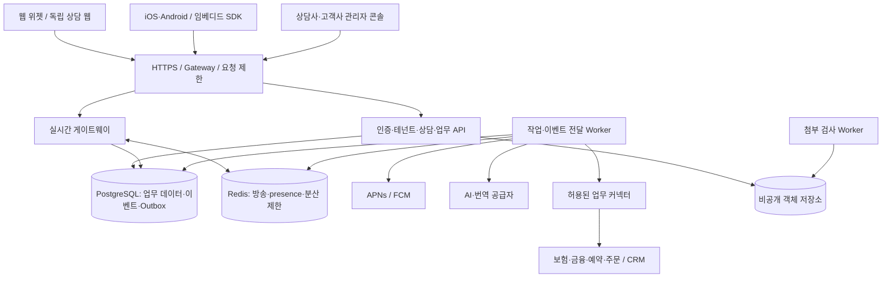

# Chating Server System — 범용 상담 전용 채팅 플랫폼 상세 개발 계획서

- 작성일: 2026-09-19
- 문서 버전: 1.0 / 개발 착수 기준안
- 대상: 웹·모바일 앱에서 사용하는 다중 고객사·다업종 상담 플랫폼
- 기반: 스템케어 상담채팅의 API, 운영자 화면, 실시간 통신, 번역·AI·운영 구현
- 제공 형태: 공용 SaaS를 기본으로 설계하고 고객사 전용 배포를 같은 코드베이스로 지원
- 구현 상태: 아래 신규 기능·수치·일정은 제안이며 현재 구현 또는 성능 달성 결과가 아님

## 1. 문서 목적과 기존 계획과의 관계

이 시스템의 목표는 스템케어 전용 상담 기능을 분리하는 데서 더 나아가, 보험·금융·여행·쇼핑 등 고객사의 업무에 맞게 구성할 수 있는 범용 상담 플랫폼을 만드는 것이다. 웹사이트 삽입 위젯, 독립 웹 상담 페이지, iOS·Android 앱 및 기존 고객사 앱 내 상담 화면이 동일한 상담 서버를 사용한다.

이전 [독립 채팅 구축계획서](<20260919_chating system_구축계획서.md>)는 단일 조직·웹 중심 분리를 다루었다. 본 문서는 **다중 조직 격리, 모바일, 고객 식별 연계, 업종 패키지, 외부 업무 시스템 연동**을 핵심 범위로 추가한다. 기존 문서는 원본 추출·회귀 검증 참고로 보존하되, 신규 범용 제품의 범위·아키텍처·일정은 본 문서를 우선한다.

| 항목 | 이전 계획 | 본 계획 |
|---|---|---|
| 고객사 구조 | 배포당 단일 조직 | 공용 SaaS의 다중 테넌트 + 전용 배포 옵션 |
| 사용자 채널 | 웹 페이지·iframe 위젯 | 웹 + iOS/Android 앱 + 임베디드 모바일 SDK |
| 업무 확장 | 브랜드·문의 유형 변경 | 업종 패키지·폼·워크플로·라우팅·지식·커넥터 |
| 고객 식별 | 익명 방 단위 세션 | 익명·인증 고객·외부 회원 ID의 검증된 연결 |
| 상담 모델 | 방·상태·담당자 중심 | 업무 건(Case)·대화·참가자·담당 팀·채널 분리 |
| 운영 | 단일 조직 운영자 | 플랫폼 운영자·고객사 관리자·팀장·상담사·감사자 |
| 확장 방식 | 새 설치 중심 | 설정과 버전이 있는 패키지, 제한된 연동 API |
| 배포 목표 | 단일 API 중심 | MVP 단일 인스턴스 허용, GA 다중 인스턴스 검증 |

상담 전용 제품이므로 친구 관계, 불특정 사용자 간 메신저, 커뮤니티·대규모 그룹채팅은 대상이 아니다. 업무 담당자 협업은 지원하되 모든 내부 협업이 고객에게 공개되지 않도록 별도 가시성 모델을 둔다.

## 2. 제품 원칙과 성공 기준

### 2.1 핵심 원칙

1. **채널 공통화:** 메시지·권한·업무 상태의 정답은 서버에 두며 웹과 앱에 서로 다른 업무 규칙을 구현하지 않는다.
2. **테넌트 격리:** 데이터·검색·소켓·캐시·파일·AI·작업·통계·백업/복구 경로 전체에 고객사 경계를 적용한다.
3. **업종 구성화:** 보험·금융·여행·쇼핑 분기를 채팅 핵심 코드에 직접 추가하지 않고 패키지와 정책으로 표현한다.
4. **안전한 연동:** 주문·계약·예약 정보는 원천 시스템이 소유하며 채팅은 최소한의 참조·표시·감사 기록을 저장한다.
5. **사람 중심 운영:** AI 없이 상담이 완료되어야 하며 고객의 사람 요청과 상담사의 개입이 AI보다 우선한다.
6. **재처리 가능성:** 연결 단절·앱 종료·서버 재시작·중복 이벤트를 정상 운영 조건으로 취급한다.
7. **점진적 출시:** 일반 상담부터 출시하고 민감한 업종·상태 변경 연동은 준비된 고객사별로 활성화한다.

### 2.2 제품 완료를 판단할 결과

- 동일 서버 빌드에서 쇼핑과 여행 고객사의 다른 폼·상담 분류·팀·업무 절차를 설정할 수 있다.
- 보험·금융 데모는 전용 정책·본인확인 단계·역할·승인 흐름을 갖추고 모의 업무 시스템에 연결된다.
- 익명 웹 상담을 인증한 동일 고객이 앱에서 이어볼 수 있으며 다른 고객·고객사 이력은 노출되지 않는다.
- iOS·Android 실기기에서 백그라운드 진입·앱 강제 종료·네트워크 변경 후 대화가 복원된다.
- API 또는 Worker 재시작 후 메시지·알림·AI·웹훅 작업이 누락 없이 재처리되고 사용자에게 중복 반영되지 않는다.
- 고객사를 추가할 때 핵심 코드 포크 대신 등록·설정·검증·배포된 커넥터 선택으로 도입한다.

## 3. 기준 시스템 분석과 재사용 범위

### 3.1 현재 구현에 대한 근거

| 확인 자료 | 확인 내용 |
|---|---|
| [README-chat.md](../../../README-chat.md) | Phase 0~6 로컬 구현·검증 기록과 운영 출시 전 잔여 항목 |
| [현재 Prisma 스키마](../../../apps/api/prisma/schema.prisma) | Operator, Customer, ChatRoom, Message, Summary, Note, Feedback |
| [API 계약](../../../apps/api/API.md) | 고객/운영자 REST, 소켓 인증·이벤트·재전송 |
| [공유 상수](../../../packages/shared/src/constants.ts) | 한일 언어, 고정 서비스 유형, 방 상태, 역할 |
| [메시지 서비스](../../../apps/api/src/messages/messageService.ts) | 공통 저장 함수, 방 잠금, clientMessageId 중복 방지 |
| [소켓 인증](../../../apps/api/src/realtime/authSocket.ts) | 고객 자격과 운영자 쿠키 구분, 운영자 활성 검사 |
| [백그라운드 작업](../../../apps/api/src/common/background.ts) | 메모리 기반 작업 추적 |
| [운영 Compose](../../../deploy/docker-compose.prod.yml) | 기존 API·관리자·홈페이지·DB·백업 구성 |

현재 스키마에는 tenantId, 앱 기기, 외부 고객 식별, 업무 건, 업종 패키지, 채널별 세션이 없다. 현재 image/file 타입 선언은 업로드 기능 완료를 의미하지 않는다. 기존 README의 테스트 통과 수는 이전 검증 기록이며 본 계획 작성 시 재실행한 결과가 아니다.

### 3.2 재사용·수정·신규 구분

| 영역 | 판단 | 구체 작업 |
|---|---|---|
| 메시지 저장·잠금·멱등성 | 재사용 후 확장 | tenant·actor·요청 fingerprint·순번 포함 |
| 고객/운영자 DTO | 원칙 재사용 | 테넌트·참가자·가시성·필드 마스킹 추가 |
| REST·Socket.IO | 재사용 | 버전 계약·재생 커서·다중 노드·세션 폐기 |
| 운영자 Next.js 화면 | 수정 | 테넌트/워크스페이스/팀, 개인 읽음, 업무 패널 |
| 고객 JS 위젯 | 추출·모듈화 | loader·iframe·SDK·공개 설정으로 분리 |
| 번역·AI 인계 | 정책 재사용 | 업종별 지식·인계·권한·비용·평가 분리 |
| 메모리 작업 | 교체 | DB 영속 작업·outbox·Worker·재시도 |
| 고객/운영자 인증 | 확장 | 외부 신원·세션·MFA/SSO 연계·토큰 회전 |
| 업종·워크플로 | 신규 | 패키지 버전·폼·규칙·승인·커넥터 |
| 모바일·푸시 | 신규 | 고객 앱·SDK·기기·오프라인·딥링크 |
| 배포·백업·테스트 | 재사용 후 강화 | 다중 테넌트·다중 노드·모바일·격리 복구 |

스템케어는 새 제품의 기본 업무가 아니라 초기 업종 패키지와 회귀 테스트 시나리오 중 하나가 된다. 기존 저장소에서 새 제품을 추출하되 기존 운영 자원·고객 정보·비밀값은 복사하지 않는다.

## 4. 서비스 계층과 도메인 용어

```text
Platform                 플랫폼 운영·고객사 등록·사용량·배포 관리
  Tenant                 계약·보안·데이터 격리 단위인 고객사
    Workspace            고객사 내 브랜드·사업부·상담 센터
      Channel            웹사이트, 독립 웹, iOS, Android, 외부 연동 채널
      Team / Queue       상담팀·배정 대기열
      ServiceDefinition  상담 서비스와 업종 패키지 적용 설정
        Case             주문 문의·보험 접수 등 하나의 업무 건
          Conversation   해당 건의 대화와 참가자·메시지
```

### 4.1 각 경계의 의미

- **Tenant:** 법인 또는 계약상 독립 고객사. 동일 이메일·전화번호라도 고객 정보는 테넌트 간 자동 연결하지 않는다.
- **Workspace:** 동일 고객사 내 쇼핑 브랜드·여행 부서 등. 같은 테넌트라도 접근 가능한 워크스페이스와 팀을 제한한다.
- **Channel:** 접속 경로와 앱/사이트 설정. Channel ID나 공개 appKey는 인증 비밀이 아니다.
- **Case:** 업무 처리의 상태·담당·SLA·외부 참조·폼 결과. 대화가 끝나도 처리 업무가 남을 수 있다.
- **Conversation:** 고객과 상담사의 통신 단위. 한 Case에 여러 대화가 연결될 수 있지만 MVP는 기본 대화 1개를 제공한다.
- **Participant:** 고객·상담사·협업자·봇의 참여 자격과 가시성. 실제 계정 또는 서비스 주체와 연결한다.
- **Identity:** 로그인 제공자의 issuer/subject와 검증된 고객 연결. 단순 표시 이름과 구분한다.

### 4.2 범위 결정

멀티테넌트 지원은 최초 스키마부터 필수다. 다만 모든 고객사에 같은 인프라를 강제하지 않는다. `deploymentMode=shared|dedicated`와 고객사 배치 레지스트리로 공용 또는 전용 데이터 영역을 선택한다. 전용 고객사를 위해 업무 코드를 포크하지 않는다.

여러 회사가 하나의 상담을 공동 처리하는 시장형 중개 모델은 GA 범위 밖이다. 후속 도입 시 명시적 동의·공유 계약·정보 복사 범위를 설계하며 tenantId를 바꾸어 공동 열람시키지 않는다.

## 5. 사용자 역할과 권한 모델

### 5.1 역할

| 역할 | 책임 | 기본 제한 |
|---|---|---|
| platform_admin | 고객사 수명주기·배포·사용량·플랫폼 장애 | 고객 대화 본문 상시 열람 불가 |
| tenant_owner | 계약·보안·관리자 지정 | 해당 테넌트만 |
| tenant_admin | 서비스·채널·폼·팀·권한 설정 | 승인되지 않은 타 워크스페이스 접근 금지 |
| supervisor | 팀 배정·SLA·품질·상담 인계 | 담당 범위·민감 필드 정책 적용 |
| agent | 담당 상담·메모·업무 처리 | 허용 팀 및 배정 정책 |
| auditor | 감사·승인된 기록 조회 | 기본 읽기 전용, 대량 추출 별도 권한 |
| customer | 본인 상담·첨부·평가 | 검증된 신원 및 참가 범위 |
| integration | 외부 시스템 API 호출 | 고객사·scope·자원·유효기간 제한 |

### 5.2 권한 판정

RBAC 역할과 자원 속성 정책을 함께 적용한다. 공통 판정 입력은 `tenantId, workspaceId, actorId, role/scopes, resource, action, assuranceLevel, assignment`다. 필드 수준 마스킹은 별도 정책으로 적용하며 프론트엔드 숨김만으로 보호하지 않는다.

| 작업 | 조건 |
|---|---|
| 상담 읽기 | 참가자 또는 허용 팀/감사 범위, 고객 공개 필드만 노출 |
| 고객 메시지 전송 | 유효한 고객 세션·대화 참여·전송 가능한 상태 |
| 상담사 답변 | 배정된 상담사 또는 명시적 협업 참여자 |
| 강제 재배정 | supervisor 이상 + 이유 + 감사 기록 |
| 민감 정보 열람 | 해당 업종 권한 + 요구되는 인증 수준 |
| 환불/계약/예약 변경 요청 | 별도 scope + 고객 신원·원천 소유권 + 승인 단계 |
| 대량 export | 별도 권한·사유·기간·파일 만료·감사 |
| 긴급 플랫폼 지원 | 테넌트 승인 또는 사전 합의된 비상 절차, 제한 시간·감사 |

한 운영자가 여러 고객사에 소속될 수 있지만 세션의 현재 tenant context는 명시적으로 선택한다. 테넌트 전환 시 소켓 구독·캐시·대기 입력·이전 화면 상태를 폐기한다. last owner 제거와 자신에게 더 높은 권한을 부여하는 요청을 차단한다.

## 6. 기능 범위와 릴리스 전략

| 릴리스 | 목적 | 필수 범위 | 제외/후속 |
|---|---|---|---|
| R0 기반 | 범용 구조와 계약 확정 | 테넌트 모델·권한·API/이벤트 계약·원본 추출·모바일 검증 PoC | 운영 고객 유입 |
| R1 웹 MVP | 고객사별 웹 상담 파일럿 | 테넌트·채널·설정형 폼·텍스트·배정·개인 읽음·첨부·감사·영속 작업 | 앱 정식 배포, 거래 실행 |
| R2 모바일 베타 | 웹과 앱의 상담 연속성 | iOS/Android 고객 앱·SDK 베타·푸시·외부 신원·오프라인·다기기 | 모든 네이티브 SDK 제품 동시 제공 |
| R3 범용 GA | 다업종 상용 운영 기반 | 패키지 4종·워크플로·커넥터·SLA·권한 강화·HA·복구·사용량 | 규제 업종의 계약 없는 실데이터 운영 |
| R4 확장 | 기업별 고급 수요 | 전용 배포 자동화·추가 SDK·고급 RAG·고객사별 인증/심사 대응 | 개별 범위 산정 |

보험·금융도 R3에서 템플릿과 모의 연동을 제공한다. 실제 계약 조회·고객정보 처리·상품 관련 업무는 해당 고객사의 인증·권한·보관·위탁·운영 요건을 확인한 뒤 별도 고객사 활성화 게이트를 통과한다. 업종 패키지 제공과 실제 업무 수행 권한 확보를 같은 완료로 보지 않는다.

핵심 기능 ID는 다음과 같이 관리한다.

| ID | 요구사항 | 인수 증거 |
|---|---|---|
| FR-TEN | 테넌트·워크스페이스 격리 | 두 고객사의 API/소켓/파일/검색/AI 교차 접근 실패 |
| FR-CHN | 웹·앱 공통 채널 | 같은 계약으로 웹·iOS·Android 상담 성공 |
| FR-IDN | 고객 신원과 이력 연결 | 검증된 동일 신원만 웹↔앱 이력 조회 |
| FR-MSG | 메시지 정합성 | 재전송·순서 역전·재시작 후 중복/누락 방지 |
| FR-OPS | 배정·협업·개인 읽음·SLA | 동시 배정·재배정·기한 계산 검증 |
| FR-DOM | 업종 패키지 | 4개 업종 설정·폼·흐름·정책 데모 |
| FR-INT | 외부 시스템 연계 | 서명·중복·타임아웃·소유권 검증 |
| FR-AI | 선택형 AI·번역·요약 | 테넌트별 OFF·평가·비용·인계 검증 |
| FR-MOB | 모바일 운영 | 실기기 푸시·복원·로그아웃 격리 |
| FR-SEC | 보안·감사·보관 | 권한·폐기·삭제·복구 리허설 |
| FR-SCL | 확장·관측·사용량 | 목표 부하·노드 장애·테넌트 quota 검증 |

## 7. 전체 시스템 아키텍처

### 7.1 초기 구조: 모듈형 서버 + 독립 Worker

기존 TypeScript API를 모듈 경계가 있는 단일 애플리케이션으로 확장한다. API, 실시간 게이트웨이, Worker는 독립 실행이 가능하게 만들되 처음부터 모든 도메인을 마이크로서비스로 나누지 않는다. 서비스 분리는 측정된 확장·배포·보안 필요에 따라 진행한다.



DB를 메시지와 업무 데이터의 원장으로 사용한다. Redis는 접속 상태·빠른 방송·요청 제한에 사용하며 Redis 장애만으로 저장된 상담이 사라지지 않아야 한다. 원장에 저장된 Outbox를 작업별 전달 이력과 함께 재처리한다.

### 7.2 모듈 책임

| 모듈 | 소유 데이터·역할 | 다른 모듈 접근 규칙 |
|---|---|---|
| tenancy | Tenant·Workspace·Channel·설정 버전 | 인증된 context 제공 |
| identity | 사용자·고객·신원·세션·기기 | 인증 결과와 scope 제공 |
| conversation | 대화·참가자·메시지·읽음·첨부 참조 | 메시지 쓰기 단일 서비스 |
| case-management | 업무 건·상태·폼·외부 참조 | 대화와 업무 상태 분리 |
| routing | 팀·스킬·대기열·배정·SLA | 원자적 배정 명령 사용 |
| workflow | 승인된 단계·전이·실행 상태 | 등록된 action만 호출 |
| industry | 업종 패키지·버전·검증 | 핵심 도메인 직접 DB 쓰기 금지 |
| integration | 커넥터·웹훅·외부 요청 이력 | tenant별 자격 증명 참조 |
| ai | 지식·번역·요약·정책·예산 | 권한 검증된 문맥만 사용 |
| operations | 감사·보관·usage·관측 | 고객 본문 기본 수집 금지 |

### 7.3 저장소 구조안

```text
chating-server-system/
  apps/
    api/                 # REST, 인증, 테넌트, 업무 모듈
    realtime/            # Socket.IO 실행 진입점; MVP는 api와 동시 실행 가능
    worker/              # Outbox, AI, 알림, 웹훅, 보관, 파일 검사
    agent-console/       # 상담사·팀장 화면
    tenant-console/      # 고객사 서비스·팀·정책 설정
    platform-console/    # 고객사·배포·사용량 관리, 본문 기본 비노출
    customer-web/        # iframe 및 독립 웹 상담
    customer-mobile/     # iOS/Android 기준 앱
  packages/
    contracts/           # OpenAPI, 이벤트 schema, 생성 타입
    domain/              # 공통 업무 서비스·정책
    sdk-web/             # 브라우저 SDK와 로더
    sdk-react-native/    # 초기 모바일 SDK와 UI 모듈
    ui-tokens/           # 색상·간격·문구 키, 화면 구현은 플랫폼별
    industry-packages/   # general, insurance, finance, travel, commerce, stemcare
    connector-contracts/ # 입출력·scope·멱등성·오류 계약
    testkit/             # 모의 고객사·데이터·업무 시스템
  deploy/ docs/ tests/
```

세 콘솔은 초기에는 같은 Next.js 프로젝트에서 권한·라우트를 나누고 논리 모듈로 관리할 수 있다. 위 트리는 목표 책임 구조이며 첫날부터 모든 디렉터리를 별도 배포할 필요는 없다. 모바일은 React Native/TypeScript를 기준안으로 삼되 P0에서 고객사의 Flutter/Swift/Kotlin 수요·기술 역량을 확인한다. 다른 클라이언트도 공개 HTTP·이벤트 계약으로 구현할 수 있어야 한다.

## 8. 멀티테넌트 데이터 격리와 배치

### 8.1 공용 SaaS 기본 정책

모든 업무 테이블은 tenantId를 가지며 워크스페이스 단위 테이블은 workspaceId도 포함한다. 전역 플랫폼 테이블은 명시적 allowlist로 구분한다. tenantId는 임의 요청 헤더를 그대로 신뢰하지 않고 로그인 membership, 등록 채널, 고객 토큰 또는 integration credential에서 서버가 확정한다.

| 계층 | 격리 방식 |
|---|---|
| API | TenantContext 필수, 자원별 정책, 목록·집계에도 필터 강제 |
| DB | tenantId 포함 FK·unique·인덱스 + RLS 방어 |
| 소켓 | 인증된 tenant/workspace/participant의 room만 구독 |
| 캐시 | 환경+tenant+workspace+권한/설정 버전 포함 키 |
| 객체 저장소 | tenant별 prefix와 서버 권한 검사, 비공개 객체 |
| 작업/이벤트 | tenantId·원인 actor·권한 스냅샷/현재 상태 검사 |
| 검색/RAG | 검색 이전 tenant·ACL 필터, 결과 재검증 |
| 통계/export | 집계 source 필터·다운로드 권한·만료 |
| 로그/추적 | tenant 식별자만 제한적으로 사용, 본문·토큰 제외 |
| 백업/복구 | 공유 DB 전체 복구와 특정 tenant 복원을 별도 절차로 분리 |

PostgreSQL RLS는 행 접근을 제한하지만 테이블 소유자·superuser·BYPASSRLS 권한에는 예외가 있다. 애플리케이션 역할과 migration 역할을 분리하고 필요 테이블에 FORCE RLS를 적용한다. [PostgreSQL 공식 RLS 문서](https://www.postgresql.org/docs/current/ddl-rowsecurity.html)

Prisma 요청은 명시적 트랜잭션 안에서 transaction-local tenant context를 설정하고 같은 트랜잭션 클라이언트로만 쿼리한다. 풀에 남는 session-level 설정을 사용하지 않는다. context 누락·빈 값은 deny로 처리하고 raw SQL·배치·관리 작업도 검증한다. RLS는 팀/참가자 권한까지 자동 해결하지 않으므로 서비스 권한 검사를 유지한다.

Outbox 전역 폴러처럼 여러 테넌트의 작업을 발견해야 하는 경로는 제한된 작업 메타데이터 저장소/역할만 사용한다. 본문·고객 정보를 읽는 실제 Worker 실행은 해당 tenant context로 수행한다. 단순 편의를 위해 API나 전체 Worker에 BYPASSRLS를 부여하지 않는다.

### 8.2 전용 배포 옵션

고객 요구에 따라 전용 DB, 객체 저장소, 암호화 키, Worker, 네트워크를 배치할 수 있게 한다. 전역 고객사 레지스트리는 tenant의 배치 위치만 제공하며 고객 본문을 집계하지 않는다. 공유/전용 양쪽은 같은 migration 버전·API 계약·패키지를 사용한다.

공유에서 전용으로 이동할 때는 대상 tenant를 일시 read-only → 복사·참조/건수 검증 → routing 전환 → 짧은 검증 기간 → 원본 정리 순서로 처리한다. 복사 중 양쪽 쓰기를 허용하지 않는다. 위치 전환 실패 시 어느 DB가 원장인지 명확히 유지한다.

## 9. 업종 확장 프레임워크

### 9.1 업종 패키지 구성

업종 패키지는 임의 서버 코드를 업로드하는 플러그인이 아니라 검증 가능한 선언형 설정과 승인된 커넥터 참조의 묶음이다.

```json
{
  "code": "commerce-support",
  "version": "1.0.0",
  "supportedContract": "v1",
  "serviceCategories": ["delivery", "return", "product"],
  "intakeSchemaRef": "commerce.intake.v1",
  "caseWorkflowRef": "commerce.case.v1",
  "routingPolicyRef": "commerce.routing.v1",
  "knowledgeCollectionRef": "commerce-faq",
  "allowedActions": ["order.read", "return.request"],
  "requiredAssurance": {"order.read": "verified_customer"},
  "aiPolicyRef": "commerce.ai.v1",
  "retentionPolicyRef": "tenant-approved-policy"
}
```

이는 목표 스키마 예시이며 현재 존재하는 파일 형식이 아니다. 패키지 설치 시 계약 버전·참조 존재·권한·필수 연동·폼 민감도·전이 유효성을 검증한다. tenant override는 허용 필드만 변경하고 플랫폼 보안·자격 요건을 낮출 수 없다.

### 9.2 확장 수준

| 수준 | 고객 요구 예시 | 구현 방식 |
|---|---|---|
| L1 설정 | 로고·문구·언어·시간·분류 | 관리자 설정, 코드 변경 없음 |
| L2 폼·흐름 | 주문번호 질문 후 배송 팀 배정 | 버전형 JSON schema와 선언형 워크플로 |
| L3 지식·정책 | 보험 FAQ·여행 취소 정책 | 승인된 지식과 인계/답변 범위 |
| L4 연동 | CRM 고객 조회·예약 조회 | 배포된 커넥터와 tenant별 자격 증명 |
| L5 신규 기능 | 새로운 승인 단계·도메인 action | 공통 extension 계약을 구현하고 제품 릴리스 |

고객별 `if (tenantId === ...)` 분기를 core에 넣지 않는다. 커넥터 코드는 CI 검증·코드 리뷰·서명된 배포 아티팩트로만 제공하고, 관리자 화면에서 JavaScript/SQL을 입력·실행하는 기능은 제외한다.

### 9.3 패키지 수명주기

초안 → 테스트 샌드박스 → 고객사 승인 → 게시 → 폐기 예정 순서로 관리한다. Case 생성 시 패키지·폼·워크플로·AI 정책 버전을 고정한다. 신규 버전은 신규 Case에 적용하며 진행 중 Case는 명시적 migration과 재검증 없이는 바꾸지 않는다. 취약한 정책의 긴급 차단은 버전 고정과 별개로 즉시 적용 가능한 상위 정책으로 둔다.

실패한 패키지 변경은 이전 활성 버전으로 되돌리고, 이미 생성된 Case를 자동으로 이전 스키마로 변환하지 않는다. preview와 diff에서 민감 필드 추가·보관 변경·권한 확대를 확인할 수 있게 한다.

## 10. 보험·금융·여행·쇼핑 상세 적용

아래는 업무 지원 설계다. 특정 국가의 자격·법률·규정 충족 여부를 확정하는 내용이 아니며, 고객사 및 제공 지역이 정해지면 별도 요건 검토 결과를 정책으로 반영한다.

| 업종 | 상담 분류·입력 | 업무 흐름 예시 | 연동 | AI와 권한 경계 |
|---|---|---|---|---|
| 보험 | 상품 문의, 계약 관리, 사고/청구 안내; 상품군·문의 사유·동의 | 문의→본인확인→권한 있는 상담사 배정→서류 안내→후속 접수 | 고객/계약/청구 시스템 | 보장·인수·지급 확정은 자동 생성하지 않음; 계약 조회에 추가 인증 |
| 금융 | 이용 안내, 계좌 서비스, 민원; 서비스 유형·문의 사유 | 일반 안내→본인확인→전문팀→검토·회신 | CRM·계좌/민원 시스템의 제한된 API | 주문·이체·신용 판단은 기본 제외; 상품 관련 응대 범위 고객사 정책 적용 |
| 여행 | 일정, 예약, 변경, 취소; 여행일·인원·언어·예약 참조 | 요구 수집→전문팀→예약 조회→변경안 확인→외부 확정 확인 | 예약·재고·일정·결제 서비스 | 재고·가격·예약 여부는 원천 조회; AI가 확정을 만들어내지 않음 |
| 쇼핑 | 배송, 반품, 상품, 결제 문의; 주문 참조·품목·사유 | 소유권 확인→주문 조회→정책 안내→반품 요청→처리 결과 | 주문·배송·재고·반품/CRM | 환불 승인·결제정보 변경은 별도 승인과 외부 성공 확인 |

### 10.1 보험 패키지

- 폼에는 일반 문의에 필요한 최소 항목만 둔다. 건강 정보·증빙이 필요한 후속 업무는 별도 동의와 보안 폼/첨부 단계에서 받는다.
- 계약번호만 입력했다고 해당 계약을 보여주지 않는다. 검증된 외부 고객 subject와 계약 소유자를 매칭한다.
- 자격·업무 범위가 맞는 팀에 배정하고 담당 변경 이력을 남긴다.
- 대화 중 생성한 요약·필요 서류 안내와 실제 청구 접수 상태를 구분한다.
- 샌드박스 인수 시나리오: 고객 A가 고객 B의 계약 참조로 접근하면 거절; 서류 요청·담당 인계·진행 상태 조회 성공.

### 10.2 금융 패키지

- 앱/고객사 인증 시스템의 확인 결과를 짧은 유효기간과 목적 scope로 수신한다. 채팅 서비스가 계좌 비밀번호·OTP·보안카드 값을 수집하지 않는다.
- 일반 안내와 고객 계정 관련 상담을 분리한다. 후자는 step-up 인증을 요구하고 만료 시 재확인한다.
- 개인화된 금융 의사결정이나 거래 실행을 범용 AI의 기본 기능으로 제공하지 않는다.
- 감사 역할, 대화·서류 접근 범위, 보관/삭제 충돌 처리 및 export 승인을 고객사와 설정한다.
- 샌드박스 인수 시나리오: 인증 만료 시 계정 조회 차단; 팀장 검토·민원 상태 기록; 로그/푸시에 계정 상세 없음.

### 10.3 여행 패키지

- 여행일·인원·시간대·선호 언어·목적 등을 구조화하고 필요한 경우에만 예약 식별자를 수집한다.
- 예상안·견적·예약 요청·확정을 각각 다른 상태와 카드로 표시한다.
- 외부 예약 상태 변경은 idempotency key와 고객 확인을 사용하고 응답 불명 시 재조회한다.
- 취소 조건은 해당 예약/정책 버전에 연결하며 오래된 FAQ로 확정 답변하지 않는다.
- 샌드박스 인수 시나리오: 견적 후 재고 변경·시간대 차이·외부 timeout에서도 미확정 상태를 명확히 유지.

### 10.4 쇼핑 패키지

- 고객사의 인증된 주문 API로 주문 소유권과 품목을 검증한다. 사용자가 보낸 주문 ID를 권한으로 취급하지 않는다.
- 배송 조회는 읽기 action, 반품 요청은 승인 가능한 쓰기 action으로 분리한다.
- 파손 사진은 첨부 검사 후 담당자에게 공개하고 업로드 자체가 반품 승인이라는 문구를 사용하지 않는다.
- 취소/환불 성공 여부는 외부 시스템 상태와 대조하며 상담 종료와 별도로 업무 결과를 저장한다.
- 샌드박스 인수 시나리오: 중복 반품 요청 1건만 반영, 외부 응답 유실 후 조회로 결과 확정.

새 업종 추가 시 공통 체크리스트는 입력 필드·데이터 민감도·신원 수준·팀 스킬·상태/승인·원천 시스템·AI 범위·보관·검수 세트다. 새 업종마다 이 항목만 추가해 core 변경 없이 동작하는지를 제품 확장성 인수 기준으로 삼는다.

## 11. 고객 웹과 설치형 위젯

### 11.1 제공 화면

서비스 선택 → 동의/기본 폼 → 상담 시작 → 대화/업무 카드 → 사람 인계 → 후속 처리 상태 → 종료/평가를 제공한다. 인증된 고객은 자신의 진행·종료 상담 목록을 조회한다. 익명 고객에게는 유효한 세션으로 증명되는 상담만 제공한다.

외부 사이트에는 버전 고정 loader와 iframe UI를 제공한다. 공개 appKey로 채널 설정을 조회하되 appKey를 인증 수단으로 보지 않는다. 허용된 부모 Origin, CSP frame-ancestors, postMessage의 origin/source/type을 검증한다. 관리자 콘솔의 프레임 삽입은 금지한다.

```html
<!-- 목표 설치 계약 예시 -->
<script src="https://chat.example.com/sdk/v1/loader.js"
        data-app-key="public-channel-key"
        data-locale="ko" defer></script>
```

### 11.2 웹 SDK 계약

`initialize`, `open`, `close`, `startConversation`, `identify`, `logout`, `onUnreadChanged`, `destroy`를 제공한다. identify는 고객사가 서버에서 발급한 단기·단일 목적 서명 assertion 또는 교환 코드만 받는다. 브라우저가 임의 customerId를 지정하여 다른 고객으로 전환할 수 없어야 한다.

외부 부모 페이지에 본문·고객 토큰·내부 상태를 노출하지 않는다. 공개 이벤트는 위젯 열림/닫힘·인증 필요·새 상담 시작 등 최소한으로 제공한다. 고객 정보가 포함된 콜백은 별도 계약과 권한 없이는 추가하지 않는다.

브라우저 저장소 차단 시 메모리 세션으로 계속 사용하고 영속 복원의 한계를 안내한다. 직접 상담 페이지로 이동할 때는 단기 일회용 교환 코드를 서버에서 원자적으로 소비한다. 원본 access/refresh token을 URL에 넣지 않는다.

### 11.3 품질 조건

모바일 360px, 데스크톱, 화면 확대, 키보드 탐색, 스크린리더, IME 조합 중 Enter를 검증한다. 과거 메시지 열람 중 강제 스크롤하지 않으며 새 메시지 도착과 전송 실패를 구별한다. 이전 방의 늦은 응답을 현재 화면에 반영하지 않도록 roomId·요청 세대 검사를 적용한다.

## 12. iOS·Android 앱과 모바일 SDK

### 12.1 제공 전략

| 제품 | R2/R3 범위 | 비고 |
|---|---|---|
| 고객 기준 앱 | iOS·Android의 서비스 진입·이력·대화·첨부·푸시 | SDK 검증용이면서 독립 앱 배포의 기준 구현 |
| React Native SDK | headless 통신 + 선택형 상담 UI | 기존 TypeScript 역량을 활용하는 기준안 |
| Native/Flutter 연동 | HTTP/이벤트 계약·인증/푸시 연동 가이드 | 전용 UI SDK는 수요에 따라 R4 |
| 상담사 모바일 | 반응형 웹 기본, 전용 앱은 후속 | 고객 앱과 상담사 앱의 보안 범위 분리 |
| 고객사 브랜드 앱 | 테마·채널·앱 설정 분리 | 각 앱의 서명·푸시 자격·배포 계정 별도 |

고객용 통합 앱이 모든 회사의 고객 신원을 하나로 합치는 서비스는 아니다. 앱 안에서 고객사를 전환해도 tenant별 인증·저장소·이력·알림 경계를 유지한다. 실제 앱 게시 범위와 앱스토어 계정 소유자는 P0에서 결정한다.

### 12.2 SDK 구성

- transport: REST 명령, Socket.IO 구독, 커서 동기화, 오류 매핑.
- session: 외부 로그인 결과 교환, 토큰 갱신·폐기, 테넌트 전환.
- local-store: 계정/tenant별 암호화된 메시지 캐시·발신 큐·커서.
- notifications: 기기 등록·토큰 변경·수신·탭 진입 라우팅.
- UI: 목록·대화·작성·첨부·폼·업무 카드·연결/재전송 상태.
- lifecycle: foreground/background·네트워크 변경·앱 복원 처리.

서버 비밀과 고객사 integration secret을 앱에 포함하지 않는다. native 로그인은 시스템 브라우저 기반 Authorization Code + PKCE 방식으로 설계하고 issuer·redirect URI·state 및 OIDC 사용 시 nonce를 확인한다. [RFC 8252: 네이티브 앱 OAuth 권고](https://datatracker.ietf.org/doc/html/rfc8252)

### 12.3 앱 수명주기와 동기화

| 상황 | 앱 동작 | 서버 동작 |
|---|---|---|
| foreground | 세션 확인→증분 동기화→소켓 구독 | 권한 및 마지막 커서 검사 |
| background | 소켓 지속을 보장하지 않음, 상태 저장 | 필요 시 최소 정보 푸시 |
| 앱 강제 종료 | 로컬 전송 큐·커서 보존 | 메시지·이벤트 원장 유지 |
| 복귀/재실행 | 토큰 갱신→누락 이벤트 조회→발신 재시도 | 동일 멱등 키에 기존 결과 반환 |
| Wi-Fi↔셀룰러 | backoff+jitter로 재연결 | 중복 연결·메시지 허용 범위 통제 |
| 다른 기기에서 열람 | 사용자 기준 읽음 커서 동기화 | lastReadSeq는 감소하지 않음 |
| 로그아웃/계정 변경 | 캐시·발신 큐·키·기기 연결 정리 | refresh 세션·push 연결 폐기 |

오프라인 전송 UI는 ‘대기 중’으로 표시한다. 서버 ACK 전에는 전달 완료로 표시하지 않는다. 로그아웃하면 이전 계정 발신 큐를 새 계정으로 전송하지 않는다. 메시지 수정 후 재전송은 새 clientMessageId를 사용한다. 작성 중 파일은 별도 업로드 상태를 관리한다.

### 12.4 푸시·딥링크

APNs/FCM은 새 메시지가 있다는 신호로 사용하며 대화 전달 원장으로 사용하지 않는다. Apple의 백그라운드 알림은 전달이 보장되지 않고, FCM 메시지 수명도 TTL 설정에 영향을 받으므로 앱 재진입 시 서버 동기화를 반드시 수행한다. [Apple 백그라운드 알림](https://developer.apple.com/documentation/usernotifications/pushing-background-updates-to-your-app), [FCM 메시지 수명](https://firebase.google.com/docs/cloud-messaging/customize-messages/setting-message-lifespan)

푸시 기본 본문은 ‘새 상담 메시지가 있습니다’이며 계좌·계약·주문 상세와 대화 본문을 포함하지 않는다. payload는 tenant/channel 식별, 불투명 conversation 참조, 이벤트 식별자 등 최소 항목으로 구성한다. 알림 탭은 앱 로그인·tenant·참가자 검증 후 이동하며 payload만으로 화면 권한을 부여하지 않는다.

DeviceInstallation은 앱 식별·환경·기기 설치 ID·사용자 연결·푸시 토큰·마지막 갱신을 관리한다. 토큰 회전·제공자 invalid 응답·앱 로그아웃·계정 변경을 처리하고 채널별 자격 증명을 분리한다. WebView 자체에 API 키를 심는 방식으로 푸시를 구현하지 않는다.

### 12.5 실기기 출시 조건

iOS/Android 각각 알림 허용/거절, 앱 foreground/background/강제 종료, 토큰 만료, 낮은 네트워크, 딥링크, 시스템 글꼴 확대, 접근성, 첨부 권한 거절을 검수한다. 앱 서명·스토어 메타데이터·개인정보 고지·심사 대응·배포 계정 준비는 서버 개발과 별도 작업으로 관리하며 심사 소요시간은 확정 개발 일정에 포함해 보장하지 않는다.

## 13. 고객 식별·인증·세션과 채널 연속성

### 13.1 인증 수준

| 수준 | 의미 | 허용 범위 예시 |
|---|---|---|
| anonymous | 채널에서 발급한 익명 세션 | 해당 세션으로 시작한 일반 문의 |
| verified_customer | 고객사 서버/IdP가 확인한 회원 | 본인 상담 목록·일반 주문 조회 |
| step_up_verified | 추가 인증 및 목적/시간 제한 충족 | 해당 정책이 요구하는 민감 정보 조회 |
| operator | 활성 membership·역할·세션 | 업무 범위 내 상담사 기능 |
| integration | 서버용 credential·scope | 등록된 시스템 연동만 |

앱 설치 ID·이메일 입력·전화번호 입력·주문번호는 그 자체로 검증된 신원이 아니다. 외부 ID 연결은 `(tenantId, issuer, subject)`를 유일 키로 사용한다. 동일 이메일로 다른 테넌트의 고객을 찾거나 병합하지 않는다.

### 13.2 외부 회원 인증 교환

1. 고객은 고객사 웹/앱에서 로그인한다.
2. 고객사 서버는 등록된 서명 키로 tenant/channel/issuer/subject/audience/만료/jti를 포함한 단기 assertion을 발급하거나 서버 간 일회용 코드를 생성한다.
3. 채팅 인증 서버는 서명·audience·발급자·만료·재사용·채널을 검증하고 목적에 맞는 세션을 발급한다.
4. access token에는 최소 식별·scope·session 참조만 포함하고 개인정보를 넣지 않는다.
5. refresh token은 회전하며 재사용 감지 시 해당 token family를 폐기한다. 동시 갱신은 SDK single-flight와 서버 정책으로 제어한다.

웹 관리자에는 HttpOnly·Secure 쿠키와 CSRF 방어를 적용한다. 모바일 refresh token은 OS 보안 저장소에 저장하고 브라우저 JS 저장소에 장기 관리자 세션을 넣지 않는다. access token·고객 방 토큰은 로그·query string·분석 이벤트로 전달하지 않는다.

### 13.3 익명 상담을 회원에 연결

현재 익명 상담을 볼 수 있는 유효 세션 증명과 새 회원 인증을 함께 제시해야 연결한다. 일회용 link 요청을 서버에서 원자적으로 처리하고 해당 테넌트의 고객으로만 이동시킨다. 연결 전후 범위와 기존 참가자 권한을 기록하고 오래된 익명 자격을 폐기 또는 제한한다.

연결은 현재 증명한 익명 상담을 회원 소유로 전환하는 작업이며, 같은 전화번호의 모든 익명 대화를 찾아 병합하는 작업이 아니다. 여러 채널에서 같은 고객으로 인증되면 동일 Customer와 연결하되 workspace 접근 정책을 적용한다.

### 13.4 세션 폐기와 감사

로그아웃·계정 비활성화·역할 변경·보안 사고 시 세션 버전을 올리고 관련 소켓과 기기 알림 연결을 종료한다. 소켓은 최초 연결 인증만으로 무기한 권한을 유지하지 않으며 중요한 명령·민감 데이터 전달 전에 만료와 현재 권한을 확인한다. 캐시를 사용하는 경우 폐기 전파 지연 목표를 정하고 민감 작업은 authoritative 검사로 처리한다.

## 14. 상담 운영·라우팅·SLA·협업

### 14.1 상담사 콘솔

| 화면 | 상세 기능 |
|---|---|
| 통합 인박스 | 허용 workspace/team별 대기·담당·보류·종료, 개인 읽음, 우선순위 |
| 상담 상세 | 고객 공개 대화, 원문/번역, 작성·첨부·카드, 연결 상태 |
| 업무 패널 | 업종별 폼·Case 상태·외부 조회·승인 요청·SLA |
| 내부 협업 | 내부 메모·담당 인계·권한 있는 협업자 초대 |
| 고객 패널 | 검증된 고객 정보·허용된 이력·동의·인증 수준 |
| 팀 운영 | 근무·가용 상태·동시 상담 한도·배정 규칙 |
| 관리자 | 채널·폼·패키지·팀·권한·지식·연동·보관 |
| 품질/감사 | SLA·이관·답변 평가·감사 조회·승인된 export |

내부 메모는 고객 Message의 visibility 값을 실수로 바꾸어 공개하지 않도록 별도 작성 경로와 DTO를 사용한다. ‘내부 메모’와 ‘고객에게 보내기’는 입력 UI도 명확히 구별한다.

### 14.2 배정 규칙

초기 라우팅은 서비스 유형·언어·업무 스킬·영업시간·우선순위·상담사 수용량을 사용한다. 우선순위 → 적격 팀 → 가용 상담사 → 최소 진행 건수 → 동률 round-robin 순서로 결정하고 규칙 버전을 남긴다.

presence와 근무 가용성은 다르다. 소켓 연결만으로 상담을 배정하지 않고 상담사가 설정한 available/away/offline과 수용량을 확인한다. 배정 트랜잭션은 Case와 상담사 용량 레코드를 일관된 순서로 잠그거나 원자적 조건부 갱신하여 한도를 넘지 않게 한다.

수동 가져오기·자동 배정이 경쟁하면 1건만 성공한다. 재배정·장기 미응답은 supervisor 규칙으로 처리하고 기존 작성 draft를 임의 전송하지 않는다. 외부 알림은 별도 작업으로 보내며 배정 DB 트랜잭션에서 기다리지 않는다.

### 14.3 SLA 정의

- 첫 응답: 접수 후 최초 사람의 공개 답변까지. 시스템 안내·봇 답변은 별도 지표로 구분한다.
- 후속 응답: 미응답 고객 메시지의 가장 이른 대기 시점부터 다음 유효 답변까지.
- 업무 해결: Case 생성부터 resolved까지이며 closed 시각과 구분한다.
- 영업시간: tenant 시간대·휴일·시간표 버전으로 계산하며 해외 확장 시 DST를 검수한다.
- 보류: waiting_customer 또는 승인된 외부 대기만 정책에 따라 시계를 멈추고 이유·시각을 기록한다.

SLA 작업은 dueAt과 기준 이벤트를 영속 저장하고 재시작 후 재개한다. 설정 변경이 진행 중 Case의 기한을 조용히 바꾸지 않게 하며 supervisor가 재계산하면 이력을 기록한다.

## 15. 데이터 모델 상세 설계

### 15.1 핵심 엔터티

| 영역 | 엔터티와 주요 필드 | 제약/설계 |
|---|---|---|
| 조직 | Tenant(id,status,deploymentMode), Workspace(tenantId,code) | tenant+code unique |
| 채널 | Channel(tenantId,workspaceId,type,publicKey,allowedOrigins,appIdentifiers) | 키는 공개용, 비밀 별도 |
| 운영자 | User, Membership(tenantId,userId,role,status), Team, TeamMember | 전역 로그인과 tenant 소속 분리 |
| 고객 | Customer(tenantId,id,displayName,locale), CustomerIdentity(issuer,subject) | tenant+issuer+subject unique |
| 세션 | Session, RefreshTokenFamily, GuestGrant, DeviceInstallation | 해시/참조 저장, 만료·폐기 |
| 서비스 | ServiceDefinition, IndustryPackageVersion, TenantPackageInstallation | 활성 버전 및 override 검증 |
| 업무 | Case(tenantId,workspaceId,customerId,serviceId,status,assignedTeamId,agentId,version) | 생성 시 정책 버전 고정 |
| 대화 | Conversation(tenantId,caseId,state,mode,lastMessageSeq,lastEventSeq,revision) | Case 상태와 별도 |
| 참가 | ConversationParticipant(tenantId,conversationId,principalId,role,joinedAt,leftAt) | 고객/상담사 권한 명시 |
| 메시지 | Message(tenantId,conversationId,seq,actorId,type,body,revision,clientMessageId) | 대화 순번·멱등 키 unique |
| 번역 | MessageTranslation(messageId,targetLocale,status,text,version,editedBy) | 다언어를 원문과 분리 |
| 읽음 | ReadCursor(tenantId,conversationId,participantId,lastReadSeq) | 사용자 기준, 단조 증가 |
| 첨부 | Attachment(tenantId,conversationId,objectKey,size,mime,scanState) | 소유·검사·보관 상태 |
| 업무 양식 | FormDefinitionVersion, FormSubmission(caseId,schemaVersion,data) | 필드 민감도·검증 |
| 외부 참조 | ExternalResourceRef(caseId,connectorId,resourceType,externalId) | tenant 범위, 임의 URL 금지 |
| 작업 | Job(tenantId,type,dedupeKey,status,leaseToken,leaseUntil,attempts) | lease·재시도·dead letter |
| 이벤트 | ConversationEvent, OutboxEvent, EventDelivery | 업무 기록과 전달 상태 분리 |
| 연동 | ConnectorInstallation, WebhookSubscription, IntegrationOperation | credential secret reference |
| AI | KnowledgeCollection/DocumentVersion, AIExecution, UsageRecord | tenant·ACL·정책·비용 |
| 운영 | SLAClock, AuditLog, ConsentRecord, RetentionPolicy, DeletionRequest | 목적별 보관 기간 |

전역 User는 운영자 로그인 계정의 편의를 위한 모델이다. 고객 Customer는 tenant별로 유지하고 이 구조를 이용해 서로 다른 회사의 고객 프로필을 합치지 않는다.

### 15.2 메시지·이벤트 순서

메시지 seq는 공개 대화에서의 저장 순서를 나타낸다. ConversationEvent sequence는 메시지 생성·번역 갱신·상태·읽음 등 동기화 가능한 변경 순서를 나타낸다. 내부 전용 이벤트는 고객 스트림에 포함하지 않고 고객용 불투명 커서로 내부 내용/건수 노출을 최소화한다.

메시지·방 version과 이벤트 sequence를 같은 잠금 범위에서 증가시킨다. 클라이언트 시각으로 메시지 순서를 결정하지 않는다. 삭제/정정은 tombstone 또는 revision 이벤트로 동기화하고 보관 정책상 완전 삭제되는 내용은 로그·Outbox payload에 중복으로 남기지 않는다.

### 15.3 키와 인덱스

- tenant 테이블 자원에는 `(tenantId,id)` 유일 제약을 두고 자식 FK도 tenantId를 포함한다.
- Message: `(tenantId,conversationId,seq)` 및 `(tenantId,conversationId,actorId,clientMessageId)` unique.
- Case 목록: `(tenantId,workspaceId,status,lastActivityAt,id)`, 담당자별 조회 보조 인덱스.
- Event: `(tenantId,conversationId,sequence)` unique; 작업 claim은 `(status,runAfter)` 등 실행 패턴에 맞게 구성.
- CustomerIdentity: `(tenantId,issuer,subject)` unique; 전화번호·이메일은 신원 키로 사용하지 않는다.
- ReadCursor: `(tenantId,conversationId,participantId)` unique; 갱신은 기존 값보다 클 때만 적용.
- 외부 실행: `(tenantId,connectorId,idempotencyKey)` unique; 동일 키의 입력 fingerprint 불일치 거절.

유연한 폼 결과는 JSONB에 저장할 수 있지만 tenant·권한·상태·외부 참조를 JSON 내부에만 넣지 않는다. 자주 검색할 필드는 승인된 인덱스/추출 컬럼으로 관리하고 tenant가 임의로 무제한 인덱스를 생성하지 않게 한다.

### 15.4 migration

새 제품은 별도 DB 초기 migration으로 시작하는 것을 기본안으로 한다. 스템케어 데이터를 이관할 때는 legacy ID 매핑과 초기 Tenant/Workspace/Service/Case 생성 후 관계를 검증한다. 글로벌 email unique 같은 기존 제약은 신규 identity/membership 설계와 충돌하지 않도록 재정의한다.

운영 migration은 expand→dual compatibility→backfill→검증→contract 순서를 따른다. 모든 tenant를 한 번에 대규모 잠그지 않으며 배치·재시도·진행률을 제공한다. 전용 배포는 버전 호환 행렬과 순차 rollout을 유지한다.

## 16. REST API·SDK 계약

### 16.1 공통 계약

기본 경로는 `/api/v1`이다. OpenAPI를 기준으로 SDK 타입·오류·예제를 생성하고 이벤트 JSON schema와 함께 버전 관리한다. 예제 tenantId는 사용자가 선택한 경로일 뿐, 서버가 검증한 tenant context와 일치해야 한다.

| API 그룹 | 대표 경로 | 인증/권한 |
|---|---|---|
| 부트스트랩 | GET `/public/channels/:appKey/config` | 공개 설정만, 활성 채널 |
| 익명 진입 | POST `/guest/sessions` | 채널·속도 제한·정책 동의 |
| 인증 교환 | POST `/auth/exchange`, `/auth/refresh`, `/auth/logout` | assertion/세션·회전 검증 |
| 신원 연결 | POST `/customers/link-guest` | 익명 증명+회원 인증 모두 |
| 고객 이력 | GET `/me/cases`, `/me/conversations` | tenant별 본인·workspace 범위 |
| 상담 생성 | POST `/conversations` | 서비스·폼·고객 context, 멱등 키 |
| 대화 조회 | GET `/conversations/:id` | 참가·업무 범위별 DTO |
| 과거 메시지 | GET `/conversations/:id/messages?before=...` | 커서·페이지 크기 제한 |
| 변경 동기화 | GET `/conversations/:id/events?after=...` | 역할별 스트림·커서 |
| 메시지 | POST `/conversations/:id/messages` | actor는 서버 결정 |
| 읽음 | PUT `/conversations/:id/read-cursor` | 본인 cursor, 단조 증가 |
| 사람 인계 | POST `/conversations/:id/handoff` | 고객/정책, 중복 방지 |
| 첨부 | POST `/attachments/init`, `/:id/complete`; GET `/:id/download` | tenant·참가·검사 상태 |
| 업무 | GET/PATCH `/cases/:id`; POST `/:id/actions/:action` | 상태·version·scope·승인 |
| 배정 | POST `/cases/:id/assignments` | 팀·수용량·경쟁 처리 |
| 기기 | POST `/me/devices`; DELETE `/me/devices/:id` | 현재 세션·앱 채널 |
| 설정 | `/admin/workspaces`, `/channels`, `/services`, `/packages` | tenant 관리 권한 |
| 팀 | `/admin/teams`, `/memberships`, `/routing-policies` | 역할·최종 owner 보호 |
| 연동 | `/admin/connectors`, `/webhooks` | 비밀 reference·scope |
| 운영 | `/admin/metrics`, `/audit-logs`, `/exports` | 범위·마스킹·감사 |
| 플랫폼 | `/platform/tenants`, `/deployments`, `/usage` | 별도 플랫폼 세션 |

### 16.2 메시지 요청 예시

```json
{
  "clientMessageId": "device-generated-uuid",
  "type": "text",
  "content": {"text": "주문 배송 상태를 확인하고 싶습니다."},
  "attachmentIds": [],
  "replyToMessageId": null
}
```

tenantId·actorId·role·발신자 종류를 본문에서 받아 그대로 저장하지 않는다. 요청 정규화 후 fingerprint를 계산하여 같은 멱등 키·같은 입력은 기존 결과, 다른 입력은 409 IDEMPOTENCY_CONFLICT로 처리한다.

상담 생성의 멱등성도 지원하되 고객 credential 발급과 대화 생성을 분리한다. 익명 세션을 먼저 발급한 뒤 해당 세션 범위의 생성 키를 사용하면 방 생성 응답에 재현 불가능한 일회용 장기 토큰을 넣는 문제를 줄일 수 있다.

### 16.3 오류와 호환성

오류는 `{error:{code,message,requestId,retryable,details?}}`로 통일하고 개인정보·스택·SQL은 제외한다. 401 SESSION_EXPIRED, 403 ACTION_FORBIDDEN, 409 VERSION_CONFLICT/IDEMPOTENCY_CONFLICT, 429 RATE_LIMITED/QUOTA_EXCEEDED, 503 DEPENDENCY_UNAVAILABLE를 구분한다.

페이지 크기 기본 50·상한 100, 본문 기본 4,000자·파일 한도는 서버 설정으로 시작하고 부하/UX 검증 후 확정한다. 업종 패키지는 상한을 낮출 수 있지만 플랫폼 최대치를 넘기지 못한다.

앱 업데이트가 즉시 적용되지 않으므로 필드 추가는 하위 호환을 유지한다. 이벤트에 schemaVersion·capabilities를 두고 알 수 없는 카드/이벤트는 안전한 텍스트 대체 또는 갱신 안내로 처리한다. GA 초기 지원 정책은 현재 및 직전 minor SDK를 최소 지원하고, 실제 지원 기간·강제 업데이트 사유는 출시 정책에 명시한다. 서버 배포마다 앱의 즉시 업데이트를 요구하지 않는다.

## 17. 실시간·정합성·개인 읽음

### 17.1 전송 계약

모바일과 외부 연동의 일관성을 위해 신규 SDK의 기본 쓰기는 REST, 실시간 수신은 Socket.IO로 제공한다. 기존 소켓 전송 경로를 유지한다면 동일 command service를 호출하고 같은 idempotency 계약을 적용한다. 소켓 transport ACK와 DB 저장 ACK를 혼동하지 않는다.

```json
{
  "eventId": "server-event-id",
  "type": "message.created",
  "schemaVersion": 1,
  "conversationId": "conversation-id",
  "cursor": "opaque-authorized-stream-cursor",
  "entityRevision": 1,
  "occurredAt": "2026-09-19T00:00:00Z",
  "payload": {"messageId": "message-id"}
}
```

유형은 message.created/updated/redacted, conversation.updated, assignment.changed, read.updated, typing.changed, presence.changed, case.updated 등으로 정의한다. 내부 메모·감사·승인 이벤트는 권한이 있는 별도 스트림에만 전달한다.

### 17.2 저장부터 전달까지

1. 인증·tenant·참가자·상태·quota·본문을 검증한다.
2. 대화 잠금 안에서 멱등 키를 확인하고 Message·Conversation 갱신·Event·Outbox를 같은 트랜잭션으로 저장한다.
3. DB 커밋 후 저장 ACK를 반환한다. 클라이언트가 ACK를 못 받았어도 같은 키로 결과를 조회/재요청할 수 있다.
4. Worker가 Outbox를 읽어 실시간 방송·푸시·AI 등 대상별 전달 작업을 만든다.
5. 수신 클라이언트는 eventId/revision으로 중복을 제거하고 불연속 커서면 REST 동기화를 수행한다.

전달 모델은 적어도 한 번 전달과 중복 제거다. 외부 네트워크까지 정확히 한 번 전달된다고 보장하지 않는다. DB commit 후 방송 전 장애는 Outbox 재처리로 복구한다.

### 17.3 재연결과 이벤트 보관

초기 snapshot과 커서를 일관된 DB 기준에서 제공하고 커서 이후 이벤트를 재생한다. snapshot 조회와 소켓 구독 사이의 변경도 재생으로 복구한다. 동일 시각에 생성된 메시지는 seq로 정렬한다.

이벤트 TTL 만료 시 CURSOR_EXPIRED와 재동기화 안내를 반환하고 최근 snapshot 및 과거 메시지 페이지를 다시 조회한다. 인증된 사용자의 전체 상담 목록도 증분 알림 또는 목록 재조회로 보완한다. 생성 이후 번역·첨부 검사·정정 변경을 놓치지 않도록 createdAt 기준만 사용하지 않는다.

### 17.4 읽음·접속·입력 중

읽음은 참가자가 실제 화면에 표시한 lastReadSeq를 명시적으로 제출할 때 갱신한다. 상담방 join이나 상세 GET을 읽음으로 간주하지 않는다. 상담사별 unread와 팀 대기 미응답을 서로 다른 지표로 제공한다.

다기기에서는 사용자 읽음 cursor가 max 연산으로 합쳐지고 감소하지 않는다. presence는 Redis TTL 기반으로 계산하고 disconnect 유실 시 만료되게 한다. typing은 저장하지 않는 짧은 TTL 이벤트이며 빈도를 제한한다.

### 17.5 다중 노드

Socket.IO 다중 노드 운영에는 노드 간 방송 어댑터가 필요하고 HTTP long-polling을 유지하면 sticky session 구성이 필요하다. [Socket.IO 다중 노드 공식 문서](https://socket.io/docs/v4/using-multiple-nodes/)

GA에서 API/실시간 인스턴스 2개 이상으로 failover·재연결·방송을 검증한다. Redis 방송 자체를 영속 이벤트 저장소로 취급하지 않는다. Redis 장애 시 실시간 지연 안내와 제한된 REST 동기화로 전환하며, 인증·quota를 우회하는 fail-open 동작은 금지한다. 독립 노드의 메모리만으로 rate limit·presence·배정 상태를 관리하지 않는다.

## 18. Case·대화 상태와 업무 워크플로

### 18.1 상태 모델

| 모델 | 상태/모드 | 의미 |
|---|---|---|
| Conversation.state | open, closed | 통신 가능 여부 |
| Conversation.mode | bot, queued, human | 자동 응대·사람 대기·사람 응대 |
| Case.status | new, queued, in_progress, waiting_customer, waiting_external, resolved, closed | 업무 처리 단계 |
| IntegrationOperation.status | requested, pending_approval, executing, succeeded, failed, outcome_unknown | 외부 작업 결과 |

기존 bot→waiting→active→closed는 각각 open/bot, open/queued, open/human, closed로 변환한다. Case의 최종 결과는 대화 종료만으로 resolved로 자동 변경하지 않는다. 자동 종료 정책을 설정하더라도 미완료 외부 작업이 있으면 별도 경고/검토를 요구한다.

### 18.2 선언형 워크플로

초기 지원 step은 collect_form, verify_identity, assign_queue, request_approval, invoke_read_action, request_write_action, wait_external_event, notify, resolve다. 조건은 허용된 필드 비교·논리 연산으로 제한하며 임의 코드·무한 루프·무제한 외부 호출은 허용하지 않는다.

워크플로 실행은 version·currentStep·inputSnapshot·deadline·attempt·lastEventId를 저장한다. 중단 후 같은 단계에서 재개할 수 있어야 하고 단계 전이는 업무 데이터·이벤트와 같은 트랜잭션으로 기록한다. max steps, timeout, 수동 종료를 설정한다.

### 18.3 동시성 및 승인

Case 변경에는 expectedVersion을 요구하고 충돌 시 최신 상태를 보여준다. 외부 호출을 DB 잠금 안에서 수행하지 않는다. 승인 후 실행 전에도 현재 권한·신원 유효성·입력 fingerprint를 확인한다. 승인 이후 금액·대상·예약일 등 중요한 입력이 바뀌면 기존 승인을 폐기한다.

외부 실행 성공 후 응답이 유실되면 outcome_unknown으로 두고 원천 상태/멱등 키로 조회한다. 실패로 단정해 무작정 재실행하지 않는다. 이미 완료된 외부 실행은 대화 메시지 삭제나 앱 롤백으로 취소되지 않는다. 취소·보상 작업은 커넥터별 별도 action으로 정의한다.

## 19. 외부 업무 시스템·웹훅·커넥터

### 19.1 커넥터 계약

| 항목 | 필수 내용 |
|---|---|
| 식별/버전 | connector code, version, 지원 API 버전 |
| 인증 | tenant별 secret reference, rotation, scope |
| action | 이름·읽기/쓰기 구분·입출력 schema·민감 필드 |
| 자원 권한 | 고객 subject와 외부 resource 소유권 검사 |
| 시간/재시도 | timeout·재시도 가능 오류·rate limit |
| 멱등성 | 외부 키 지원 여부·조회/대사 방법 |
| 승인 | 필요 역할·고객 확인·추가 인증·유효기간 |
| 감사 | actor·입력 fingerprint·외부 요청 ID·결과 참조 |

첫 구현은 주문 조회와 예약 조회의 모의/실제 read-only 커넥터 각 1종으로 계약을 검증한다. 반품 접수처럼 제한된 write action을 다음으로 추가한다. 보험·금융은 고객사별 API/인증 계약이 없으면 mock으로 검수하고 실제 연결 완료라고 표기하지 않는다.

### 19.2 웹훅

발신 이벤트에는 eventId·schemaVersion·occurredAt·최소 payload를 포함하고 서명·timestamp를 제공한다. 수신자는 eventId로 중복 제거하며 재시도·순서 역전을 허용한다. 전달 attempt와 다음 재시도 시각을 기록하고 최대 횟수 후 dead letter로 이동한다. 관리자 replay는 원래 eventId와 별도 attemptId를 유지한다.

수신 웹훅은 등록 공급자 서명·시간·재사용을 검증한 뒤 원자적으로 dedupe 기록과 처리 작업을 저장한다. 외부 payload의 tenantId를 믿지 않고 endpoint/credential 매핑에서 tenant를 결정한다.

### 19.3 외부 요청 보안

허용 목적지·HTTPS·DNS/IP 검사·redirect 제한·타임아웃·응답 크기 제한으로 SSRF를 방어한다. 사설·메타데이터 주소 요청은 기본 거절하고 전용망 연동은 승인된 별도 connector 경로로 제한한다. 고객사 임의 URL을 그대로 서버에서 호출하지 않는다.

외부 시스템 장애 시 기존 메시지 상담은 유지하고 업무 패널에 조회 실패/결과 확인 중을 표시한다. 회로 차단, 동시 요청 한도, 고객사별 rate limit으로 한 커넥터 장애가 전체 채팅을 고갈시키지 않게 한다.

## 20. 첨부파일·업무 카드·검색

### 20.1 첨부 생명주기

init → signed upload → complete → quarantined → scanning → clean/rejected → accessible → expired/deleted 순서로 처리한다. init과 complete 모두 tenant·대화 참여·quota를 검증하고 실제 객체 크기·파일 signature를 확인한다. 검사 완료 전에는 고객·상담사 다운로드를 허용하지 않는다.

초기 허용 형식은 JPEG/PNG/PDF, 파일당 10MB·메시지당 3개를 제안한다. 실행 파일·HTML·매크로 문서·압축파일은 기본 제외한다. 원본 MIME만 믿지 않고 다운로드는 안전한 Content-Disposition을 적용한다. 썸네일/변환본에도 동일 tenant·보관·삭제 정책을 적용한다.

업로드 후 메시지 전송이 취소된 orphan 파일은 TTL로 정리한다. 검사 서비스 장애는 fail-closed로 유지하되 텍스트 상담은 계속한다. 민감도가 높은 파일은 짧은 download URL TTL과 매 요청 권한 검사를 적용한다.

### 20.2 업무 카드

주문 요약·예약 상태·필수 서류·승인 요청을 schemaVersion이 있는 구조화 카드로 표현한다. 카드 action은 서버가 발급한 허용 action 참조만 사용하고 카드에 임의 JavaScript·HTML·외부 API credential을 포함하지 않는다. 외부 정보는 조회 시각과 원천을 표시하며 만료된 카드의 상태 변경은 재조회·재확인한다.

구버전 앱이 알 수 없는 카드를 받으면 텍스트 요약과 안전한 조회 경로를 표시한다. 카드 렌더 실패로 대화 전체가 깨지지 않게 한다.

### 20.3 검색

MVP는 tenant·workspace·권한 필터를 적용한 DB 검색과 목록 필터로 시작한다. 대화 본문 검색은 별도 권한·개인정보 범위를 적용하고 export와 분리한다. 검색엔진을 도입하면 indexing/outbox·삭제 전파·재색인·tenant filter 누락 테스트를 먼저 구현한다. 대량 데이터를 모두 검색한 뒤 애플리케이션에서 tenant 결과를 거르는 방식은 금지한다.

## 21. AI·번역·지식·업무 보조

### 21.1 기능별 독립 활성화

| 기능 | 입력·결과 | 운영 경계 |
|---|---|---|
| 언어 감지·번역 | 원문→대상 언어, 수정 이력 | 실패 시 원문 보존 |
| 상담 요약 | 허용 대화→요약·후속 행동 초안 | 상담사 검수, 업무 완료로 간주 금지 |
| 답변 추천 | 지식+문맥→초안 | 상담사 승인 후 발신 |
| 제한형 자동 응대 | 승인 FAQ→고객 답변 | 업종·인증·인계 정책 우선 |
| 분류·라우팅 보조 | 문의→분류 후보 | 정책 허용 범위, 불확실 시 일반 대기열 |
| 업무 action 제안 | 입력→등록 action 후보 | 서버 권한·고객 확인·승인 없이는 실행 금지 |

### 21.2 지식 관리

문서 업로드→텍스트 추출→민감도/ACL 확인→청크·색인→검수→게시 순서로 처리한다. 문서 버전·유효일·업종·언어·공개 범위를 저장하고 검색 시 tenant/ACL/활성 버전을 먼저 제한한다. 상담 답변에 이용한 문서·버전 참조를 감사 가능한 형태로 기록한다.

지식 문서와 고객 메시지에 포함된 지시문은 시스템 권한으로 취급하지 않는다. 검색 결과로 다른 tenant를 조회하거나 임의 action을 호출할 수 없게 한다. 외부 원천의 가격·재고·계약 상태는 정적 RAG로 확정하지 않는다.

### 21.3 AI 실행과 작업 정합성

AI 호출은 Message/Event와 함께 생성한 Job으로 실행한다. dedupeKey는 tenant·대상 메시지·기능·정책/언어 버전을 포함한다. leaseToken·만료·최대 시도·재처리 상태를 저장하고 Worker 재시작 시 회수한다.

결과 저장 직전에 tenant/대화 상태·mode·최신 고객 메시지·담당 인계·동의·보관 삭제 상태를 다시 확인한다. 대화가 사람 상담으로 전환되었으면 늦은 자동 답변을 버린다. 외부 모델 호출은 여러 번 발생할 수 있지만 동일 결과 메시지를 중복 저장하지 않는다.

### 21.4 예산·정책·평가

tenant별 모델 허용 목록·일/월 비용 한도·동시 실행·문맥 크기·데이터 전송 정책을 설정한다. 모델명·공급자는 환경/정책으로 추상화하고 현재 저장소의 모델 설정을 새 제품의 확정 선택으로 보지 않는다. 공급자 보관·처리 지역·계약 조건은 선택 시 확인한다.

업종별 최소 100건 합성 평가 세트에 정상 문의·사람 요청·오탈자·혼합 언어·권한 우회·프롬프트 조작·잘못된 확답·외부 장애를 포함한다. 목표는 명시적 사람 요청 인계 100%, 다른 tenant 정보 노출 0건, 금지된 확답 0건, 핵심 번역 의미 보존 95% 이상이다. 이는 출시 게이트 목표이며 현재 측정값이 아니다.

미달 기능은 tenant별로 OFF할 수 있어야 한다. 운영 로그에 전체 프롬프트·본문을 남겨 품질 분석을 대신하지 않고, 승인된 평가 데이터와 제한된 접근의 검수 절차를 사용한다.

## 22. 보안·감사·개인정보·데이터 수명주기

### 22.1 기본 통제

| 영역 | 구현 요구 | 인수 증거 |
|---|---|---|
| 계정 | 관리자 MFA/기업 IdP 연계, 계정 복구·비활성화·세션 폐기 | 분실·역할 변경·퇴사 시나리오 |
| API | scope·자원 소유권·schema 검증·요청 크기·속도 제한 | 권한별 부정 테스트 |
| 암호화 | 전송 TLS, 저장소/백업 암호화, 필요 민감 필드 별도 암호화 | 키 권한·rotation·복구 확인 |
| 비밀 | secret manager/reference, 환경·tenant별 분리 | 클라이언트/로그/저장소 스캔 |
| 웹 | XSS·CSRF·CSP·CORS·프레임·postMessage 검증 | 악성 입력·잘못된 Origin |
| 모바일 | OS 보안 저장소·로컬 데이터 최소화·계정별 분리 | 백업/로그/계정 전환 검수 |
| 공급망 | 잠금 파일·취약점 검사·SBOM·이미지 출처 | CI 산출물 및 예외 기록 |
| 운영 | 최소 권한·접근 이력·보안 업데이트·긴급 차단 | 런북·실행 리허설 |

앱 변조 탐지·기기 attestation은 고객사 정책에 따라 보조 신호로 도입할 수 있으나 서버 권한 검사를 대체하지 않는다. 민감 기능은 요구 인증 수준을 서버에서 검증하고 화면 우회로 실행되지 않게 한다.

### 22.2 감사 모델

감사 이벤트는 actor·tenant·workspace·action·target·requestId·시각·결과·사유·정책 버전을 기록한다. 본문·비밀번호·토큰·원본 민감 필드는 기본 제외하고 safeChanges만 저장한다. 로그인·권한·인계·민감 조회·연동 실행·설정 게시·export·삭제·긴급지원은 감사 대상이다.

고객사 관리자가 감사 기록을 임의 수정할 수 없게 하며 보관 정책에 따라 별도 저장소 복제 또는 변경 탐지 체계를 마련한다. platform_admin 본문 접근은 별도의 긴급 접근 승인·시간 제한·종료·고객사 통지 정책으로 관리한다.

### 22.3 보관 정책과 삭제

기존 스템케어의 180/365일 설정을 업종 전체의 기본 보관 의무로 승계하지 않는다. tenant·업종·데이터 종류별 수집 목적·보관 기간·처리 지역·외부 AI 전달·다운로드 정책을 게시된 버전으로 관리한다.

| 데이터 | 정책 항목 |
|---|---|
| 고객 식별·연락처 | 최소 필드·유효성·정리 시점·동의/근거 |
| 대화·번역·요약·메모 | 종료/해결 기준·삭제 또는 마스킹·재개방 처리 |
| 첨부·썸네일 | 원본과 파생본 일괄 만료·quarantine 정리 |
| 지식·검색·벡터 | 원천 문서 삭제/권한 변경 전파·재색인 |
| 로컬 앱 캐시 | 보관 일수·로그아웃 정리·기기 분실 대응 |
| 이벤트·Job·Outbox | 재생/재처리 필요 기간, 본문 중복 저장 최소화 |
| 감사·동의 | 목적별 별도 기간·접근 제한 |
| 백업 | 만료·복구 후 삭제 이력 재적용·키 관리 |

DeletionRequest는 대상·승인·보존 예외·시작/완료·각 저장소 처리 결과를 추적한다. 승인된 보존 조치가 존재하면 자동 삭제를 중지하고 이유·범위·만료·재검토를 관리한다. 단순 이름/전화번호 제거를 전체 대화 익명화라고 표시하지 않는다.

삭제 작업은 멱등적 배치로 수행하고 Worker·검색·푸시·웹훅이 삭제 후 데이터를 다시 만들지 않도록 원장 tombstone과 상태 검사를 적용한다. 백업은 운영 DB에서 즉시 수정되는 매체가 아니므로 보관 만료와 복구 후 삭제 재적용 절차를 문서화한다.

### 22.4 업종별 운영 승인

보험·금융의 실제 운영 전에는 제공 국가·업무 범위·사업자 역할·고객사 계약·본인확인·고객 데이터 처리·감사/보관·외부 위탁 요건을 담당자와 확정한다. 특정 인증 또는 규제 준수를 제품 기본 기능만으로 보장하지 않는다. 해당 검토 결과는 tenant 정책과 출시 체크리스트에 기록하며, 일반 쇼핑/여행 파일럿을 불필요하게 동일 범위로 확대하지 않는다.

## 23. 영속 작업·사용량·과금 준비

### 23.1 Worker 운영

기본 영속 큐는 PostgreSQL Job/Outbox 테이블을 사용한다. claim 시 `FOR UPDATE SKIP LOCKED`와 짧은 트랜잭션으로 lease를 설정하고 외부 호출은 트랜잭션 밖에서 수행한다. 완료 시 leaseToken을 확인하여 이전 Worker의 늦은 결과를 거절한다.

AI·푸시·웹훅·파일 검사·보관을 작업 종류별 실행 풀로 나누고 tenant별 동시 실행·대기 건수 상한을 둔다. 한 고객사의 대량 작업이 다른 고객사의 상담을 막지 않도록 공정 스케줄링을 적용한다. 대규모 큐 전환은 처리 지연·DB 부하 측정 후 별도 ADR로 결정한다.

작업 상태는 pending/running/succeeded/failed/dead/cancelled이며 attempt·오류 분류·nextRunAt·원인 이벤트를 기록한다. 운영자는 권한 있는 작업만 재시도하고 위험한 외부 쓰기 작업은 결과 대사 후 재시도한다. 재시도는 최대 횟수·총 경과 시간·지수 backoff+jitter를 적용한다.

### 23.2 usage와 entitlement

| 항목 | 측정 단위 | 제한 방식 |
|---|---|---|
| 상담사 | 활성 seat | 계정 활성화 시 entitlement 검사 |
| 상담/메시지 | 생성 Case·저장 Message 건수 | 재전송 중복 제외, tenant별 한도 |
| 저장소 | 원본·첨부·파생본 byte | 업로드 전 예약·완료 시 확정 |
| AI | 기능·모델별 실제 입력/출력 사용량 | 예산 예약·정산·최대 초과량 제한 |
| API/웹훅 | 요청/전달 단위 | 속도·동시성·일 한도 |
| 기능 | 패키지·연동·전용 배포 | 서버 entitlement 검사 |

UsageRecord는 `(tenantId,meter,sourceEventId)` 유일 키로 중복 집계를 막는다. 비용 예약과 실제 사용 차이는 정산하고 외부 청구서와 월별 대사한다. 실제 결제·청구 자동화는 R4 옵션이며 GA는 사용량·한도·리포트와 수동 청구 근거를 제공한다.

한도 도달 정책은 기능별로 다르다. AI는 비활성화하고 사람 상담 유지, 첨부는 업로드 제한, 신규 접수 제한은 명시적 안내를 제공한다. 진행 중 상담 데이터 조회·내보내기·법적/계약상 필요한 접근을 단순 요금 상태 때문에 임의 삭제하지 않는다.

## 24. 인프라·성능·가용성·관측

### 24.1 단계별 인프라

| 단계 | 배포 구성 |
|---|---|
| 개발/CI | 독립 test DB·Redis·객체 저장소 대체 환경, mock AI/업무 API |
| R1 파일럿 | API+RT 1개 허용, Worker 분리, DB·파일 저장소·외부 백업 |
| R2 베타 | 푸시/모바일 자격 분리, 실제 staging 도메인·기기 테스트 |
| R3 GA | API/RT 2개 이상, 분리 Worker, DB 복구/가용성 구성, Redis 장애 대응 |
| 전용 배포 | 동일 이미지/계약, 전용 데이터·키·네트워크, 독립 복구 검증 |

개발 Compose를 운영 고가용성 달성으로 간주하지 않는다. 관리형 인프라 또는 별도 이중화 중 선택은 고객사 지역·비용·운영 역량으로 결정한다. Kubernetes는 최초 필수 요구가 아니며 배포 수·조직 운영 능력에 따라 선택한다.

### 24.2 제안 용량·성능 목표

아래는 산정·시험 기준이고 현재 확보된 성능이나 계약 SLA가 아니다. 실제 VM 사양·DB 크기·지역·클라이언트 네트워크·AI 제외 여부를 보고서에 함께 기록한다.

| 지표 | R1 파일럿 | R3 GA 목표 |
|---|---|---|
| 고객사 | 3~5개 | 50개 기준 부하 모델 |
| 동시 연결 | 500 | 5,000, 이 중 상담사 300 가정 |
| 메시지 입력 | 지속 20건/초 | 지속 200건/초, 1분 500건/초 burst |
| 저장 ACK | p95 700ms 이하 | p95 500ms 이하, AI 제외 |
| 정상 실시간 화면 반영 | p95 1.5초 이하 | p95 1초 이하, 정상 접속 조건 |
| 상담 목록 | p95 700ms 이하 | p95 500ms 이하, cursor page 50 |
| 시험 데이터 | 10만 메시지 | 1,000만 메시지·100만 Case 합성 데이터 |
| 가용성 설계 목표 | 99.5% | 99.9%, 장애·계획 정지 정의 확정 필요 |
| 복구 목표 | RPO 24h / RTO 4h | RPO 15분 / RTO 2h |

GA RPO 15분은 일 1회 덤프로 달성할 수 없다. 지속 WAL/PITR 또는 동등한 복구 기능을 구성하고 실제 시점 복구 훈련으로 확인한다. 백업뿐 아니라 키·설정·객체 저장소·배치 레지스트리 복구까지 RTO 측정에 포함한다.

### 24.3 과부하·장애 시 동작

- DB 쓰기 실패: 저장 성공 ACK를 반환하지 않고 클라이언트 재시도를 유도한다.
- Redis 장애: 소켓 지연·presence 불확실을 표시하고 제한된 REST 동기화로 전환한다.
- Worker 적체: 상담 원문은 유지하고 번역·첨부·연동 지연을 표시한다.
- AI 장애: 제한형 안내·사람 대기열로 전환한다.
- 외부 업무 시스템 장애: outcome_unknown/조회 불가로 구분하고 결과 대사한다.
- 푸시 장애: 원장·앱 재진입 동기화는 유지하고 알림 재시도 TTL을 적용한다.
- 한 tenant 폭주: 해당 tenant rate/quota·동시성 제한, 전체 고객사 전파 차단.

### 24.4 지표와 알림

HTTP/DB 지연·5xx·소켓 재연결·저장 ACK 실패·Outbox 최장 대기·Job lease 회수·dead letter·파일 검사 시간·AI 비용·외부 요청 outcome_unknown·푸시 invalid token·SLA 미응답·백업 마지막 성공을 측정한다.

requestId→eventId→jobId→externalRequestId로 추적을 연결하되 본문·토큰은 trace에 넣지 않는다. tenant별 과다 cardinality를 제한하고 운영 지표의 권한을 분리한다. 외부 가용성 probe는 고객 접수·운영자 로그인 가능한 경로를 합성 데이터로 검증한다.

초기 알림은 최소 트래픽 조건하의 5분 5xx 5% 초과, 작업 최장 대기 5분, DB 준비 실패 2분, 백업/PITR 지연 목표 초과, 저장소 80% 초과로 제안한다. 실제 SLO와 알림 소음을 파일럿에서 조정하고 담당자·심각도·복구 절차를 연결한다.

## 25. 개발·검증·출시 품질 계획

### 25.1 테스트 계층

| 계층 | 주요 항목 | 자동화/증거 |
|---|---|---|
| 타입·계약 | OpenAPI·이벤트·SDK 생성·schema 호환 | CI breaking change 검사 |
| 도메인 단위 | 권한·상태·라우팅·폼·멱등성·SLA | 경계·실패 중심 테스트 |
| DB 통합 | 복합 FK·RLS·트랜잭션·동시 배정 | 실제 PostgreSQL, 비소유자 앱 역할 |
| API·소켓 | 고객/상담사·tenant·폐기·재연결 | HTTP/소켓 동일 정책 검증 |
| Worker | lease·outbox·중복·강제 종료 | fault injection·대사 보고 |
| 웹 E2E | 위젯·외부 Origin·운영자·접근성 | Chromium 및 주요 브라우저 검수 |
| 모바일 | 실기기·푸시·네트워크·계정 변경 | iOS/Android 기기 행렬 |
| 커넥터 | 서명·소유권·재시도·결과 불명 | mock 계약 + sandbox 검증 |
| 업종·AI | 4개 업종 흐름·금지 답변·인계 | 합성 데이터·업무 담당자 검수 |
| 운영 | migration·다중 노드·복구·격리 | staging 리허설·런북 |
| 부하 | 지속·burst·대량 데이터·공정성 | 24장 목표 대비 측정 |

### 25.2 테넌트 격리 필수 부정 테스트

고객사 A·B와 각각 2개 workspace, 서로 같은 외부 subject/주문 ID를 사용하는 합성 fixture를 만든다. A 자격으로 B의 conversation/message/attachment/job/export/knowledge ID를 지정해도 API·소켓·검색·캐시·Worker·파일 다운로드에서 접근할 수 없어야 한다.

추가로 tenant context 누락, DB connection pool 재사용, raw query, RLS owner/BYPASSRLS 차이, 캐시 키 충돌, 플랫폼 운영자의 본문 접근, membership 폐기와 방송 경쟁을 검증한다. unique/FK 오류 메시지로 타 tenant 존재를 과도하게 노출하지 않는지도 검사한다.

### 25.3 핵심 인수 시나리오

| ID | 시나리오 | 연결 요구사항 |
|---|---|---|
| AT-01 | 같은 코드로 쇼핑·여행의 폼·라우팅·업무 화면이 다르게 동작 | FR-DOM |
| AT-02 | A 테넌트 자격으로 B의 모든 자원 접근 실패 | FR-TEN, FR-SEC |
| AT-03 | 익명 웹→회원 연결→앱 복원 성공, 타 고객 이력은 미노출 | FR-IDN, FR-CHN |
| AT-04 | 메시지 DB commit 직후 프로세스 종료, 재시도로 한 번만 저장 | FR-MSG |
| AT-05 | 구독 중단 중 번역/첨부 상태가 바뀌어도 재접속 후 복구 | FR-MSG |
| AT-06 | 앱 강제 종료·푸시 누락·네트워크 변경 후 대화·발신 큐 복원 | FR-MOB |
| AT-07 | 계정 변경 후 이전 고객 draft·푸시·캐시가 보이지 않음 | FR-MOB, FR-SEC |
| AT-08 | 자동/수동 배정 경쟁·상담사 수용량 상한이 원자적으로 적용 | FR-OPS |
| AT-09 | 사람 인계/종료 후 늦은 AI 응답이 고객에게 나오지 않음 | FR-AI |
| AT-10 | 내부 메모·업무 민감 필드가 고객 이벤트에 포함되지 않음 | FR-SEC |
| AT-11 | 외부 쓰기 성공 후 응답 유실 시 조회로 확인, 중복 실행 없음 | FR-INT |
| AT-12 | 첨부 검사 실패·quota 초과 시 차단, 텍스트 상담 유지 | FR-SEC |
| AT-13 | 패키지 새 버전 게시에도 진행 Case의 이전 흐름 보존 | FR-DOM |
| AT-14 | 보험/금융 민감 조회에 step-up 요구, 만료 시 거절 | FR-DOM, FR-IDN |
| AT-15 | API 노드 종료·Redis 장애·Worker 재시작 후 원장 정합성 유지 | FR-SCL |
| AT-16 | 개별 tenant 복구가 다른 tenant의 최신 데이터에 영향 없음 | FR-TEN, FR-SEC |
| AT-17 | 삭제가 검색·첨부·AI 문맥에 반영되고 복구 후 재적용 | FR-SEC |
| AT-18 | tenant 폭주가 다른 tenant의 응답 목표를 과도하게 악화시키지 않음 | FR-SCL |
| AT-19 | 구버전 SDK가 새 카드/필드를 안전하게 처리 | FR-CHN, FR-MOB |
| AT-20 | AI OFF 상태에서도 접수→상담→업무 완료→평가 가능 | FR-AI, FR-OPS |

### 25.4 테스트 데이터와 CI

test DB와 운영/개발 DB의 URL·이름·역할을 분리하고 파괴적 초기화 방어를 유지한다. 병렬 CI는 job별 DB/schema·Redis prefix·객체 prefix·포트를 나눈다. 실고객·계약·계좌 데이터를 fixture로 사용하지 않는다.

PR 단계는 타입·단위·주요 통합·계약·보안 검사, staging 단계는 E2E·모바일 빌드·업종 시나리오, release 단계는 부하·장애·복구·실기기 검수를 수행한다. 자동 테스트의 외부 AI/업무 API는 mock이고 실제 공급자 평가는 승인된 sandbox에서 분리한다.

## 26. 단계별 일정·인력·작업 분해

### 26.1 산정 전제

웹 전용 분리보다 범위가 크므로 기존 8~10주 추정을 적용하지 않는다. 아래 범용 GA 기준안은 **24~30주**이며, 전담 백엔드 2명·웹 1명·모바일 1명·QA 1명·PM/업무 설계 1명에 DevOps/보안 0.5~1명·디자이너 0.5명이 참여하는 약 7~7.5 FTE를 전제로 한다.

모든 고객사별 실제 연동, 모든 모바일 프레임워크 SDK, 전용 배포 자동화 및 보험/금융 개별 심사까지 이 기간에 일괄 완료하는 견적이 아니다. 2~3명으로 추진하면 범위를 단계 축소하고 일정 재산정이 필요하다. 각 고객사 credential·API 계약·업무 결정·앱 심사 대기는 별도 위험으로 관리한다.

### 26.2 마일스톤

| 단계 | 주차 | 산출물 | 완료 게이트 |
|---|---|---|---|
| P0 제품·기술 설계 | 1~2주 | 요구·용어·테넌트·권한·채널·스키마·API·모바일 PoC·ADR | 필수 결정 및 범위 고정 |
| P1 기반·추출 | 3~6주 | 신규 저장소·CI·core·tenant/RLS·identity·outbox·기본 콘솔 | 두 tenant 기본 상담 및 격리 |
| P2 웹 MVP | 7~10주 | 위젯·폼·Case·배정·개인 읽음·첨부·설정·감사 | R1 기능/회귀 테스트 |
| P2.5 파일럿 안정화 | 11~12주 | 3~5개 일반 상담 고객사 파일럿·런북·백업 | R1 제한 출시 |
| P3 모바일 | 9~16주, P2와 병행 | 앱·SDK·신원 연결·푸시·오프라인·딥링크 | 실기기 베타 및 AT-03/06/07 |
| P4 업종·연동 | 13~20주 | 패키지 4종·워크플로·커넥터·SLA·AI 평가 | 업종 sandbox 인수 |
| P5 GA 강화 | 21~24주 | 다중 노드·부하·침투 관점 점검·PITR·운영 교육 | 출시 게이트·복구 실측 |
| P6 출시·완충 | 25~28주, 최대 30주 | 앱 배포·고객사 순차 활성·결함 수정·운영 인수 | R3 범용 GA, 고객사별 적용 확인 |

P3 모바일은 P1의 인증/메시지 계약이 안정된 후 시작한다. P4 커넥터는 워크플로·identity·감사·멱등성이 선행되어야 한다. 파일럿과 동시에 민감 업종 전체를 활성화하지 않는다.

### 26.3 개발 티켓 WBS

| ID | 작업 | 담당 | 의존 | 완료 정의 |
|---|---|---|---|---|
| W01 | 요구·업종 흐름·모바일 방식·권한 확정 | PM/전체 | 없음 | 용어·범위·ADR·기본 UX |
| W02 | 원본 추출·라이선스·회귀 목록 | BE/WEB | W01 | 파일 대응표·기존 테스트 이식 |
| W03 | 신규 CI·환경·DB/Redis/파일 저장소 | OPS/BE | W01 | 빈 환경 설치·빌드 |
| W04 | tenant/workspace/channel·RLS·복합 FK | BE | W03 | AT-02 기반 부정 테스트 |
| W05 | 회원/익명·외부 assertion·세션·membership | BE | W04 | 인증·회전·폐기·위조 검사 |
| W06 | Case/Conversation/Participant/Message | BE | W04,W05 | 상태·메시지·트랜잭션 |
| W07 | Event/Outbox/Worker·멱등성·재생 | BE | W06 | AT-04/05, lease 회수 |
| W08 | 패키지/폼/설정 schema·버전 | BE/WEB | W04,W06 | 미리보기·검증·게시·롤백 |
| W09 | 고객 웹·loader·iframe·web SDK | WEB | W05~W08 계약 | 외부 Origin 설치·접근성 |
| W10 | 콘솔·개인 읽음·팀·배정 | WEB/BE | W06,W07 | AT-08/10 및 업무 흐름 |
| W11 | 첨부·검사·다운로드·삭제 | BE/OPS | W04,W06 | AT-12, orphan 정리 |
| W12 | 모바일 인증·transport·저장소 | MOBILE | W05,W07 | offline queue·계정 격리 |
| W13 | 모바일 UI·SDK·푸시·딥링크 | MOBILE/BE | W12,W09 계약 | AT-03/06/07/19 |
| W14 | workflow·SLA·승인·상태 전이 | BE/PM | W06,W08 | version·deadline·재개 |
| W15 | connector/webhook 계약·sandbox | BE | W05,W07,W14 | 소유권·서명·대사·재시도 |
| W16 | 업종 패키지 4종·업무 데모 | PM/BE/WEB | W08,W14,W15 | AT-01/11/13/14 |
| W17 | 번역·AI·지식·예산·평가 | BE/PM/QA | W07,W08 | AT-09/20 및 평가 보고 |
| W18 | 감사·보관·삭제·export | BE/OPS | W04~W07,W11 | AT-17, 민감 필드 검사 |
| W19 | usage/quota·플랫폼 운영 화면 | BE/WEB | W04,W07 | tenant별 집계·중복 방지 |
| W20 | 다중 노드·관측·PITR·복구 | OPS/BE | W07,W18 | AT-15/16/18, RPO/RTO |
| W21 | 종합 E2E·부하·실기기·보안 검수 | QA/전체 | W09~W20 | 요구사항별 증거 보고 |
| W22 | 설치·운영·SDK 문서·교육·출시 | PM/OPS/전체 | W21 | 인수·순차 활성·롤백 확인 |

### 26.4 일정 변경 규칙

추가 업종의 폼/지식 설정은 W16 확장으로, 새로운 외부 action·인증 방식·규제 요건은 별도 변경 요청으로 산정한다. 모바일 프레임워크 추가와 신규 커넥터는 core 수정이 적어도 검수·배포 비용이 있으므로 무상 설정 변경과 구분한다.

MVP 축소가 필요하면 AI 자동 응대, 고급 검색, 추가 업종 실연동, 전용 배포 자동화를 뒤로 미룬다. tenant 격리·고객 인증·메시지 정합성·첨부 검사·기본 복구를 축소 대상으로 삼지 않는다.

## 27. 배포·이관·전환·롤백

### 27.1 배포 절차

1. CI 통과 커밋에 불변 이미지·웹 자원·SDK 버전과 migration 버전을 부여한다.
2. staging에 새 버전을 배포하고 최소 두 tenant의 웹/앱·연동·권한 검수를 수행한다.
3. DB/앱의 전후 버전 호환과 백업/PITR 상태를 확인한다.
4. 단일 migration 작업 후 일부 tenant/인스턴스에 canary 배포한다.
5. health뿐 아니라 합성 상담 생성·메시지·동기화·푸시 작업 상태를 확인한다.
6. 오류·지연·권한·작업 적체 기준으로 확대 또는 rollback한다.
7. SDK/app 구버전 호환을 유지하고 고객사별 기능 flag를 순차 활성화한다.

웹 loader·앱·서버·패키지·커넥터 버전은 별개이며 호환 표를 관리한다. 앱 배포 지연 때문에 서버 전체 릴리스를 막지 않도록 additive 계약을 기본으로 한다.

### 27.2 스템케어 이관

기본안은 신규 고객사부터 새 플랫폼을 적용하고 스템케어는 후속 tenant로 온보딩한다. 이관을 선택하면 원본 고객 정보와 동의·대화·메모·평가의 사용 범위를 확인한 뒤 필요한 데이터만 옮긴다.

| 기존 | 신규 매핑 |
|---|---|
| 스템케어 단일 서비스 | Tenant + Workspace + 웹 Channel |
| Operator | User + Tenant Membership + Team 소속 |
| Customer | tenant 범위 Customer, 인증 신원은 확인된 경우만 연결 |
| ChatRoom | Case + Conversation + Participant |
| bot/waiting/active/closed | 18장 mode/state 매핑 |
| Message 번역 필드 | Message + MessageTranslation |
| operatorLastReadAt | 별도 migration 메타데이터; 개인 읽음으로 임의 확정 금지 |
| serviceType | 업종 패키지의 ServiceDefinition/분류 |

dry-run에서 건수·ID 매핑·타임존·첨부·참조·권한·본문 checksum을 검증한다. 이전 관리자/고객 토큰을 그대로 신뢰하지 않고 새 인증 또는 안전한 연결 절차를 적용한다. 활성 상담은 기존 시스템에서 마무리하고 신규 상담부터 전환하는 방식을 우선한다.

### 27.3 롤백과 개별 고객사 복구

개인정보 노출·tenant 경계 실패·메시지 유실이면 신규 유입/문제 기능을 즉시 제한한다. 호환 가능한 이전 이미지로 앱 rollback하고 스키마 destructive rollback은 자동 실행하지 않는다.

공유 DB의 특정 tenant 문제 때문에 전체 DB를 과거로 돌려 다른 tenant 최신 데이터를 잃게 해서는 안 된다. 특정 시점 백업을 격리 DB에 복원 → 해당 tenant만 추출 → 삭제/보존 이력 재적용 → 최신 데이터와 충돌 대사 → 대상 tenant 쓰기 중지 창에서 복원하는 절차를 갖춘다.

복구 시 지연된 webhook/Outbox/푸시/외부 write action을 일괄 재실행하지 않는다. 외부 실행 이력과 대사하고 이미 완료된 작업은 성공 상태를 유지한다. rollback·restore·외부 취소는 서로 다른 작업이다.

## 28. 고객사 온보딩·운영 인수·비용 산정

### 28.1 고객사 온보딩 절차

요구 수집 → tenant/workspace 생성 → 업종 패키지 선택 → 팀/권한/영업시간 → 고객 신원 방식 → 채널 등록 → 연동 credential → 샌드박스 검수 → 정책 승인 → 웹 설치/앱 연결 → 제한 출시 → 운영 인수 순서로 제공한다.

설치 검사 화면에서 허용 Origin, SDK 버전, API 도달, 인증 교환, 소켓, 푸시, webhook 상태를 확인한다. 테스트 버튼은 합성 데이터와 sandbox를 사용하고 운영 환불·예약 변경을 수행하지 않는다.

고객사 해지/중단은 신규 접수 차단·진행 업무 처리·export·비밀 폐기·기기/세션 폐기·보관 만료·삭제 증적 순서로 처리한다. 중단과 즉시 전체 삭제를 같은 버튼으로 묶지 않는다.

### 28.2 인수 문서

- 개발 환경·설정·migration·테스트 DB 안전 지침.
- 테넌트·권한·데이터 모델·API·이벤트·오류·호환성 명세.
- 웹 SDK 설치·모바일 SDK·푸시·인증 교환·샘플 앱 가이드.
- 업종 패키지 작성·검증·게시·진행 Case migration 지침.
- 커넥터·웹훅·scope·서명·멱등성·대사 문서.
- 상담사·팀장·고객사 관리자·플랫폼 운영 매뉴얼.
- 배포·canary·rollback·키 교체·장애·보관·개별 tenant 복구 런북.
- 부하·AI·실기기·보안·복구 검증 결과와 잔여 제한.

### 28.3 비용 모델

금액은 인프라 지역·제공자·AI 공급자·앱 수·고객사 연동 요구가 미정이므로 확정하지 않는다. 월 비용은 API/RT·Worker + DB/Redis + 객체/백업/전송 + 검색/관측 + AI + 인증/알림 + 도메인/앱 운영 + 유지보수 인력으로 계산한다.

| 항목 | 산식 기준 |
|---|---|
| 메시지 저장 | 일 메시지 × 평균 원문/번역 크기 × 보관일 + 인덱스/이벤트 여유 |
| 첨부 | 업로드 건수 × 평균 크기 × 보관기간 + 썸네일 + 다운로드 트래픽 |
| 실시간 | 동시 연결 × 연결 유지 메모리 + 방송량 + 재연결/폴링 비용 |
| AI | 기능별 호출 수 × 평균 토큰 × 선택 모델 요율 + 재시도 |
| 관측 | 수집 이벤트·로그 크기 × 보관일; 본문 저장 제외 |
| 전용 배포 | 고객사별 최소 인프라 + 키/백업/감시 + 운영 대응 |
| 모바일 | 지원 OS·SDK 프레임워크·브랜드 앱 수별 검수/릴리스 비용 |

P0에서 상담량·첨부량·보관 기간·동시 연결 가정을 받고 R1 파일럿 실측으로 수정한다. 가격표·과금 단위는 사업 결정 사항이며 기술 usage ledger와 분리한다.

## 29. 위험·의존성·착수 전 결정 사항

### 29.1 위험 관리

| 위험 | 영향 | 대응·검증 |
|---|---|---|
| tenant 필터 누락 | 고객사 간 유출 | 복합 FK·RLS·공통 context·부정 테스트 |
| 업무 설정의 과도한 자유도 | 보안/운영 복잡도 | 선언형 schema·허용 action·게시 승인 |
| 채널마다 다른 고객 ID | 이력 단절/오연결 | issuer/subject 검증·명시적 익명 연결 |
| 앱 백그라운드/푸시 누락 | 메시지 도착 오해 | 원장+커서·재진입 동기화 |
| 앱 구버전 잔존 | UI/프로토콜 오류 | additive 계약·fallback·호환 행렬 |
| 외부 실행 timeout | 중복 예약/환불 요청 | outcome_unknown·멱등성·결과 대사 |
| 업종별 민감 요건 미확정 | 실제 도입 지연 | 일반 파일럿과 업종 활성 게이트 분리 |
| AI 잘못된 확답 | 고객 피해·업무 오류 | 기능별 OFF·사람 인계·평가·쓰기 승인 |
| 고객사 대량 작업 | 다른 고객사 성능 저하 | quota·공정 queue·부하 검증 |
| 개별 tenant 복구 미흡 | 타 tenant 데이터 손실 | 격리 복원·선별 이관 리허설 |
| 모든 SDK 동시 요구 | 일정 증가 | RN 기준+프로토콜 공개, 추가 SDK 별도 |
| 원본 구조 그대로 복제 | 일반화 실패 | 4개 업종 데모·설정 변경 검수 |

### 29.2 필수 결정표

| 결정 | 제안 기본안 | 결정 담당·시점 |
|---|---|---|
| 제품·서비스명 | Chating Server System은 작업명 | 사업 / P0 |
| 제공 방식 | SaaS 우선, 전용 배포 호환 | 사업·개발 / P0 |
| 초기 고객사·업종 | 일반 상담·쇼핑/여행 파일럿, 보험/금융 sandbox | 사업 / P0 |
| 앱 제품 | 고객 기준 앱+RN SDK, 상담사 앱 후속 | 사업·모바일 / P0 |
| 외부 신원 | 고객사 서버 assertion/OIDC 연계 | 고객사·보안 / P0 |
| 초기 언어 | 한국어·일본어, locale 구조 확장 | 운영 / P0 |
| 데이터 지역·보관·동의 | 고객사/업종별 확정 | 정책·보안 / P0~P4 |
| 플랫폼 지원 접근 | 본문 기본 비노출, 긴급 접근 절차 | 보안·사업 / P0 |
| 기대 용량·복구 | 24장 가정 기반 확정 | 운영·개발 / P0 |
| 실제 연동 공급자 | 주문/예약 우선, 나머지 계약 후 | 고객사·개발 / P2 이전 |
| AI 범위·비용 | 답변 추천 우선, 자동 응대 제한형 | 사업·업무 / P4 |
| 배포·앱 계정 소유 | 서비스 운영 주체 명확화 | 사업·운영 / P0~P3 |
| 스템케어 이관 | 신규 서비스 안정화 후 선택 | 사업 / P4 이전 |

미결정 항목은 본 문서의 기본안을 사용해 설계를 진행하되, 실데이터 유입·실제 외부 쓰기·앱 게시처럼 해당 결정에 의존하는 단계는 담당자의 확정 없이 완료로 처리하지 않는다.

## 30. 최종 완료 기준과 출시 체크리스트

### 30.1 R1 웹 MVP

- [ ] 별도 저장소·DB·키·CI가 스템케어 환경과 분리되었다.
- [ ] 두 개 이상 tenant와 workspace의 데이터 격리를 자동 검증했다.
- [ ] 웹 위젯·직접 접속·운영자 콘솔에서 상담 전 과정이 동작한다.
- [ ] 폼·분류·브랜드·팀·기본 정책을 코드 수정 없이 설정한다.
- [ ] 메시지·개인 읽음·배정·첨부·영속 작업·감사·백업을 검증했다.
- [ ] AI OFF 상태에서 사람이 상담을 완료할 수 있다.

### 30.2 R2 모바일 베타

- [ ] iOS·Android 실기기에서 인증·이력·전송·첨부·푸시를 검증했다.
- [ ] 익명→회원 연결과 웹↔앱 이력이 동일 고객 범위에서만 동작한다.
- [ ] 오프라인·앱 종료·기기 변경·로그아웃·계정 변경 시나리오를 통과했다.
- [ ] SDK 문서·기준 앱·오류/버전 호환 정책을 제공한다.
- [ ] 앱 서명·푸시 자격·개인정보 고지·배포 소유자를 확정했다.

### 30.3 R3 범용 GA

- [ ] 보험·금융·여행·쇼핑 패키지의 폼·상태·권한·정책 데모를 인수했다.
- [ ] 최소 2개 read-only 커넥터와 1개 제한된 write 흐름을 sandbox에서 검증했다.
- [ ] 실연동 여부·모의 검증 여부·업종별 잔여 승인 사항을 고객사별로 기록했다.
- [ ] API/RT 다중 노드·Worker 재시작·Redis 장애·폭주 격리를 검증했다.
- [ ] 성능 목표·AI 평가·보안 부정 테스트·AT-01~20 증거를 정리했다.
- [ ] PITR와 개별 tenant 복구를 수행하고 RPO/RTO를 실측했다.
- [ ] 보관/삭제가 DB·파일·검색·AI·복구 절차 전체에 반영된다.
- [ ] 사용량·quota·장애 알림·담당자·운영 매뉴얼·고객사 온보딩을 인수했다.
- [ ] 이전 서버/SDK·앱 버전 호환과 rollback을 확인했다.

문서·샌드박스·로컬 테스트만 완료된 기능과 실제 운영 검증된 기능을 릴리스 노트에서 구분한다. GA는 플랫폼 공통 기능의 운영 준비를 뜻하며 모든 국가·업종·고객사 연동의 자동 승인을 뜻하지 않는다.

## 31. 기술 결정 기록과 검증 근거

### 31.1 착수 시 작성할 ADR

| ADR | 결정 주제 | 본 문서의 기준안 |
|---|---|---|
| ADR-001 | SaaS/전용 배포와 tenant 경계 | 공유 스키마+RLS, 전용 배치 지원 |
| ADR-002 | 서버 서비스 분리 | 모듈형 서버+독립 Worker, 측정 후 분리 |
| ADR-003 | 모바일 프레임워크·SDK | RN 기준 앱/SDK, 공개 프로토콜 유지 |
| ADR-004 | 쓰기·실시간·재생 | REST 명령+Socket.IO 수신+DB 이벤트 |
| ADR-005 | 영속 queue·브로커 | PostgreSQL Job/Outbox, Redis 방송/제한 |
| ADR-006 | 외부 고객 identity | tenant+issuer+subject, 검증된 연결 |
| ADR-007 | 패키지/워크플로 확장 | 선언형·버전형, 승인된 action만 |
| ADR-008 | AI 및 외부 작업 권한 | 서버 정책·사람 승인·결과 대사 |
| ADR-009 | 파일·검색·보관 | 비공개 저장·검사·권한 필터·삭제 전파 |
| ADR-010 | 가용성·복구 | GA 다중 노드·PITR·개별 tenant 복원 |

각 ADR은 선택 이유·검토 대안·운영 부담·변경 비용·검증 방법을 포함한다. 기술 버전은 현재 저장소를 출발점으로 의존성 호환·지원 상태·보안 업데이트를 확인하여 확정하며, 이 문서는 최신 버전을 임의 지정하지 않는다.

### 31.2 외부 기술 근거

다음은 2026-09-19 문서 작성 과정에서 확인한 공식 자료다. 본 계획의 일정·용량·업종 설계는 이 자료가 보장하는 사실이 아니라 프로젝트 제안이다.

| 공식 자료 | 반영 범위 |
|---|---|
| [PostgreSQL Row Security Policies](https://www.postgresql.org/docs/current/ddl-rowsecurity.html) | RLS 정책, 소유자/특수 역할 예외, 앱 역할 분리 |
| [Socket.IO Using multiple nodes](https://socket.io/docs/v4/using-multiple-nodes/) | 다중 노드 방송 및 long-polling 세션 유지 |
| [RFC 8252 OAuth 2.0 for Native Apps](https://datatracker.ietf.org/doc/html/rfc8252) | 네이티브 인증·외부 사용자 에이전트·PKCE |
| [Apple Background Updates](https://developer.apple.com/documentation/usernotifications/pushing-background-updates-to-your-app) | 백그라운드 알림에 의존하지 않는 앱 복원 |
| [FCM Message Lifespan](https://firebase.google.com/docs/cloud-messaging/customize-messages/setting-message-lifespan) | 푸시 TTL과 원장 기반 동기화 필요성 |

## 32. 실행 순서

첫 2주에는 원본 추출보다 먼저 tenant·고객 신원·Case/Conversation·메시지/이벤트·업종 패키지 계약을 확정한다. 다음으로 두 tenant의 웹 상담을 구현해 격리와 정합성을 검증하고, 확정된 공통 계약 위에 모바일 앱·SDK를 연결한다. 이후 업종별 workflow·연동·AI 정책을 추가하고 다중 노드·복구·실기기 검수를 거쳐 범용 GA로 확장한다.

이 순서의 핵심은 스템케어를 이름만 바꾼 서비스로 복제하지 않고, 고객사·채널·업무가 늘어도 공통 상담 엔진을 유지하는 것이다. 신규 업종과 신규 앱이 핵심 메시지·인증·격리 로직을 다시 구현하지 않아도 되는 상태를 최종 개발 목표로 삼는다.
