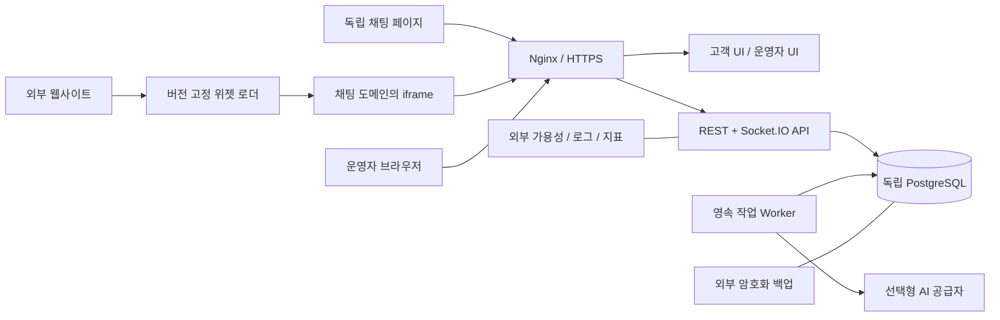

# 스템케어 상담채팅 기반 독립 채팅 시스템 상세 구축계획서

- 작성일: 2026-09-19
- 문서 상태: 구현 착수를 위한 제안 기준안
- 기준 시스템: 현재 저장소의 스템케어 상담채팅 Phase 0~6 구현
- 대상: 독립 고객 상담채팅 서비스, 고객용 채팅 화면·삽입 위젯·운영자 콘솔·API·운영 인프라
- 범위: 설계와 실행 계획. 이 문서 작성이 새 시스템의 구현·배포 완료를 의미하지 않는다.

## 1. 구축 목표와 기본 전제

스템케어 홈페이지에 결합된 상담채팅을 추출하여, 다른 브랜드·업무에도 적용할 수 있는 독립 서비스로 구축한다. 기존에 구현된 메시지 저장, 실시간 통신, 운영자 상담, 한일 번역, AI 인계, 운영 기능을 재사용하고 브랜드·문의 분류·고객 입력 폼·AI 지침·배포 설정을 분리한다.

사용자가 아직 지정하지 않은 사업명, 도메인, 운영 조직, 예상 트래픽은 다음 전제로 계획한다. 실제 착수 시 20장의 결정표를 확정하되, 그 전까지 아래 전제를 설계 기준으로 사용한다.

| 항목 | 기준안 | 변경 시 영향 |
|---|---|---|
| 서비스 성격 | 방문 고객과 상담원이 대화하는 1:1 상담 서비스 | 친구·그룹·커뮤니티 메신저라면 참가자·권한·알림 모델 재설계 |
| 독립 수준 | 별도 저장소, DB, 인증 비밀, 배포 파이프라인, 도메인 | 기존 시스템의 런타임·DB를 공유하지 않음 |
| 운영 단위 | 배포 1개당 조직 1개, 조직 내 여러 웹사이트 지원 | 여러 회사가 동일 DB를 쓰는 SaaS는 후속 단계 |
| 이용 채널 | 독립 채팅 페이지와 외부 웹사이트 삽입 위젯 | 네이티브 앱·메신저 연동은 제외 |
| 초기 언어 | 한국어·일본어, 문구 확장이 가능한 구조 | 추가 언어는 번역 품질·UI 검수 일정 추가 |
| 고객 인증 | 비회원 상담 및 방 단위 자격 증명 | 회원 SSO·전화번호 인증은 후속 단계 |
| 데이터 | 새 DB에서 신규 상담 시작 | 기존 고객 대화 이관은 별도 선택 작업 |
| AI | 기능별 활성화 가능, AI 없이도 사람 상담 가능 | 외부 AI 공급자·모델은 환경 설정으로 지정 |
| 초기 배포 | 단일 API 인스턴스 + 별도 작업 프로세스 + PostgreSQL | 수평 확장은 부하 측정 후 별도 전환 |

핵심 완료 조건은 홈페이지 없이 상담 서비스가 동작하고, 브랜드를 바꿀 때 핵심 채팅 코드를 수정하지 않으며, 배포·장애·데이터가 기존 스템케어 서비스와 분리되는 것이다.

## 2. 기존 구현 조사 및 재사용 판단

### 2.1 확인 근거

이 계획의 현재 상태 설명은 저장소 문서와 코드를 확인한 결과다. 패키지 버전은 현재 선언·잠금 파일을 출발점으로 하며 최신 버전 또는 운영 적합성이 확인되었다는 뜻은 아니다. 아래 상대 링크는 이 문서 위치 기준이다.

| 근거 | 확인 내용 |
|---|---|
| [README-chat.md](../../../README-chat.md) | Phase 0~6 완료 기록, 기존 검증 결과, 운영 출시 전 잔여 항목 |
| [API 명세](../../../apps/api/API.md) | 공개/운영자 REST, 소켓 이벤트, 인증, 읽음·재전송 계약 |
| [Prisma 스키마](../../../apps/api/prisma/schema.prisma) | 운영자·고객·방·메시지·요약·메모·평가 모델 |
| [공유 상수](../../../packages/shared/src/constants.ts) | 한일 언어, 스템케어 문의 유형, 상태·역할 정의 |
| [위젯 설정](../../../js/chat/config.js) | API 주소, `scj-chat-session`, 전용 문의 유형 |
| [API 설정](../../../apps/api/src/config.ts) | Origin, 쿠키명, DB·AI 설정 및 운영 설정 검사 |
| [방 잠금](../../../apps/api/src/chatRooms/roomLock.ts) | PostgreSQL 행 잠금을 이용한 방 단위 동시성 제어 |
| [백그라운드 처리](../../../apps/api/src/common/background.ts) | 메모리 내 작업 추적과 종료 대기 |
| [운영 배포 구성](../../../deploy/docker-compose.prod.yml) | API·관리자·사이트·DB·프록시·백업 구성 |

기존 README에는 2026-09-18 기준 자동 테스트 334개 통과가 기록되어 있다. 이는 기존 검증 기록이며, 본 문서 작성 과정에서 테스트를 재실행하거나 새 시스템의 통과 결과로 인정하지 않았다. 실운영 배포·공인 인증서·실제 AI 품질·원격 CI는 기존 문서에서도 미완료 항목이다.

### 2.2 기능별 현황과 처리 방침

| 영역 | 현재 확인된 구현 | 새 시스템 처리 |
|---|---|---|
| 백엔드 | Express·TypeScript·Prisma·PostgreSQL | 구조와 도메인 서비스 재사용 |
| 운영자 화면 | Next.js·React, 목록/상세/고객 패널/설정/운영 지표 | 화면 재사용, 브랜딩·권한·관리 기능 확장 |
| 고객 위젯 | `js/chat/*`, 전역 설정과 홈페이지 CSS 연계 | 별도 빌드 앱 및 iframe 내부 화면으로 추출 |
| 실시간 통신 | Socket.IO, 재연결, HTTP 폴링 | 인증·공유 저장 경로 유지, 증분 동기화 보강 |
| 중복 방지 | 방+`clientMessageId` 유일성, 발신자 충돌 검사 | 유지, 본문이 다른 ID 재사용 거절 추가 |
| 개인정보 응답 | 고객/운영자 DTO 분리 | 모든 신규 응답과 이벤트에 적용 |
| AI·번역 | 번역·미리보기·인계·요약·늦은 답변 폐기 | 정책 설정화, 영속 작업 큐 추가 |
| 고객 이력 | 동일 customerId 이력만 조회, 시작 시 새 고객 생성 | 자동 병합 금지 유지, 복원 범위 명확화 |
| 읽음 | 방 단위 공유 읽음, 방을 연 소켓과 연계 | 1차 유지, 운영자별 읽음은 후속 기능 |
| 문의 유형 | `stemcell`, `korea_travel`, `undecided` 고정 | 설정 및 ServiceCategory 모델로 전환 |
| 역할 | admin/operator 값과 로그인 계정 확인 | 작업별 권한 미들웨어·정책 테스트 추가 |
| 운영자 설정 | 본인 정보 확인·로그아웃 | 계정 관리·비밀번호 변경·세션 폐기 추가 |
| 파일 | 공유 타입에 image/file 값 존재 | 실제 업로드 기능 완료로 간주하지 않음, 1차 제외 |
| 운영 | 보관 작업·로그·평가·로컬 백업·Compose | 외부 백업·실서버 감시·복구 검증 보강 |

### 2.3 그대로 가져오면 안 되는 결합

1. `@stemcare/*` 패키지명, `STEMCARE_CHAT_API_URL`, `scj_*` 쿠키·스토리지 키.
2. 줄기세포·한국 여행 분류, 의료 상담 전용 문구와 AI 프롬프트.
3. 홈페이지 DOM·스타일·페이지 경로에 대한 암묵적 의존성.
4. 한국어 운영자 읽기 언어, 한국 시간 기준 지표, 고정 보관 일수.
5. 운영 Compose의 웹사이트 빌드와 기존 DB/볼륨/컨테이너 식별자.
6. 테스트 포트·DB명·seed 계정·브라우저 저장소 및 기존 GitHub 워크플로 경로.

단순 전체 문자열 치환 대신 식별자·사용자 문구·업무 정책·보안 설정을 나누어 변경한다. 기존 테스트의 개인정보 분리, IME 입력, 스크롤, 재전송, 늦은 AI 응답 처리 회귀 방지를 추출 완료 조건으로 둔다.

## 3. 출시 범위와 우선순위

### 3.1 1차 출시 필수 범위

| ID | 요구사항 | 검수 가능한 결과 |
|---|---|---|
| FR-01 | 독립 채팅 페이지 | 기존 홈페이지 파일 없이 URL 직접 접속·상담 시작 |
| FR-02 | 삽입 위젯 | 허용된 외부 사이트에서 스크립트 1개로 설치·열기·닫기 |
| FR-03 | 상담 시작 | 최소 고객 정보, 문의 유형, 언어, 동의 버전 기록 |
| FR-04 | 텍스트 상담 | 고객↔운영자 송수신, 실패 표시·재전송, 종료 후 전송 차단 |
| FR-05 | 연결 복원 | 새로고침·일시 오프라인·소켓 차단 후 누락 메시지 복구 |
| FR-06 | 상담 운영 | 대기/진행/종료 필터, 담당 배정, 상태 변경, 내부 메모 |
| FR-07 | 운영자 관리 | 관리자 계정 생성·비활성화·권한, 본인 비밀번호 변경 |
| FR-08 | 브랜드 설정 | 이름·로고·색상·인사말·문의 유형·입력 필수 여부 설정 |
| FR-09 | 다국어 | 한국어·일본어 UI 및 번역 실패 시 원문 유지 |
| FR-10 | 선택형 AI | AI/번역/요약 개별 설정, 실패 시 사람 상담 연결 |
| FR-11 | 영속 작업 | 재시작 뒤 미완료 번역·요약·AI 작업 재개, 중복 답변 차단 |
| FR-12 | 운영 품질 | 상태별 건수·미응답·평가·장애·작업 적체·백업 감시 |
| FR-13 | 보안·보관 | 권한 검사, 세션 만료·폐기, 감사 기록, 보관 작업 |
| FR-14 | 배포와 복구 | 환경 분리, 자동 검증, HTTPS, 외부 백업 및 복구 리허설 |

AI 기능이 품질 기준을 충족하지 못해도 FR-01~09 및 FR-11~14가 충족되면 AI를 꺼서 사람 상담 서비스를 출시할 수 있다. AI 비활성 상태에서는 처음부터 waiting으로 접수하고 bot에 머무르지 않는다.

### 3.2 후속 범위

- 파일·이미지 업로드: 객체 저장소, 서명 URL, 악성 파일 검사, 용량 제한을 포함한 별도 단계.
- 회원 SSO·인증된 재방문 이력, 운영자별 읽음, 고급 검색, 태그·상담 통계 내보내기.
- 외부 메신저·이메일·푸시·CRM·웹훅 연동과 전송 실패 재처리.
- FAQ/RAG, 승인된 지식 관리와 출처 표시, 추가 언어.
- 다중 조직 SaaS, 조직별 과금·사용량 제한, 다중 API 인스턴스 및 다지역 운영.

음성·영상 통화, 일반 사용자 간 메시지, 그룹채팅, 모바일 네이티브 앱, 결제는 이번 구축에 포함하지 않는다.

## 4. 목표 아키텍처

### 4.1 구성



API가 메시지와 작업 레코드를 같은 DB 트랜잭션으로 기록한다. Worker는 PostgreSQL 작업 테이블에서 작업을 임대하여 처리한다. API는 저장된 변경 이력을 읽어 연결된 소켓에 전달하며, 브라우저는 마지막 동기화 커서 이후를 REST로 재확인한다. 따라서 Worker가 소켓 서버를 직접 참조하거나 API 프로세스의 메모리를 공유할 필요가 없다.

초기에는 Redis를 필수 구성으로 추가하지 않는다. 수평 확장 시 Socket.IO 공유 어댑터, 분산 접속 상태·속도 제한·예약 작업 잠금, 로드밸런서의 long-polling 세션 유지까지 한 묶음으로 도입한다. 컨테이너 수만 늘려서는 확장 완료로 보지 않는다.

### 4.2 신규 저장소 구조안

```text
chat-system/
  apps/
    api/                    # 기존 API와 도메인 서비스
    admin/                  # 기존 운영자 Next.js 화면
    widget/                 # iframe 화면 + 독립 채팅 페이지
    worker/                 # 영속 작업 실행 진입점
  packages/
    shared/                 # DTO, 상태, 이벤트, 검증 계약
    chat-core/              # API/Worker 공용 도메인 로직
    widget-loader/          # 외부 사이트에 삽입하는 최소 스크립트
    config/                 # 공개/비공개 설정 스키마 및 기본값
  tests/
    api/ admin/ widget/ e2e/ ops/ load/
  deploy/                   # Compose, Nginx, 백업, 실행 문서
  docs/                     # 설계, API, 설치, 운영, 장애 대응
  .github/workflows/
```

`chat-core` 추출은 API·Worker가 실제 공유하는 서비스에 한정한다. DB 연결 및 AI 공급자 의존성은 주입하고 HTTP Request/Response, 소켓 객체, 브라우저 코드를 core에 넣지 않는다. 불필요하게 전체 코드를 라이브러리화하지 않는다.

### 4.3 도메인·경로·환경

아래 도메인은 배치 예시이며 실제 등록·배포 대상이 아니다.

| 경로 | 역할 | 인증 |
|---|---|---|
| `https://chat.example.com/chat` | 고객 직접 접속 | 방 토큰 |
| `/embed/:siteKey` | iframe 채팅 | 사이트 확인 + 방 토큰 |
| `/assets/widget/v1/loader.js` | 설치용 로더 | 공개 정적 자원 |
| `/admin/*` | 운영자 콘솔 | 운영자 세션 |
| `/api/v1/public/*` | 고객 API | 일부 공개, 방 단위 토큰 |
| `/api/v1/admin/*` | 운영자 API | 세션 + 역할/방 정책 |
| `/socket.io/*` | 실시간 통신 | 고객/운영자 별도 검증 |
| `/health/live`, `/health/ready` | 생존/준비 상태 | 공개 응답 최소화, 상세는 내부 |

관리자와 API를 같은 출처로 제공해 관리자 쿠키 동작을 단순화한다. iframe도 채팅 출처에서 API에 접근하므로 기존 고객 CORS에 무제한 외부 출처를 추가할 필요가 없다. 운영자 페이지는 iframe 삽입을 금지하고 고객 embed 경로만 허용한다.

개발 포트는 예를 들어 widget 8082, API 4100, admin 3200, DB 5435로 분리하되 착수 시 충돌 확인 후 확정한다. dev/staging/prod/test별 DB·키·쿠키·볼륨·도메인·AI 예산을 분리하고 운영 데이터를 개발·테스트 DB로 복사하지 않는다.

## 5. 기존 코드 추출·공통화 실행 계획

| 순서 | 원본 | 신규 작업 | 완료 기준 |
|---|---|---|---|
| 1 | 루트 package/lock, 빌드 설정 | 신규 저장소 생성, 원본 기준 커밋·라이선스 기록 | 잠금 파일 기반 설치·기본 빌드 성공 |
| 2 | `packages/shared` | 패키지명 전환, DTO/상태 보존 | API·관리자 공유 타입 컴파일 |
| 3 | `apps/api` | 원본 API 추출, DB·환경 기본값 독립화 | 신규 DB로 기존 핵심 테스트 통과 |
| 4 | `apps/admin` | 브랜딩 제거, API/basePath 분리 | 로그인→목록→상담 흐름 성공 |
| 5 | `js/chat/*`, `css/chat-widget.css` | widget 앱으로 이동, 홈페이지 DOM 의존 제거 | 빈 호스트 페이지에서 상담 가능 |
| 6 | 상수·폼·i18n·프롬프트 | 설정 및 DB 문의 분류로 치환 | 두 개 브랜드 설정으로 동일 빌드 실행 |
| 7 | AI/background/보관 작업 | core 추출 및 영속 Worker 구축 | API/Worker 각각 재시작 후 재개 |
| 8 | deploy/tests/CI | 독립 이미지·볼륨·테스트 DB·워크플로 | 스템케어 자원 없이 스테이징 배포 |

기존 `.env`, 토큰, 고객 데이터, DB 덤프, 로그, `node_modules`, 빌드 산출물은 추출 대상에서 제외한다. 원본 파일과 신규 파일의 대응표를 남기고, 변경한 계약은 API 명세와 테스트를 함께 갱신한다. 기존 스템케어 사이트의 운영 코드·설정은 추출 과정에서 변경하지 않는다.

새 저장소의 API는 `/api/v1`을 기준으로 정리하고 신규 클라이언트와 함께 배포한다. 기존 위젯 교체를 선택하는 경우에만 구 API 호환 라우터 또는 신규 사이트 연결을 별도 설계한다. 기존 고객 토큰과 운영자 세션을 신규 서비스에서 그대로 허용하지 않는다.

## 6. 브랜드·사이트·업무 설정

### 6.1 설정 구분

| 분류 | 대표 항목 | 저장·변경 방식 |
|---|---|---|
| 비밀/인프라 | DATABASE_URL, 세션 서명 키, AI 키, 백업 자격 증명 | 배포 비밀 저장소, 브라우저 노출 금지 |
| 배포 설정 | 서비스 ID, 공개 URL, 쿠키명, 포트, 로그 수준 | 환경변수 및 시작 시 유효성 검사 |
| 업무 설정 | 브랜드, 문의 분류, 영업시간, 보관 기간, AI 활성화 | 관리자 전용 API, 버전·감사 이력 |
| 사이트 설정 | siteKey, 허용 부모 Origin, 폼 필드, 기본 언어 | 사이트별 설정, 저장 전 검증 |
| 공개 설정 | 표시 문구, 색상, 언어, 사용 가능한 문의 유형 | 공개 DTO의 명시적 허용 목록 |

설정은 Zod 등 기존 검증 체계로 검증한다. 로고 URL·색상·텍스트 길이·Origin을 제한하고 임의 HTML/JavaScript 입력은 허용하지 않는다. 공개 DTO에 AI 프롬프트, API 키, 내부 메일, 비공개 운영 설정을 포함하지 않는다.

서비스 유형은 문자열 상수 대신 `ServiceCategory(id, code, labels, isActive, sortOrder)`로 관리한다. 기존 상담이 참조하는 분류는 물리 삭제하지 않고 비활성화한다. 1차 입력 폼은 이름·연락처·이메일·문의 유형의 사용/필수 여부만 설정하고 범용 폼 빌더는 만들지 않는다.

영업시간은 조직 시간대와 요일별 시간, 휴무일로 표현한다. 영업시간 외에는 대기 접수·예상 응대 안내를 제공하고 확정되지 않은 응답 시간이나 예약을 약속하지 않는다. 설정 변경은 신규 상담에 적용하고 기존 방에는 생성 시 사용한 설정 버전을 남긴다.

### 6.2 설치 계약

```html
<!-- 신규 서비스에서 제공할 설치 예시이며 현재 구현된 인터페이스가 아님 -->
<script
  src="https://chat.example.com/assets/widget/v1/loader.js"
  data-site-key="public-site-key"
  data-language="ja"
  defer>
</script>
```

siteKey는 공개 식별자이며 비밀키가 아니다. 권한은 방 토큰과 서버 정책으로 검증한다. 허용 Origin 검사는 설치 제한 장치이며 비브라우저 봇 방지 인증을 대체하지 않는다.

로더는 중복 설치를 방지하고 외부 페이지 스타일을 최소한으로 건드린다. iframe과 부모 간 postMessage는 열기·닫기·높이·준비 완료 등 UI 이벤트만 허용하며 `event.origin`, `event.source`, 메시지 타입을 확인한다. 고객 토큰·대화 내용·운영자 데이터는 부모 페이지로 전송하지 않는다. API는 부모가 임의로 보낸 siteKey 또는 Origin을 신뢰하여 접근권한을 부여하지 않는다.

iframe 저장소가 차단되는 브라우저에서는 메모리 세션으로 현재 상담을 유지하고, 영속 복원이 제한된다는 안내와 독립 채팅 페이지 이동 수단을 제공한다. 기존 상담을 넘겨야 하면 단기·일회용 교환 코드를 사용하고 원본 토큰을 URL에 넣지 않는다. 교환 코드는 서버에서 원자적으로 소비하고 짧은 만료를 적용한다. 이 경로는 실제 Safari·Chrome·Firefox 설정별로 검증한다.

## 7. 고객 화면 상세 구현

### 7.1 화면과 상태

1. 진입: 브랜드·언어·운영 안내를 불러오고 저장된 세션의 유효성을 확인한다.
2. 상담 시작: 활성 문의 유형, 설정상 필수 필드, 문의 본문, 동의 내용을 표시한다.
3. 대화: 원문 또는 고객 표시문, 시간, 담당자 연결 상태, 입력 중 표시를 제공한다.
4. 대기/인계: AI에서 사람으로 전환한 사실과 영업시간 안내를 제공한다.
5. 오류: 전송 실패·오프라인·인증 만료·종료 상태를 구별하고 가능한 행동을 표시한다.
6. 종료: 추가 전송을 막고 별점·의견 제출과 새 상담 시작을 제공한다.

비동기 응답에는 현재 roomId와 화면 세대 값을 확인하여 이전 방의 늦은 응답이 새 방에 섞이지 않게 한다. IME 조합 중 Enter 전송 금지, 최근 메시지를 읽을 때만 자동 스크롤, 과거 열람 중 새 메시지 버튼 제공 등 기존 동작을 유지한다.

### 7.2 세션·재전송 규칙

- 저장 키는 `서비스ID:siteKey:session:v1`처럼 서비스·사이트별로 분리한다.
- 고객 토큰은 충분한 난수로 생성하고 DB에 해시만 저장한다. 만료 시각과 폐기 시각을 추가한다.
- 토큰을 query string, 로그, 분석 이벤트, postMessage에 포함하지 않는다.
- 401/403 등 확정적인 자격 실패와 네트워크·5xx 장애를 구분한다. 일시 오류로 상담을 삭제하지 않는다.
- 동일 전송 재시도에는 같은 clientMessageId를 사용한다. 본문을 수정하면 새 ID를 만든다.
- 서버 ACK는 DB 커밋 완료를 의미하며 상대방 열람 완료로 표시하지 않는다.
- 방 종료·토큰 만료 후 새 상담은 별도 생성한다. 이름·전화번호 일치로 이전 방을 연결하지 않는다.

### 7.3 접근성·모바일

360px 폭에서 가로 스크롤 없이 작동하고 모바일 키보드·안전 영역·회전 시 입력창을 유지한다. 키보드만으로 열기·닫기·전송·언어 변경이 가능해야 한다. 대화 추가는 스크린리더에 과도하게 반복되지 않도록 알리고, 포커스 이동 및 대비·오류 문구를 검수한다.

## 8. 운영자 콘솔과 권한

### 8.1 화면별 구현

| 화면 | 상세 기능 | 주요 검수 |
|---|---|---|
| 로그인 | 로그인·로그아웃·만료 안내·속도 제한 | 비활성 사용자와 폐기 세션 거절 |
| 상담 목록 | 상태·담당·문의 유형·사이트 필터, 페이지네이션 | 대량 상담에서 전체 로드 금지 |
| 상담 상세 | 원문/번역, 전송, 번역 수정, 인계, 종료·재개 | 종료/배정 동시 변경 충돌 처리 |
| 고객 패널 | 정보, 동일 고객 이력, 메모, AI 요약 | 고객 응답으로 내부 정보 유출 없음 |
| 계정 설정 | 내 비밀번호 변경, 세션 종료 | 변경 후 이전 세션·소켓 폐기 |
| 운영자 관리 | 관리자에 의한 생성·비활성화·역할 변경 | 마지막 활성 관리자 제거 차단 |
| 서비스 설정 | 브랜드·문의 유형·사이트·영업시간·AI 설정 | 권한·검증·변경 이력 |
| 운영 지표 | 미응답·번역 실패·작업 적체·평가 | 시간대와 집계 정의 일치 |

초기 계정 발급은 관리자가 임시 비밀번호를 별도 전달하는 방식으로 시작하고, 최초 로그인에서 변경을 강제한다. 이메일 초대·재설정 발송은 외부 메일 연동이 추가될 때 구현한다. 비밀번호는 해시만 저장하고 관리자에게 기존 비밀번호를 보여주지 않는다.

### 8.2 권한 기준안

| 작업 | 고객 | operator | admin |
|---|---|---|---|
| 상담 조회 | 자기 방의 공개 정보 | 조직 내 상담 | 조직 내 상담 |
| 메시지 전송 | 자기 열린 방 | 본인 담당 열린 방 | 본인 담당 또는 명시적 인계 후 |
| 대기 상담 배정 | 불가 | 본인 배정 | 본인 배정·담당 변경 |
| 종료 | 1차 미제공 | 본인 담당 방 | 조직 내 방 |
| 재개방 | 불가 | 본인 담당 방, 사유 기록 | 조직 내 방, 사유 기록 |
| 내부 메모 | 불가 | 접근 가능한 방 | 접근 가능한 방 |
| 브랜드·계정·보관 설정 | 불가 | 불가 | 가능 |
| 감사 이력 | 불가 | 불가 | 가능 |

현재 구현보다 엄격한 전송·담당 권한을 도입하는 변경이므로 UI 버튼뿐 아니라 REST, 소켓, 작업 재처리 경로에 동일 정책을 적용한다. 권한 없는 응답은 내부 존재 여부를 과도하게 노출하지 않는다. 배정 경쟁은 행 잠금으로 1명만 성공시키고 다른 요청에는 409와 최신 상태를 반환한다.

## 9. 데이터 모델과 마이그레이션

### 9.1 기존 모델 변경

| 모델 | 변경안 | 설계 주의점 |
|---|---|---|
| Operator | passwordChangedAt, mustChangePassword, sessionVersion | 비밀번호·권한 변경 시 세션 폐기 |
| Customer | 이름/연락처 선택 허용, consentVersion | 입력 폼 설정과 DB null 허용 일치 |
| ChatRoom | siteId, serviceCategoryId, configVersion, tokenExpiresAt/revokedAt, revision | 상태 변경·이벤트 동기화 기준 |
| Message | roomSequence, revision, requestFingerprint | 최초 순서와 후속 번역 변경을 모두 추적 |
| ChatSummary | sourceMessageId, promptVersion, 상태 | 오래된 요약의 덮어쓰기 차단 |
| OperatorNote | 기존 구조 유지, 감사 연계 | 고객 응답과 이벤트에서 제외 |
| ChatFeedback | 방당 1개 유지 | 종료 이후 제출, 재시도 멱등 처리 |

### 9.2 신규 모델

| 모델 | 핵심 필드 | 제약·인덱스 |
|---|---|---|
| ServiceSettings | version, brand, languages, timezone, policies | 활성 버전 명확화, 비밀값 저장 제외 |
| Site | id, publicKey, name, allowedOrigins, enabled | publicKey unique |
| ServiceCategory | code, labels, isActive, sortOrder | code unique |
| OperatorSession | id, operatorId, expiresAt, revokedAt | operatorId+expiresAt, 토큰 해시/세션 참조 |
| BackgroundJob | type, dedupeKey, roomId, sourceMessageId, status, attempts, runAfter, leaseUntil, leaseToken | dedupeKey unique, status+runAfter |
| RoomEvent | roomId, sequence, type, entityId, createdAt | roomId+sequence unique, 보관 기간 제한 |
| AuditLog | actorId, action, targetType/id, safeChanges, requestId, createdAt | actorId+createdAt, targetType+targetId |
| ConsentRecord | customerId, siteId, version, agreedAt, purposes | 고객 동의 변경 이력 |

`revision`은 엔터티 변경 감지 값이고 `RoomEvent.sequence`는 방 안에서 모든 메시지·번역·상태 변경의 순서를 나타낸다. 메시지 생성 시 부여한 roomSequence와 이벤트 sequence를 혼동하지 않는다. 커서는 서버가 해석하는 불투명 값으로 제공한다.

### 9.3 정합성 규칙

1. 상담방, 최초 문의, 동의 기록, 필요한 작업 레코드를 하나의 트랜잭션으로 생성한다.
2. 같은 방+clientMessageId에 다른 발신자 또는 다른 요청 본문이 오면 409를 반환한다. fingerprint는 정규화된 전송 계약을 기준으로 계산한다.
3. 방 쓰기와 이벤트 sequence 증가는 같은 행 잠금과 트랜잭션 안에서 처리한다.
4. 종료·담당 변경·AI 응답은 동일 상태/권한 검증 함수를 사용한다.
5. 이벤트에는 민감한 전체 DTO를 저장하지 않고 참조 ID를 남기며 전송 시 권한별 DTO를 만든다.
6. 삭제·보관 처리와 작업 완료가 경쟁하면 작업 결과를 저장하기 전에 대상 존재와 현재 상태를 다시 확인한다.
7. 작업 완료·메시지 생성·이벤트 기록은 원자적으로 처리하고 dedupeKey로 중복 AI 응답을 차단한다.

### 9.4 마이그레이션 방식

신규 DB이므로 스키마를 정리한 초기 migration과 기본 설정 seed를 생성한다. 기존 migration을 재사용할 경우에는 이력 전체를 유지하고 추가 migration으로 변경하며 두 방식 중 하나만 선택한다. 1차 기준안은 신규 초기 migration이다.

운영 적용은 추가 필드·새 구조 생성 → 호환 코드 배포 → 데이터 보정 → 제약 강화 순서로 진행한다. 대량 작업은 배치화하고 행 잠금 시간을 측정한다. 실패 시 자동 down migration에 의존하지 않고 이전 앱과 호환되는 스키마로 롤백하거나 별도 DB 복구 절차를 수행한다.

## 10. API·실시간 계약

아래 경로는 신규 시스템 제안 계약이며 현재 저장소의 API와 구별한다. OpenAPI와 공유 타입에서 요청·응답·오류·인증 요건을 정의하고 계약 테스트로 동기화한다.

### 10.1 REST

| 메서드·경로 (`/api/v1` 이하) | 기능 | 주요 조건 |
|---|---|---|
| GET `/public/sites/:siteKey/config` | 공개 설정 | 활성 사이트, 비공개 필드 제거 |
| POST `/public/chat/start` | 상담 생성 | 사이트·필수 필드·동의 검증, 시작 요청 멱등 키 |
| GET `/public/chat/:roomId` | 상태·초기 스냅샷 | 방 토큰, 최근 메시지 제한 |
| GET `/public/chat/:roomId/messages` | 과거 메시지 페이지 | before 커서·limit 상한 |
| GET `/public/chat/:roomId/events` | 변경분 동기화 | after 커서, 권한별 직렬화 |
| POST `/public/chat/:roomId/messages` | 메시지 저장 | clientMessageId 필수 |
| POST `/public/chat/:roomId/handoff` | 사람 상담 요청 | bot→waiting, 중복 안내 방지 |
| POST `/public/chat/:roomId/feedback` | 평가 제출 | 종료 방, 방당 1회 |
| POST `/admin/auth/login`, `/logout` | 로그인·로그아웃 | 세션 생성/폐기, 쿠키 처리 |
| GET `/admin/auth/me` | 현재 계정 | DB 활성·세션 확인 |
| PATCH `/admin/auth/password` | 본인 비밀번호 변경 | 현재 비밀번호 검증, 기존 세션 폐기 |
| GET `/admin/chat-rooms` | 상담 목록 | 커서, 필터, limit 상한 |
| GET `/admin/chat-rooms/:id` | 상담 상세 | 조직·역할 정책, 조회 자체는 읽음 부작용 제거 |
| POST `/admin/chat-rooms/:id/read` | 명시적 읽음 | 실제 화면 표시한 마지막 위치 |
| PATCH `/admin/chat-rooms/:id/assign`, `/status` | 배정·상태 | revision 및 권한 확인 |
| POST `/admin/chat-rooms/:id/messages`, `/notes` | 상담·메모 | 담당 정책, 멱등성 |
| POST `/admin/translations/preview` | 번역 미리보기 | 언어·길이·예산·제한 검사 |
| GET/POST/PATCH `/admin/operators` 및 `/:id` | 계정 관리 | admin 전용 |
| GET/PATCH `/admin/settings` | 업무 설정 | admin, 버전 충돌 검사 |
| GET/POST/PATCH `/admin/sites`, `/admin/categories` 및 `/:id` | 사이트·문의 유형 | admin, 비활성화 방식 |
| GET `/admin/metrics`, `/admin/audit-logs` | 운영 지표·감사 | 각 권한, 페이지네이션 |

시작 요청은 별도 idempotency key로 중복 방 생성을 방지한다. 최초 토큰 전달 응답의 재현이 필요하므로 단기 암호화 응답 캐시 또는 안전한 세션 재발급 방식을 설계하고, 영구적으로 평문 고객 토큰을 저장하지 않는다. 응답 캐시 TTL·만료 후 동작은 계약에 명시한다.

오류는 `{ error: { code, message, requestId } }`로 통일한다. 대표 코드는 VALIDATION_ERROR, UNAUTHORIZED, FORBIDDEN, ROOM_CLOSED, ALREADY_ASSIGNED, MESSAGE_ID_CONFLICT, VERSION_CONFLICT, RATE_LIMITED, CURSOR_EXPIRED다. 운영 응답에 내부 스택·SQL·토큰을 포함하지 않는다.

### 10.2 소켓과 동기화

기존 `chat:join`, `chat:leave`, `chat:message`, `chat:typing`, `chat:handoff-request`, `chat:message:ack`, `chat:error`, `chat:status`, `chat:presence`, `rooms:updated` 명칭은 가능한 유지한다. 신규 계약에 roomId, eventId/sequence, 엔터티 revision을 명시한다.

연결 시 고객 자격이 일부라도 있으면 운영자 쿠키로 대체하지 않는다. 고객은 자기 방만 구독하며 운영자는 계정·세션·역할을 확인한다. join뿐 아니라 전송·재구독·브로드캐스트 시에도 폐기 상태를 반영한다.

초기 스냅샷과 커서를 같은 일관된 조회 기준으로 반환하고, 그 이후 변경을 재생한다. 순서가 바뀌거나 중복된 이벤트는 sequence와 revision으로 정리한다. 번역 완료처럼 기존 메시지가 수정된 경우도 이벤트를 기록하여 생성 시각만으로 조회할 때 생기는 누락을 방지한다.

이벤트 보관 기간을 지난 커서는 CURSOR_EXPIRED로 응답하고 최근 스냅샷을 다시 받는다. 과거 메시지는 페이지네이션으로 조회한다. 소켓 재연결 시 증분 조회를 수행하며, 소켓 장애 시에는 REST 폴링을 유지한다. 백그라운드 탭은 빈도를 낮추고 복귀 즉시 재동기화한다. 조회 폴링에는 전송용 속도 제한을 적용하지 않는다.

## 11. 상태 전이와 동시성

| 현재 | 요청·사건 | 다음 | 조건 |
|---|---|---|---|
| 없음 | 상담 생성 | bot 또는 waiting | AI 사용·인계 규칙에 따라 결정 |
| bot | 고객 인계 요청·AI 실패·정책 인계 | waiting | 안내 메시지 중복 방지 |
| bot/waiting | 운영자 배정 | active | 배정 경쟁 1건만 성공 |
| active | 담당 변경 | active | 관리자 권한·감사 기록 |
| bot/waiting/active | 종료 | closed | 권한·작업 무효화 |
| closed | 명시적 재개 | waiting 또는 active | 사유 기록, 토큰 정책 확인 |

종료 방을 bot으로 자동 복귀시키지 않는다. 재개방은 별도 명시적 행동이며 고객 토큰이 만료됐다면 단순 재개방만으로 접근권한을 복원하지 않는다. UI는 오래된 revision으로 변경할 때 충돌을 안내하고 최신 상태를 갱신한다.

잠금 안에서는 상태 확인·DB 쓰기만 수행한다. AI 호출 등 장시간 네트워크 작업을 DB 트랜잭션 안에서 기다리지 않는다. AI 요청 시작 시 상태와 마지막 고객 메시지를 기록하고 응답 저장 직전에 다시 검사해 담당자 배정·종료·새 문의 이후의 오래된 답변을 버린다.

## 12. 번역·AI·영속 작업 설계

### 12.1 업무 정책 분리

번역, 자동 응대, 인계 요약을 각각 켜고 끌 수 있게 한다. `AIProvider` 경계 뒤에 현재 공급자 연동을 두고 모델명·시간 제한·예산은 설정으로 관리한다. 기존 모델 설정을 최신 권장 모델로 간주하지 않으며 착수 시 지원 여부와 품질을 별도 검증한다.

프롬프트는 공통 지침, 브랜드 정보, 허용 업무, 인계 조건, 언어 정책으로 분리하고 버전을 기록한다. 스템케어 의료·여행 지침은 선택형 예시 정책으로 남기고 다른 서비스 기본값에 넣지 않는다. 고객 메시지는 지침 변경 요청이 아니라 입력 데이터로 처리하며 비밀·시스템 프롬프트·다른 상담 정보를 포함하지 않는다.

번역 실패 시 원문 상담을 계속하고 수동 재시도를 제공한다. AI 실패 시 waiting 전환과 고정 안내를 1회 기록한다. 미리보기 번역은 운영자가 내용을 확인·수정한 뒤 보내며, 수정된 문장과 원문을 함께 저장한다. 고객에게 표시한 문장을 나중에 자동 번역 결과로 조용히 교체하지 않는다.

### 12.2 영속 작업 처리

1. 메시지 저장 트랜잭션에서 `translate:<messageId>:<targetLanguage>:<version>` 등 dedupeKey로 작업을 삽입한다.
2. Worker가 처리 가능한 작업을 `FOR UPDATE SKIP LOCKED`로 가져와 짧은 트랜잭션 안에서 lease를 설정한다.
3. 트랜잭션 밖에서 AI를 호출한다. 작업 시간 제한과 lease 연장 정책을 둔다.
4. 완료 저장 시 leaseToken과 방 상태·입력 버전을 확인한다. 이전 Worker가 늦게 돌아와 새 Worker 결과를 덮어쓰지 못하게 한다.
5. 결과·이벤트·완료 상태를 같은 트랜잭션으로 저장한다. 실패 시 지수 백오프와 최대 시도 횟수 후 failed로 전환한다.
6. 중단된 Worker의 lease가 만료되면 다른 Worker가 회수한다. 같은 방의 AI 응답 생성은 논리적으로 직렬화한다.
7. API 이벤트 전달과 REST 동기화가 저장된 결과를 클라이언트에 반영한다.

초기 제안은 번역 최대 3회, AI 응답 최대 2회, 요약 최대 3회 재시도이며 비용·실패율에 따라 조정한다. 재시도로 외부 공급자 비용이 중복 발생할 수 있으므로 공급자 호출과 DB 결과 저장의 정확히 1회 실행을 보장한다고 표현하지 않는다. 보장 대상은 사용자에게 저장·노출하는 중복 답변 방지다.

번역 8초, 상담·요약 15초의 기존 제한을 초기 설정으로 승계하되 실제 품질 평가로 조정한다. 일일 예산 상한, 최대 문맥 크기, 동시 작업 수, 사용자별 요청 제한을 두고 상한 도달 시 사람 상담을 유지한다.

### 12.3 AI 검수

한국어·일본어 일반 문의, 오탈자, 언어 혼합, 불명확한 질문, 사람 요청, 금지된 확답, 프롬프트 조작, 타임아웃, 연속 메시지·인계 경쟁을 포함한 최소 100건의 합성 평가 세트를 만든다. 두 언어 검수자가 의미 보존·부적절한 확답·인계 적절성을 판정한다.

출시 제안 기준은 명시적 사람 요청 인계 100%, 금지된 확답 사례 0건, 핵심 번역 의미 보존 95% 이상이다. 이는 목표이며 현재 측정 결과가 아니다. 기준 미달 기능은 꺼서 출시하고 실제 AI 평가 비용·지연·사용 모델·프롬프트 버전을 기록한다.

## 13. 보안·개인정보·보관

### 13.1 인증과 접근 제어

- 관리자 쿠키는 HttpOnly·Secure·적절한 SameSite 및 서비스별 이름을 사용한다. 쿠키 Domain을 불필요하게 상위 도메인으로 넓히지 않는다.
- 관리자 쓰기 API에는 CSRF 방어와 Origin 검사를 적용하고 세션을 DB에서 폐기할 수 있게 한다.
- 계정 비활성화·비밀번호/역할 변경·로그아웃 시 기존 소켓도 권한을 잃게 한다.
- 고객 방 토큰은 만료·폐기·해시 저장을 적용하고 접근 실패율을 감시한다.
- 비밀번호 해시·키·고객 본문을 로그에 기록하지 않는다. 감사 로그는 식별자와 허용된 변경 필드만 기록한다.
- 로그인·상담 시작·메시지·AI 요청별 속도 제한을 분리하고 프록시 IP 신뢰 범위를 설정한다.
- 고객 텍스트를 HTML로 직접 삽입하지 않는다. 링크·로고 URL·postMessage·CSP·CORS를 별도 검수한다.
- DB·관리 지표·백업 저장소를 공개 네트워크에 노출하지 않는다.

### 13.2 보관 및 삭제

기존 180일 연락처 정리·365일 상담 삭제는 참고값이며 새 서비스의 확정 정책이 아니다. 연락처 필드 삭제만으로 본문까지 익명화되었다고 보지 않는다. 다음 항목은 사업 담당자가 목적에 맞게 확정하고 설정한다. 이 문서는 법률 적합성 판단을 대신하지 않는다.

| 대상 | 구현 요구 |
|---|---|
| 고객 기본 정보 | 수집 필드 최소화, 보관 기간·정리 시점 명시 |
| 메시지·요약·메모·평가 | 종료 기준 보관 기간, 연관 삭제와 작업 취소 |
| 동의 기록 | 버전·목적·일시 추적, 보관 범위 확정 |
| 감사 로그 | 본문 제외, 별도 보관 기간과 접근권한 |
| RoomEvent/작업 이력 | 재연결·장애 분석에 필요한 기간만 유지 |
| 백업 | 보관 만료와 삭제 요청의 복구 후 재적용 절차 |
| AI 전달 데이터 | 필요한 문맥만 전달, 공급자 정책·계약 별도 확인 |

보관 작업은 dry-run, 대상 건수·실행 ID, 배치 크기, 재시도, 중복 실행 잠금을 제공한다. 실행 중 재개방된 방을 잠금 안에서 다시 검사한다. 복구한 DB에 이미 처리된 삭제 요청이 되살아나지 않도록 삭제 이력을 분리 보관하고 복구 절차에서 재적용한다.

## 14. 성능·가용성·관측 목표

아래 값은 초기 부하 시험용 가정이며 실제 확보된 성능이나 계약 SLA가 아니다. Phase 0에서 예상 상담량을 받아 확정한다.

| 지표 | 초기 목표 | 측정 조건 |
|---|---|---|
| 동시 연결 | 고객 300 + 운영자 20 | 운영 유사 스테이징, 30분 유지 |
| 메시지 처리 | 지속 20건/초, 1분 50건/초 | 정상 전송·재전송·폴링 혼합 |
| 저장 ACK | p95 500ms 이하 | AI 시간 제외, 부하 조건 명시 |
| 상대 화면 도착 | p95 1초 이하 | 정상 소켓 연결 시 |
| 상담 목록 조회 | p95 500ms 이하 | 10만 방·100만 메시지 합성 데이터 |
| 월 가용성 | 99.5% 목표 | 외부 probe, 계획 정지 포함 여부 별도 정의 |
| 데이터 복구 목표 | RPO 24시간, RTO 4시간 | 일 1회 외부 백업 및 복구 훈련 |
| 위젯 | 호스트 페이지 주 기능 차단 없음 | 지연 로딩·네트워크 실패 검수 |

폴링 주기만으로 화면 도착 시간을 보장하지 않는다. 최대 부하에서 DB 연결 풀·CPU·메모리·잠금 대기·이벤트 적체·폴링 요청량을 측정하고 목표 미달이면 조회 인덱스·커서·폴링 주기부터 개선한다.

주요 지표는 HTTP 오류·지연, 소켓 재연결, 메시지 저장 실패, 중복 억제 건수, 미응답 상담, AI 지연·실패·비용, 작업 대기 시간·lease 회수, DB 저장량, 마지막 백업 성공 시각이다. 연결 수·로그 라벨에 customerId/roomId를 무제한 태그로 넣지 않는다.

알림 초기값은 5분간 5xx 5% 초과, DB 준비 실패 2분, 작업 최장 대기 5분, 백업 성공 26시간 경과, 디스크 80% 초과로 제안한다. 최소 요청 수·중복 알림 억제·해제 알림을 설정하고 담당자와 대응 문서를 연결한다.

## 15. 테스트 및 인수 기준

### 15.1 검증 계층

| 계층 | 대상 | 완료 기준 |
|---|---|---|
| 정적 검사 | 타입·빌드·설정 스키마·의존성 | API·Worker·admin·widget·loader 모두 성공 |
| 단위 | 상태 전이·권한·멱등성·설정·프롬프트 조합 | 정상·실패·경계 조건 |
| API 통합 | 실제 PostgreSQL, 잠금·세션·삭제·큐 | 트랜잭션·유일성·접근 통제 확인 |
| 소켓 통합 | 인증 혼합·구독·권한 폐기·복원 | 토큰 일부 제공, 끊김·중복·순서 역전 |
| UI | IME·스크롤·번역 편집·실패·이전 방 응답 | 기존 회귀 시나리오 유지 |
| E2E | 고객·운영자 별도 브라우저 문맥 | 직접 페이지 및 다른 Origin iframe |
| 운영 | 마이그레이션·백업·복구·재배포 | 별도 DB 복구, 실패 시 데이터 정합성 |
| 부하 | 연결·전송·폴링·대량 목록 | 14장 목표 대비 보고서 |
| AI 수동 | 합성 한일 평가 세트 | 12장 기준, 지연·비용 기록 |

### 15.2 필수 인수 시나리오

1. AI 키가 없어도 고객 접수→운영자 배정→대화→종료→평가가 가능하다.
2. 브랜드·문의 유형을 바꿔도 코드를 수정하거나 다시 빌드하지 않고 업무 설정이 반영된다.
3. 외부 사이트의 CSS가 위젯을 깨뜨리지 않으며 저장소 차단 시 안내·대체 접속이 동작한다.
4. 메시지 저장 직후 연결을 끊고 재전송해도 DB 및 UI에 한 번만 나타난다.
5. 소켓을 끊은 동안 생성·번역 완료된 메시지가 재연결 후 모두 동기화된다.
6. 운영자 2명이 같은 방을 동시에 배정하면 1명만 성공한다.
7. AI 요청 중 운영자 배정·방 종료·새 문의가 발생하면 오래된 답변이 저장되지 않는다.
8. Worker 강제 종료 후 미완료 작업이 회수되고 중복 답변이 없다.
9. 고객에게 내부 메모·요약·전화번호·다른 방 데이터가 REST/소켓 어느 경로로도 전달되지 않는다.
10. 운영자 비활성화·세션 폐기 후 기존 쿠키와 열린 소켓으로 작업할 수 없다.
11. 보관 작업과 재개방이 동시에 발생해도 재개방된 상담이 잘못 삭제되지 않는다.
12. 외부 백업을 빈 환경에 복구하여 정합성·로그인·상담 조회를 확인한다.
13. 신규 서비스 정지·배포·DB 초기화가 기존 스템케어 시스템에 영향을 주지 않는다.

테스트는 전용 `_test` DB를 사용하고 운영·개발 DB와 주소가 다름을 검증한다. 기존 API/E2E가 같은 테스트 DB를 초기화하는 제약은 유지하거나 CI 작업마다 DB를 분리한다. 같은 DB에 파괴적 테스트를 병렬 실행하지 않는다. 자동 테스트는 기본적으로 AI mock을 사용하고 실제 공급자 평가는 분리한다.

## 16. 단계별 구현 일정과 작업 분해

기본 추정은 풀타임 개발자 2명, QA 0.5명, 운영·기획 담당자의 단계별 참여를 전제로 8~10주다. 이는 확정 견적이 아니며 Phase 0에서 재산정한다. 개발자 1명이 전체를 맡으면 병행 구간이 줄어 12~16주를 계획 범위로 잡는다. 도메인·운영 계정·정책 결정 대기는 별도다.

| 단계 | 기간 제안 | 주요 작업 및 산출물 | 선행 조건·완료 게이트 |
|---|---|---|---|
| P0 요구·설계 확정 | 1주 | 범위·화면 흐름·권한표·설정 스키마·API 초안·원본 기준점·위험 목록 | 20장 필수 결정 및 목표 합의 |
| P1 독립 추출 | 1주 | 새 저장소·DB·빌드·CI·브랜딩 제거·기존 테스트 이식 | 홈페이지 없이 기본 상담 동작 |
| P2 고객 UI·설정 | 1~2주 | 독립 페이지·iframe·로더·브랜드/사이트/폼 설정·세션 복원 | 직접/외부 사이트 E2E 통과 |
| P3 운영자·권한 | 1~2주, P2와 일부 병행 | 운영자 관리·세션·담당 권한·설정 화면·감사 기록 | 권한표 REST/소켓 검증 |
| P4 안정성·AI | 1~2주 | 영속 큐·Worker·이벤트 커서·번역·프롬프트 정책·비용 제한 | 재시작/중복/늦은 결과 검증 |
| P5 운영·품질 | 1~2주 | 배포·외부 백업·보관·감시·부하·브라우저·AI 검수 | 모든 필수 인수 시나리오 통과 |
| P6 파일럿·출시 | 1주 | 제한된 사이트 파일럿·교육·운영 인수·확대 | 출시 게이트 및 복구 훈련 완료 |

API/스키마 계약을 P0에서 정하고 P2·P3를 병행한다. P4는 P1 데이터 정합성 구조에 의존하므로 전체 병렬 착수하지 않는다. 8~10주는 단계별 시간을 단순 합산한 값이 아니라 일부 UI 개발 병행과 검수 완충을 반영한 추정이다.

### 16.1 착수 가능한 작업 티켓

| ID | 작업 | 담당 역할 | 의존 | 완료 정의 |
|---|---|---|---|---|
| T01 | 범위·브랜드·입력 필드·운영시간 결정 | 기획/운영 | 없음 | 결정표 승인·기본값 확정 |
| T02 | 원본 기준 커밋·라이선스·회귀 목록 기록 | 개발 | 없음 | 추출 목록과 검증 기준 문서 |
| T03 | 새 저장소·독립 환경·CI | 개발/운영 | T02 | 빈 환경에서 설치·빌드·테스트 |
| T04 | 신규 스키마·migration·seed | 백엔드 | T01,T03 | 신규 DB 및 제약 검증 |
| T05 | 설정·사이트·분류 API | 백엔드 | T04 | 공개/비공개 DTO·권한 테스트 |
| T06 | 고객 페이지·iframe 로더 | 프론트엔드 | T03,T05 계약 | 외부 Origin 설치 검수 |
| T07 | 토큰·상담 시작 멱등성·복원 | 백엔드/프론트엔드 | T04,T06 | 중복 시작·저장 제한 E2E |
| T08 | 세션·권한·운영자 관리 | 백엔드/프론트엔드 | T04 | 비활성화·비밀번호 변경 검증 |
| T09 | 목록·상세·설정 UI | 프론트엔드 | T05,T08 | 권한별 운영 흐름 |
| T10 | 이벤트 커서·증분 동기화 | 백엔드/프론트엔드 | T04 | 누락·중복·번역 갱신 검증 |
| T11 | 영속 작업·Worker | 백엔드 | T04,T10 | lease 회수·중복 저장 차단 |
| T12 | AI 정책·번역·요약 | 백엔드/기획 | T01,T11 | 기능 OFF·실패·평가 세트 |
| T13 | 보관·감사·백업·알림 | 백엔드/운영 | T04,T08 | 삭제 경쟁·외부 복구 성공 |
| T14 | 통합·브라우저·보안·부하 검증 | QA/개발 | T06~T13 | 결함 정리·목표 보고서 |
| T15 | 운영 문서·파일럿·출시 | 운영/전체 | T14 | 체크리스트·교육·담당 인수 |

각 티켓은 코드·관련 테스트·명세·설정 예시를 함께 완료한다. 초기 AI 품질이 지연되면 T12 자동 응대만 비활성화하고 나머지 흐름을 검수한다. 권한·데이터 정합성·백업 검증을 일정 단축 대상으로 제외하지 않는다.

## 17. 배포·전환·롤백

### 17.1 배포 절차

1. 신규 서비스용 도메인·서버·DB·비밀·백업 저장소를 준비한다.
2. CI에서 테스트·빌드를 통과한 커밋에 불변 이미지 태그를 부여한다.
3. 스테이징에서 production과 동일한 경로·HTTPS·쿠키·소켓·iframe 정책을 검증한다.
4. 배포 직전 백업과 스키마 호환성을 확인하고 migration을 단일 작업으로 실행한다.
5. API·Worker·관리자·위젯을 배포하고 readiness와 고객↔운영자 합성 상담을 확인한다.
6. 외부 가용성·백업·인증서 갱신·오류 알림을 확인한다.
7. 제한된 사이트에 설치하고 3~5영업일 파일럿 후 적용 범위를 늘린다.

iframe 로더는 버전별 URL을 제공하며 캐시가 남은 로더와 신규 API의 호환 기간을 정의한다. 관리자 Next.js의 public URL/basePath 등 빌드 시 주입 값은 재빌드가 필요함을 배포 문서에 구분한다.

### 17.2 기존 데이터·서비스 전환

기준안은 기존 스템케어 서비스를 그대로 두고 신규 사이트에 독립 채팅을 설치하는 것이다. 기존 이력·쿠키·토큰을 공유하지 않는다.

기존 사이트까지 교체하기로 결정하면 다음 작업을 별도 범위로 수행한다.

- 기존 활성 상담은 기존 시스템에서 종료하도록 유지하고 새 상담만 신규 서비스로 라우팅한다.
- 데이터 이관이 필요하면 대상·목적·필드를 승인하고 익명화/최소화한 trial import를 수행한다.
- 고객·방·메시지·메모·평가의 ID 매핑, 시간대·상태·건수·참조 무결성을 검사한다.
- 오래된 방문자 토큰·운영자 비밀번호/세션을 단순 복사하지 않고 신규 인증을 적용한다.
- 증분 이관 또는 최종 쓰기 중지 창 중 하나를 정하고, 이관 중 양쪽에서 같은 방을 쓰지 않게 한다.
- 이관 완료 후 원본 보관·접근 제한·삭제 기준을 문서화한다.

### 17.3 롤백 기준과 행동

개인정보 노출·권한 우회·메시지 유실이 확인되면 즉시 신규 유입을 중지한다. 지속적인 오류율·성능 목표 미달은 원인과 영향에 따라 이전 이미지 또는 위젯 버전으로 되돌린다.

애플리케이션 롤백은 호환 스키마와 이전 불변 이미지를 사용한다. DB 복구는 새로 들어온 데이터 손실 가능성이 있어 일반 앱 롤백과 분리하고, 책임자가 영향 범위를 확인한 뒤 격리 DB에 먼저 복구한다. 기존 스템케어 DB를 신규 서비스 복구 대상으로 사용하지 않는다.

## 18. 운영 인수와 비용 관리

### 18.1 필수 인수 문서

- 로컬 설치·환경변수 목록·개발/테스트 DB 안전 규칙.
- 사이트별 위젯 설치·허용 Origin·CSP·버전 변경 가이드.
- 운영자 상담·배정·종료·계정·AI 실패 대응 매뉴얼.
- API·소켓·공개 설정 명세, 스키마 및 상태 전이 문서.
- 배포·마이그레이션·롤백·인증서 갱신·키 교체 절차.
- 백업·복구 리허설·보관·삭제·감사 기록 운영 절차.
- 장애 심각도, 담당자, 알림 채널, 업무시간 외 대응 체계.

### 18.2 비용 산정 방식

실제 공급자·상품·요금이 결정되지 않았으므로 금액을 확정하지 않는다. 월 비용은 `애플리케이션/DB + 백업 저장·전송 + 로그/감시 + AI 입력·출력 사용량 + 도메인/통신 + 운영 인력`으로 분해한다.

AI 비용은 월 상담 수 × 상담당 번역 횟수/자동응답 횟수/요약 횟수 × 각 작업의 평균 토큰으로 추정한 뒤 선택 모델의 계약 요율을 적용한다. 메시지 저장량은 일 메시지 수 × 평균 원문·번역문 크기 × 보관일에 인덱스·이벤트·백업 여유를 추가해 계산한다. 파일 업로드 도입 시 저장·전송·검사 비용을 별도로 추가한다.

파일럿에서 상담량·토큰·작업 실패 재시도·DB 증가량을 측정해 1개월/6개월 용량과 월 상한을 확정한다. AI 예산 초과 시 자동 응답을 정지하되 상담 데이터와 사람 상담은 유지한다.

## 19. 주요 위험과 대응

| 위험 | 영향 | 대응 및 검증 |
|---|---|---|
| 별도 시스템이 실제로 일반 메신저를 의미 | 설계·일정 변경 | P0에서 1:1 고객 상담 범위 확인 |
| 업무 하드코딩 잔존 | 다른 브랜드에서 부정확한 안내 | 설정 2세트 및 문자열·프롬프트 검수 |
| iframe 저장·쿠키 제한 | 새로고침 복원 불가 | 실제 브라우저 검증, 직접 접속 경로 |
| REST와 소켓 권한 불일치 | 정보 노출·무단 전송 | 공통 정책 함수와 양 경로 부정 테스트 |
| 소켓 이벤트 누락·중복 | 화면과 DB 불일치 | 영속 변경 이력·커서·재동기화 |
| Worker 재시도 경쟁 | 중복 답변·비용 증가 | leaseToken·dedupeKey·저장 직전 재검증 |
| 기존 전역 읽음의 의미 혼선 | 다른 운영자 미확인 상태 오해 | 1차 공유 읽음 명시, 후속 개인 읽음 |
| 보관과 재개방 경쟁 | 필요한 대화 삭제 | 방 잠금·대상 재확인·dry-run |
| 동일 장비 자원 충돌 | 기존 스템케어 영향 | 포트·DB·볼륨·프로젝트명 분리 |
| 복구 불가능한 백업 | 장기 장애·데이터 손실 | 외부 보관·빈 DB 복구 리허설 |
| 초기 SaaS 요구 확대 | 일정·보안 범위 급증 | 조직별 독립 배포 유지, 별도 재견적 |
| 실제 AI 품질 미달 | 잘못된 답변 | 평가·인계·기능별 OFF·운영자 검수 |

## 20. 착수 전 결정표 및 최종 완료 체크리스트

### 20.1 결정 항목

| 항목 | 현재 기준안 | 확정 시점·담당 |
|---|---|---|
| 서비스명·브랜드·도메인 | 미정, 설정 가능하게 설계 | P0 / 사업 담당 |
| 사용 형태 | 1:1 고객 상담, 단일 조직 | P0 / 사업 담당 |
| 필수 고객 정보·문의 유형 | 최소 수집, 설정형 | P0 / 운영 담당 |
| 대상 언어·운영시간·시간대 | 한일, 시간대 설정 | P0 / 운영 담당 |
| 운영자 수·동시 접속·월 상담량 | 14장 시험 가정 | P0 / 운영·개발 |
| 개인정보·AI 전달·보관 정책 | 확정 전, 기존 일수 자동 승계 금지 | P0~P5 / 정책 담당 |
| 기존 데이터 이관 | 하지 않음 | P0 / 사업 담당 |
| AI 활성 범위·공급자·예산 | 선택형, 품질 충족 시 활성 | P4~P5 / 사업·개발 |
| 배포 환경·복구 목표 | 독립 배포, RPO 24h/RTO 4h 목표 | P0~P5 / 운영 |
| 알림·장애 대응 책임 | 지정 필요 | P5 이전 / 운영 |

### 20.2 출시 게이트

- [ ] 신규 저장소·DB·키·볼륨·CI가 기존 스템케어와 분리되어 있다.
- [ ] 기존 홈페이지 없이 직접 채팅·외부 위젯이 모두 동작한다.
- [ ] 브랜드·사이트·문의 유형·업무 안내를 설정으로 변경할 수 있다.
- [ ] 고객/운영자 권한과 개인정보 DTO 분리가 REST·소켓 전체에서 검증되었다.
- [ ] 전송 재시도·소켓 복원·작업 재시작·상태 경쟁 검증이 완료되었다.
- [ ] 운영자 계정 관리·비밀번호 변경·세션 폐기가 동작한다.
- [ ] AI 없이 사람 상담이 가능하며 활성 AI 기능은 품질·비용 평가를 통과했다.
- [ ] 주요 브라우저·모바일·IME·스크롤·접근성 검수가 완료되었다.
- [ ] 설정된 부하 목표 측정 결과와 잔여 한계를 기록했다.
- [ ] 운영 HTTPS·인증서 갱신·가용성·오류·백업 알림을 검증했다.
- [ ] 외부 백업을 별도 환경에 복구하고 복구 시간을 기록했다.
- [ ] 보관·삭제·동의·AI 전달 정책과 운영 책임자가 확정되었다.
- [ ] 파일럿 결함을 정리하고 앱 롤백·DB 복구 절차를 인수했다.

본 계획의 1차 산출물은 설정 가능한 독립 상담채팅 제품이다. 다중 조직 SaaS나 일반 메신저로의 확장은 1차 운영 데이터와 요구사항을 확보한 뒤 별도 계획으로 추진한다.
